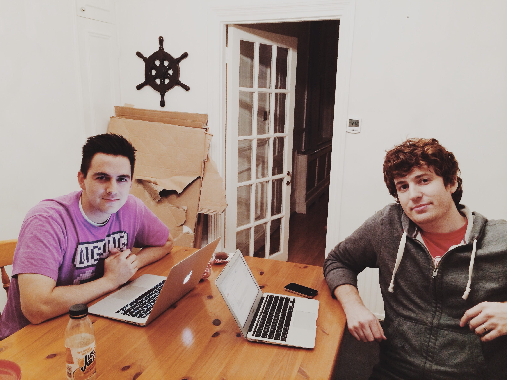
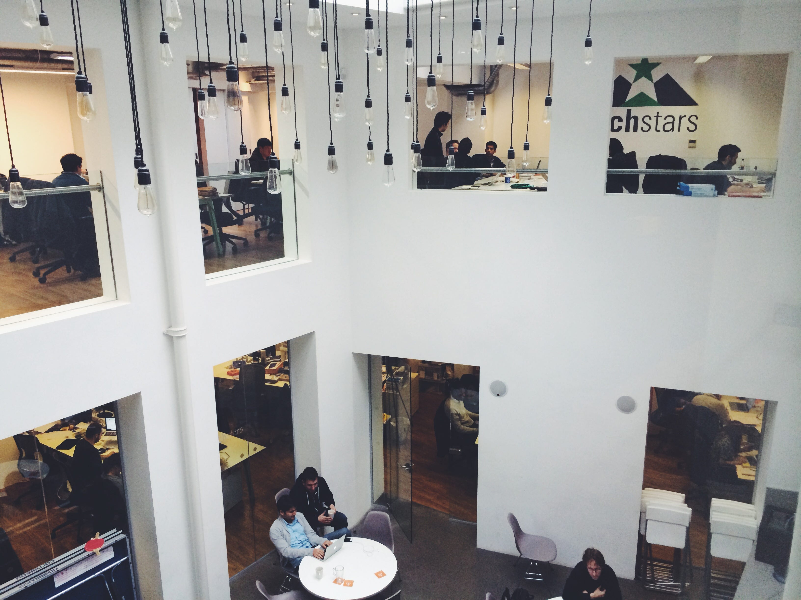
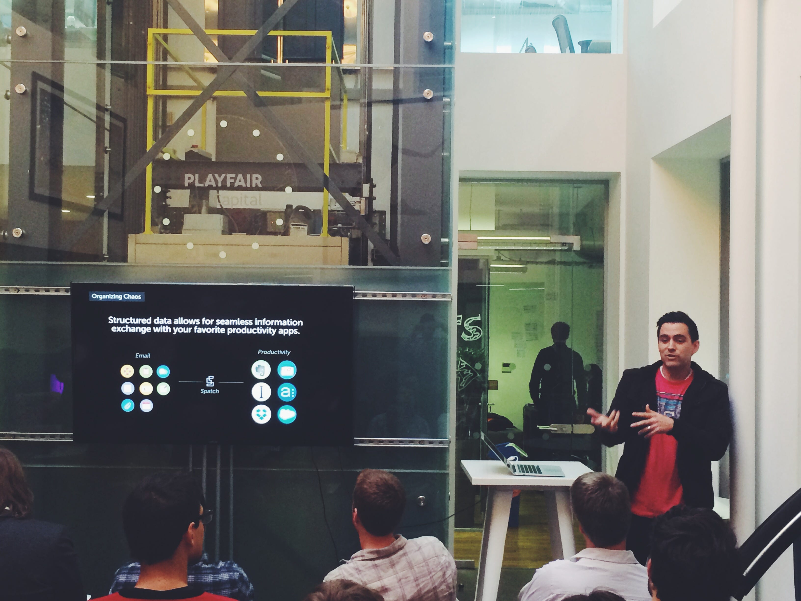

# Techstars London: Founder Diaries

Techstars London: Founder Diaries

### Month 1: Enough drama & love for a soap opera.
*Mick Hagen*

***Note:** We’ve since renamed our company to be [Mainframe](http://mainframe.co).*

***Editor’s Note**: [Mick Hagen](http://mickhagen.com/) is the Founder of [Spatch](http://spatch.co/), a new workplace messaging app that’s built on top of email. He’s currently going through [Techstars London](http://techcrunch.com/2014/03/24/techstars-london-2014-intake/). Mick’s first company Zinch, [was acquired by Chegg](http://allthingsd.com/20110915/chegg-buys-zinch-in-another-move-toward-a-social-education-platform/) in 2011. You can follow him on [Twitter](https://twitter.com/mickhagen).*

Day 1 of Techstars London was nothing like we expected. We weren’t writing code or practicing our pitch. Instead, we were playing an *Amazing Race*-style game, with mixed teams from the [11 accepted startups](http://techcrunch.com/2014/03/24/techstars-london-2014-intake/) (1500+ applied) and racing through London using clues to find historical landmarks.
> “Do you think it’s Westminster Abbey then?”
“No… can’t be. Shakespeare doesn’t have a statue there.”
“Okay then it has to be Shakespeare Theatre. That ***has ***to be the next clue.”

*Spatch Founders Mick Hagen & Ryan Johnson, the day before Techstars began.*

No taxis (or uber) allowed. No tube (subway). Some teams rented bikes. Others took buses. Many walked. The ultra-competitive jogged.

It was a perfect welcome — if not a fascinating social experiment. Some teams gelled together, with clear leaders emerging. Others floundered for lack of leadership or simply too much attempted leadership. It was an effective way to start Day 1 of Techstars London. Teams quickly got to know each other. We familiarized ourselves with this new, historic city. And it set the tone for the kind of intensity we could expect from this program (or is it *programme*?).

### Drama

This may not be Real Housewives of New Jersey… but just one month in we’ve seen our fair share of drama. One cofounder didn’t get the proper UK Visa, so upon arriving to London was immediately sent back to his home country. That put them back a few weeks. In a 13-week program, every week counts.

*Warner Yard, where Techstars London companies are working from.*

Within the first week of the program, one team had a massive implosion (cofounder issues). They were at risk of being kicked out. One cofounder departed but the CEO was able to hold things together. They’ve managed to weather the storm.

One team has had to do a major pivot just weeks into the program because their idea didn’t survive mentor week — everyone was telling them the same thing… their current idea just didn’t scale. They’ve since recovered nicely and I believe are on a promising path.
> # It’s like we’re living life in fast-forward mode.

All of the ups and downs of regular startup life are compressed into a tighter timeline. It is what they say it is, an accelerator — it’s like we’re living life in fast-forward mode.

### Togetherness

As each of those dramatic moments unfolded, it was inspiring to see the immediate blanket of support & love from the fellow founders. In another occasion this last week, the aunt of a Techstars Associate (intern) tragically passed away. There was an immediate outpouring of concern and support. We each signed a card and reached out individually.

*Spin the Bottle: Sharing lessons learned in the first month.*

We don’t just support each other and work alongside each other. We [learn together](https://www.facebook.com/photo.php?fbid=1502384586647779). We [eat together](https://www.facebook.com/photo.php?fbid=1503512806534957). We [watch “football”](https://www.facebook.com/photo.php?fbid=1502493606636877) together. We [play together](https://www.facebook.com/photo.php?fbid=1495451640674407). We [dance together](https://www.facebook.com/photo.php?v=1502864053266499). We [laugh together](https://www.facebook.com/photo.php?fbid=1498968630322708). We’ve all grown close.

Most of us have come in from all over the world (Estonia, Germany, South Korea, Israel, Spain, Ireland, USA and of course UK) and we sorta only have each other. We spend nearly all our waking hours together. We help test beta builds, provide each other feedback, brainstorm, promote products/blog posts/surveys, and make introductions. We’re genuinely rooting for each other. We’re all in this together trying to build something people want. We’re all trying to survive.

I’m used to coding in a dark corner of my house… alone. The sense of camaraderie I’ve felt during this first month has been heartwarming. These are friendships that will last forever.

### Exposure

For a while now my cofounder and I have been heads down hacking… building what we assumed would be the perfect solution to the problem we were attacking.

*London Underground (tube)*

We were wrong.

For two weeks, we went through a process called “[Mentor Matching](http://blog.spatch.co/post/81760439809/techstars-mentor-matching-week-1-why-it-matters).” Our product & vision was analyzed, dissected and scrutinized by 80+ really smart people (most of whom are target users of our product). Of course no one knows our business like we do — but important questions, challenges and patterns emerged and it helped us crystalize our thinking.

We realized that we had a few core mechanics completely wrong. We’ve narrowed the focus and re-calibrated our product. This structured and somewhat forced exposure was exactly the kick in the butt we needed.

### Introspection

The process of building and growing a startup transcends cultures, language barriers, or borders. We’re a group of creators fighting every day to survive. We know the odds. We know most startups fail. But we still wake up everyday motivated by the chance — even if it’s small — to change the world for the better.

*Mick sharing the Spatch vision on a Thursday Night.*

The pressure cooker of an accelerator is unique and extraordinary. The unusual speed and intensity reveals hard truths you’re forced to confront and reconcile. These challenges have led to a closeness and friendship among the founders we could never have expected.

In the end, we’re all still searching for that next clue.

*You can follow the Spatch Techstars journey via [Twitter](https://twitter.com/SpatchApp), [Facebook](https://www.facebook.com/SpatchApp) or [Instagram](http://instagram.com/spatchapp). Or you can follow the [Spatch Blog](http://blog.spatch.co/).*

Source: https://blog.hifi.finance/techstars-london-founder-diaries-ad28c48c30f
