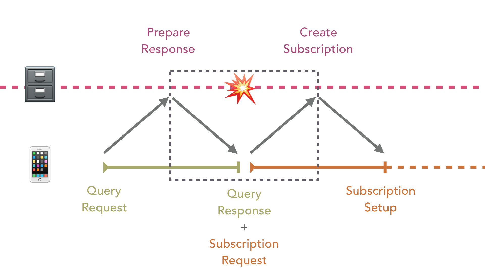
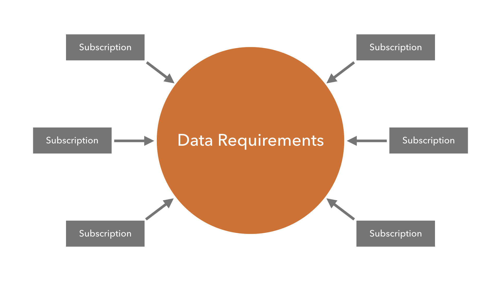
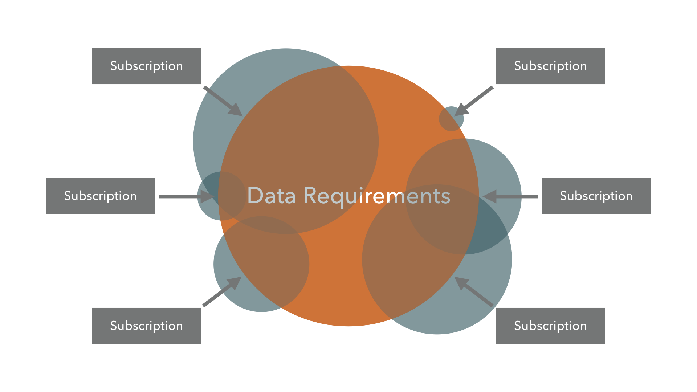
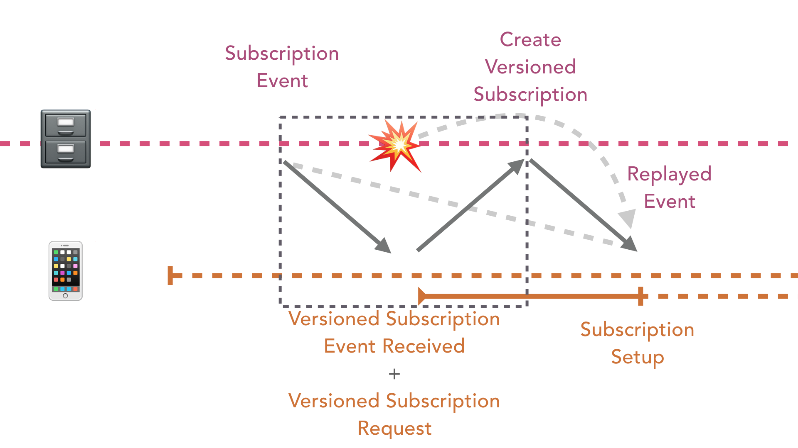
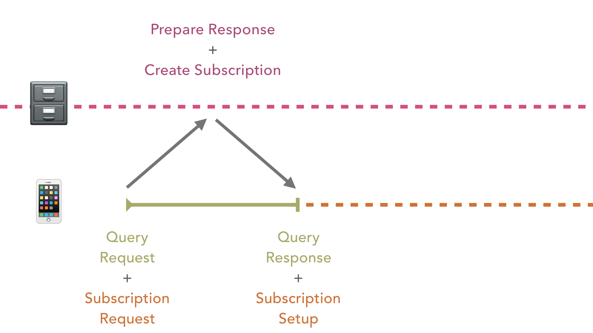

# Fragment Subscriptions in GraphQL

Taz Singh at GraphQL EU | May 21, 2017

At GraphQL Europe on May 21st, I spoke about [Mainframe](https://mainframe.com/)’s journey with realtime GraphQL. Our entire product’s experience is contingent on an efficient and reliable realtime architecture that we have spent a lot of time perfecting.

In this article I will provide an overview of some of the client side challenges that we faced when building our product with GraphQL, our solutions, and [proposals that are under discussion in the GraphQL spec](https://github.com/facebook/graphql/issues/314) to improve this.

## The Problem

GraphQL is a fantastic way for our front-end clients to describe their data dependencies to a server. The server then has to satisfy those data dependencies for the client, such that the client can render its screens appropriately. I’ve personally been watching this space since Facebook announced GraphQL as this problem has been at the forefront of client-side development for many years.

The realtime story has been under discussion since shortly after GraphQL itself was announced publicly however it has taken the community a while to flesh out various solutions for it. Two leading paradigms emerged, live queries and subscriptions, as well as a variety of solutions in between.

At [Mainframe](https://mainframe.com/), we’ve decided to move forward with subscriptions as it gives us the best flexibility on the client and a path towards implementation on the server. Since we’re using Relay, we used the [relay-subscriptions](https://github.com/edvinerikson/relay-subscriptions) library to hook into the same containers that we’re using to declare our data requirements.

All of these tools worked exceptionally in getting our application converted over to using Relay and GraphQL. We went from prototypes to having the entire application migrated in a matter of weeks and we removed a lot of data specific code in the process.

However there is one fundamental issue with the GraphQL subscription specification that we wanted to evaluate further once we had our application fully set up — the gap between receiving a query’s response and setting up a subscription based on data in the response.

*Gap between receiving a query’s response and setting up a subscription*

If an event occurs within this gap, the server does not yet know that the client cares about that event. Therefore an event can be entirely missed by some clients while being handled correctly by others. This creates an inconsistent experience and does not let us achieve our goal of having a reliable realtime experience.

You may be thinking that this gap is small; and for fast and reliable desktop internet connections, it certainly can be. But our application also operates across slow mobile networks with high latency. In these circumstances, this gap can be quite large. Mobile devices can also lose connection intermittently, resulting in the query and subscription negotiation to be repeated when the device comes back online. Meaning that this gap can be experienced multiple times within the lifespan of a single screen.

For some applications, this gap may not even matter. At Facebook, for example, if they drop a “like” in their realtime architecture during a live stream, does it really matter? However for [Mainframe](https://mainframe.com/), where this event can be a message from a colleague containing critical information, we cannot allow the client to become desynchronized.

We spent some time evaluating various solutions and came up with a versioning strategy for responses from GraphQL. All query responses from our system additionally return a version, which we then attach to any subsequent subscription requests reliant on a query’s data. In this way, the server can then replay any missed events back to the subscription and we don’t drop any events!

*Queries respond with a version which is then sent back to the server on subsequent requests*

## The story doesn’t end here

We started with this approach for our data requirements, but we soon realized our solution had a fundamental flaw.

To illustrate, let’s assume that the following diagram represents the data requirements for an application:

Subscriptions feed into these data requirements:

And when each subscription triggers, it will influence its part of the data:

As you can see from the above diagram, the updates from each subscription can overlap with updates from other subscriptions. Also if a subscription is bound to a piece of the data requirements, if another subscription updates that bound piece of data, the original subscription will have to be disposed and another set up to replace it with the new data.

Thus we have a situation where the subscriptions influence the data requirements and the data requirements also influence the subscriptions:

And so we’re back at the same situation we were in before where the server can return a response and the client needs to change the definition of its data requirements based on that response, which the server does not know about until it receives the new request.

To work around this scenario, we also added a version to all subscriptions responses. This version is then used in subsequent subscription requests to allow the server to replay any missed events.

*Versioned subscription responses used as an input to other subscription requests*

Thus every response in our system will return a version and any requests back to the server that relies on data in that response will send that same version along with its request.

In this way we can effectively ensure that no events are dropped between the response and request of operations within our system. The server can replay any events that a client would have missed. And our client can maintain a consistent state in all scenarios.

We’ve found that this solution works well and can definitely recommend it if you are experiencing similar problems.

## We can do better

The above approach is what we can do right now with the GraphQL specification. It defines these constructs and our application is limited to using only what it provides.

But what if we can change this specification and mold it to fit our needs? What if we can simplify our architecture and in the process also simplify the collective architectures of the community at large?

This is what I’ve attempted with a [discussion around fragment subscriptions in the GraphQL specification](https://github.com/facebook/graphql/issues/314). My hope is that this discussion will pave a path forward for a simpler realtime experience for the community at large.

At its core, it does not consider the query’s data requirements and the subscription’s data requirements to be separate as in reality they are one in the same. A screen fundamentally only cares about receiving data regardless of how the data gets to it.

If this is the case, then why not merge these two concepts? Why not define the subscriptions themselves along with the initial query for data?

We can dramatically improve our network diagram from the above to instead look like this:

The query and subscription now become one atomic operation.

The server can prepare the response and register the subscriptions at the same time.

The client can then process the response and setup the subscriptions as a single operation as well.

With an approach like this, we can remove all code related to versioning on our clients and on the server. Our architecture is dramatically simplified and most importantly, we can sleep better at night knowing that this problem is entirely impossible under this new approach.

So what exactly is this new approach? And why isn’t it possible right now?

One incarnation can look something like this:

<iframe src="https://medium.com/media/55916e239a60480ea9bd03caa9616073" frameborder=0></iframe>

Let’s go over this example line by line:

1: A GraphQL fragment on the User type that’s called userFragment .

2: The new@subscribeTo directive with the name of the subscription (“avatarChange”) and the fragment to define the response of the subscription itself (avatarChangeFragment).

3–9: The body of the userFragment containing the data requirements for the screen.

7: The avatarChangeId which can be added implicitly to the body of the fragment by the server. Its purpose is to map any incoming subscription events from the server to a specific place on the client. Therefore we can always have a consistent place to operate on this event even if the path to the fragment from the root of the query changes.

11: A GraphQL fragment on the subscription’s payload data type (UserAvatarChangePayload)

11–15: A description of data which the client needs in order to respond to the subscription event. In this case, it requires the new avatarUrl in order to update the previous value.

This solution can solve all of the problems identified above but also potentially comes with its own set of problems.

Right now in the GraphQL specification, directives use Arguments to define additional values to be passed along with the directive. These Arguments are used elsewhere in the specification, such as to pass additional values to Fields (e.g. avatarUrl(size: 200) is a Field with Arguments ). Therefore if we were to extend Arguments to accept other fragments, it could have unintended effects on Fields as well.

Another approach to achieving this can look something like this:

<iframe src="https://medium.com/media/2cfe84c6374c36eb25a853a41033defb" frameborder=0></iframe>

Whereby the subscribeTo (line 2) construct is a new extension to the language itself. This extension can then reference the subscription (line 11) which we can define as we would define any other subscription in our system.

I personally would prefer an approach like this as it utilizes the same constructs that we’re familiar with. We would normally create a subscription with the subscription keyword and are simply linking it to the previous fragment with the subscribeTo construct.

Of course this has its own challenges as the userFragment can appear multiple times within a query. For each instance of the userFragment , we have to link that to an instance of a userAvatarChangeSubscription . Within the current GraphQL specification, this isn’t possible at all. There has been discussion around cross binding fields across queries but this only works for a single instance as the fields themselves are bound to a named variable which cannot be overwritten by multiple values.

## What’s next

I am looking forward to a discussion about these solutions to pave a path that [Mainframe](https://mainframe.com/) and the community can walk along. If you have any ideas around paths forward, please participate in the [discussion on the GraphQL specification repository](https://github.com/facebook/graphql/issues/314).

These problems may not apply to everyone but we believe the entire GraphQL ecosystem can benefit from a general solution at the specification level. Developers will not have to undergo the substantial work of implementing versioning schemes across fragments contained in a response and clients won’t have to worry about passing these versions back only when appropriate.

Everyone can get an efficient and reliable realtime experience with GraphQL for free. Just like the one that we have here at [Mainframe](https://mainframe.com/).

Source: https://blog.hifi.finance/fragment-subscriptions-in-graphql-1dddb92b5696
