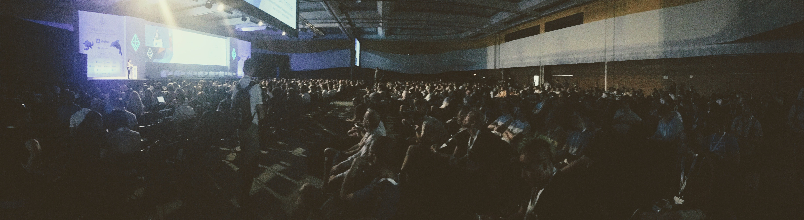
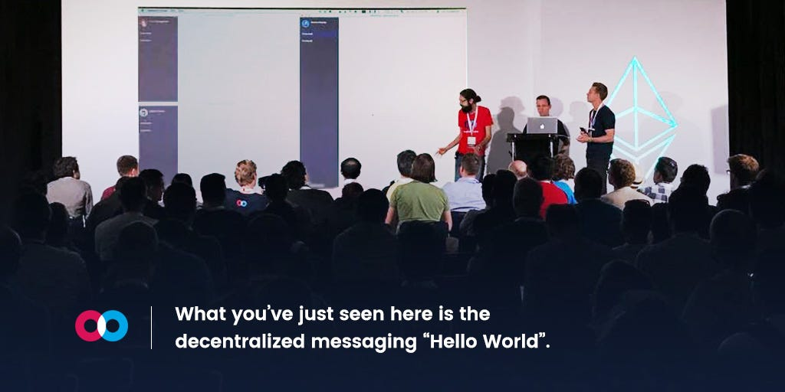
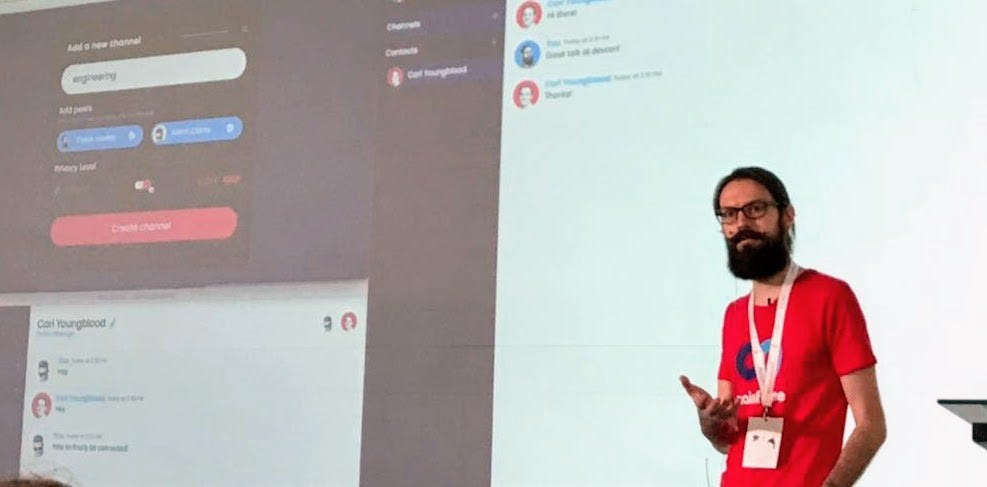
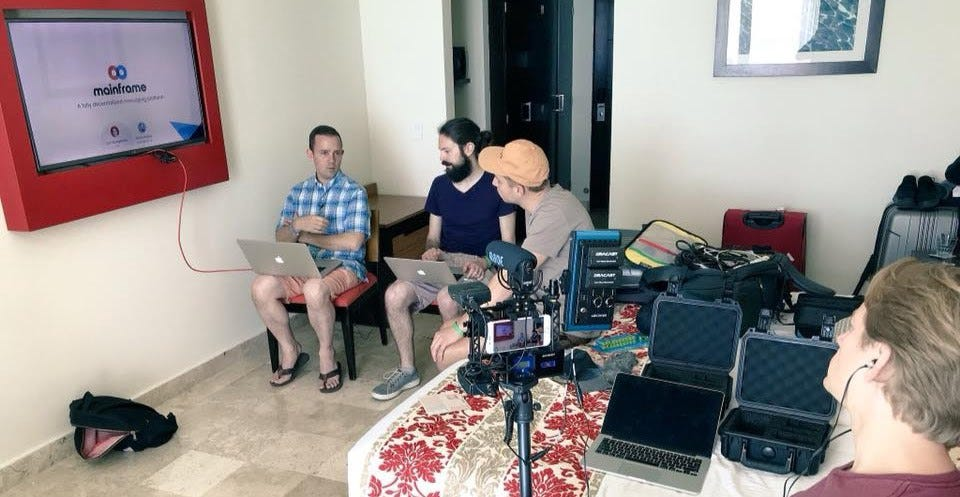
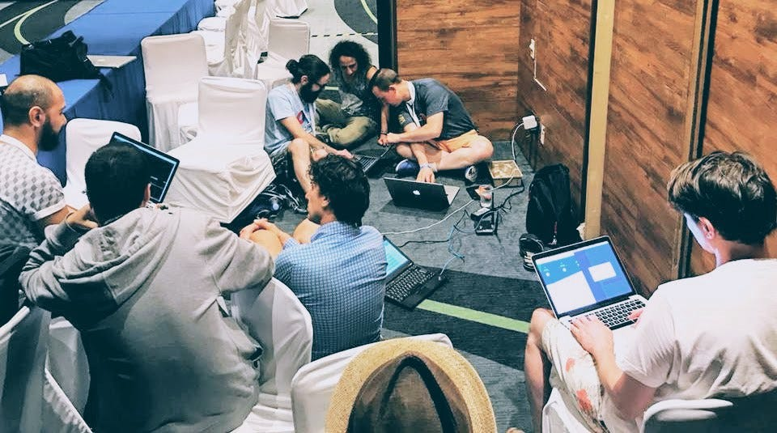
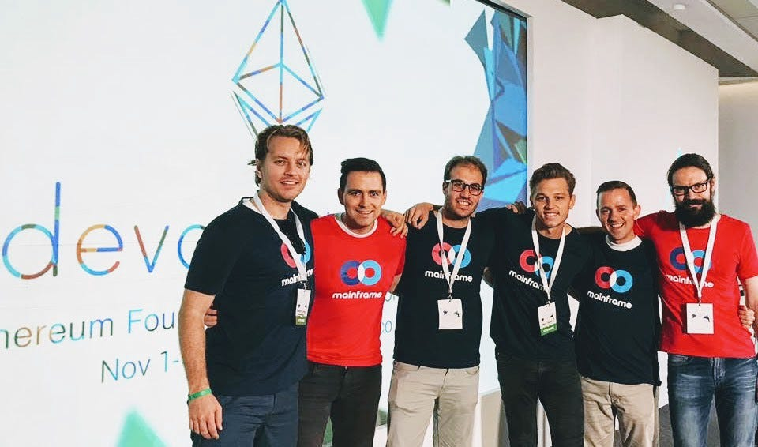

# Preparing, Presenting, and Reception at Devcon 3

There wasn’t a lot of sweat or trembling anxiety before our Mainframe presentation at Devcon 3. But frankly there was a little unease. We’d fully prepared, we knew our tech was killer. But the variables we couldn’t control… the A/V gear, the audience involvement… and okay, maybe there was some nervousness about publicly showcasing new code.

But nothing is more memorable than an interactive experience, so that’s what we set out to create for everyone there.

*A full house for the main stage at Devcon 3.*

Cancún, Mexico played host this year to Devcon3, the software developers conference hosted by the [Ethereum Foundation](https://ethereum.org/). With Ethereum topping $30 billion in market capitalization, thousands of developers using the platform, and institutional finance getting involved, you might think Devcon would attract more reporters, investors, and newcomers in the space. But true to the name, Devcon is for developers. The presentations were deeply technical, with an audience eager to grasp platform mechanics… because *they’re building the platform*.

*The conference could have been hosted anywhere, but it didn’t hurt to be in a beachside paradise.*

We reached out to the [Ethereum Foundation](https://ethereum.org/foundation) months ago seeking advice on our decentralized messaging technology. The hurdles are significant, as this isn’t something that’s been done *quite* this way before. One of the incredible benefits of blockchain technology is the ability to layer systems, like a three dimensional puzzle, creating behavior incentives on top of complex information networks. As leaders in cryptocurrency, we hoped they might offer counsel on our proposed architecture.

You might call it serendipity or good luck. We think it’s what happens when passion meets hard work. We shared our goals and methods with the Foundation members, and they were just as thrilled about the messaging tool as we were. It’s a perfect fit with protocols they’ve been developing for months. They asked if we could share more at Devcon, their major conference for the year. It was only a few weeks away.

It’s a pretty energizing offer. This is a gathering of the top minds in the Ethereum world. But we wanted to share more than a theory. We wanted to offer a functional demo with the audience engaging in real time. “*We made this, and you should try it*” is more compelling than “*we have an idea.*”

The following weeks were consumed in writing, debugging, gathering critical feedback, and refining both the software and the presentation. There were rehearsals, then more rehearsals. Mainframe engineers [Carl](https://blog.mainframe.com/announcing-mainframes-new-cto-8b6e9930c21a) and Shane stayed especially focused, as they’d be the ones presenting on stage.

*Louis Holbrook, one of the lead developers of the PSS protocol used by Mainframe, inviting conference attendees to see our demo on the final day.*

We were scheduled for the fourth and final day of Devcon. Members of the Ethereum Foundation mentioned us from stage multiple times, inviting attendees to participate in our demo. While we were confident in our code and the underlying technology, there are plenty of things that ***can*** go wrong in a live demo of early software, especially in a totally new setting. Glitches happen to major players all the time, from Apple to Microsoft. It was a risky move, but the payoff could be big.

When the day came, most of the nervousness had faded. We’d seen the other presentations, we’d met the other groups speaking. Devcon is by no means a competition, on the contrary, it’s *very* collaborative. But we knew we had something valuable to share.

It was only a 20 minute presentation — some slides, a demo, some Q&A. And we’re happy to say it had the desired effect.

> What you’ve just seen here is the decentralized messaging “[Hello World](https://en.wikipedia.org/wiki/%22Hello,_World!%22_program)”.

That simple sentence from our own Shane Howley meant a lot to us. Even more gratifying was the spontaneous applause from an excited audience. Clearly it meant something to them too.

In addition to our *“Hello World”* moment, everybody enjoyed sending gifs and notes in our live chatroom during Q&A. After the presentation, audience members approached our team asking when they could start using the tool for their organizations. Some came from scrappy startups, others from decades old NASDAQ traded companies. The demo was just a proof of concept, but the demand for a tool like this is clear.

In plain language, here’s what we shared with them:

The Mainframe team is building a decentralized messaging network with security and privacy functions that don’t exist anywhere else. We’ve experienced the shortcomings of other messaging tools, and we’re pretty sure you have too. With virtually any email or messaging provider, you’re entirely reliant on the host to keep your information secure, convenient, and real-time. You give them full control of your data. You rely on third-party infrastructure and proprietary software. And when those things fail, there’s no recourse. You get hacked, phished, surveilled. Better luck next time.

Mainframe is changing all of that.

With Mainframe messaging, you have the security of end-to-end encryption with the convenience of an intuitive, sleek interface. You get peace of mind knowing your messaging is on a distributed network built from the ground up to resist disruption or surveillance from any threat. We offer powerful privacy tools and features in a package that won’t require a PhD to use.

With Mainframe, you have security, control, and freedom.

<iframe width="560" height="315" src="https://www.youtube.com/embed/eaQyE8m9pKk" frameborder="0" allowfullscreen></iframe>

See our presentation above, and let’s stay in touch. Follow us on social channels for more updates, coming soon.

And if you’re ever in Cancún, say hi to the band at *La Destileria* for us!

<iframe width="560" height="315" src="https://www.youtube.com/embed/jY8NkrwxY00" frameborder="0" allowfullscreen></iframe>

Source: https://blog.hifi.finance/mainframe-presentation-at-devcon-1693b6a07ffa
