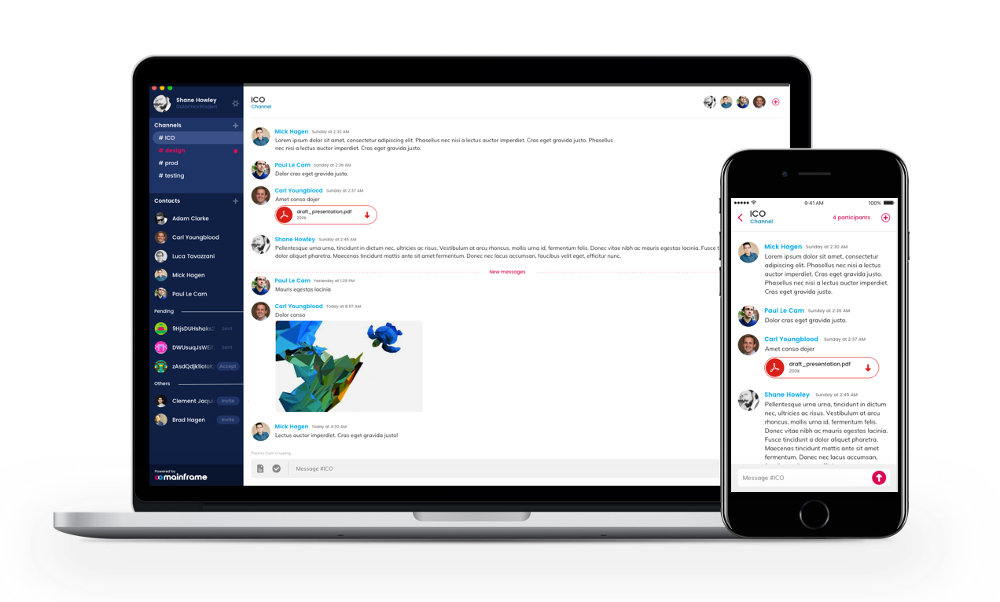

# Onyx: Alpha Release

A glimpse at fully decentralized workplace messaging

We’ve been working incredibly hard on decentralized messaging protocols for some time now. It’s been quite [the journey](https://mainframe.com/team#our-journey). I’m so proud of our team. Today we have an exciting announcement: the alpha release of the first application for the Mainframe network is now [available for download](https://github.com/MainframeHQ/onyx/releases)!

When we [presented at DevCon](https://blog.mainframe.com/our-presentation-at-devcon3-2dc3ea2ca8f8) a month or so ago, we did not expect the response we received. We thought we still had a lot more work before we could release something to the public. We assumed people would need more functionality and a richer feature-set. However, immediately after our presentation the audience was clamoring to get their hands on what we had built. We were surprised yet humbled at how useful everyone thought it was already. So our work since the conference has been put into hardening the app against unauthorized access and packaging it for stand-alone use. We have code-named this release Onyx.

So here we are... blemishes and all. Are there bugs? Yes. Should you be forgiving? Yes. Is this fully decentralized messaging leveraging blockchain technology? Yes yes yes!

**Local Mainframe Node**

In its default mode of operation, the desktop client runs your Mainframe Node locally (which includes your mailbox service) and connects to a network of Ethereum bootnodes that we have deployed around the globe in datacenters in Ireland, Northern California, and Tokyo. Because the Mainframe Node is running locally, any messages sent to you while your app is closed will not be saved. Don’t send any mission-critical messages in this mode. *Actually, don’t send any mission-critical messages in ANY mode — this is an alpha release!*

**Virtual Mainframe Node**

For those who wish to experiment with deploying their Mainframe Node to the cloud, there are instructions in the [README](https://github.com/MainframeHQ/onyx-server). This mode of operation will ensure that all messages continue to be saved while your app is closed, and is also what you will need to be able to see a unified view of your messages from multiple clients. This is undoubtedly the better user experience but requires a little more technical know-how. We will continue to work hard to make a great user experience for all users — technical or not.

**Contact & Support**

There are a number of [known issues](https://github.com/MainframeHQ/onyx#known-issues) with this release. If you run into a problem, please [create an issue](https://github.com/MainframeHQ/onyx/issues/new) on our [github](https://github.com/MainframeHQ/onyx) project. Though we are not yet providing full support for this version (it’s alpha, remember?), we will accept well-crafted pull requests and look forward to getting your feedback on what you would like to see in future official releases.

Please reach out to us on [github](https://github.com/MainframeHQ/onyx), [twitter](https://twitter.com/MainframeApp), [facebook](https://www.facebook.com/MainframeApp), in [our slack](https://join.slack.com/t/mainframeprotocol/shared_invite/enQtMjYyODg3Mjk3MjMyLTI5ZTk0OGFlODllNTcwN2E3OGU3ZWYzMDUzOTllYTViNmE4ZmU4OGRjOWM1OTRhMTA1NWZkZGQ3NzdkNTA4ZjU), here on our blog, and last but not least, on Mainframe itself! Feel free to add any one of us using [our public keys](https://github.com/MainframeHQ/onyx#get-in-touch), and we’ll invite you to a discussion channel.

Thanks for your support. This is the beginning of an exciting journey!

~ Mick Hagen (CEO)& Carl Youngblood (CTO)

Source: https://blog.hifi.finance/mainframe-pre-alpha-release-fca532317111
