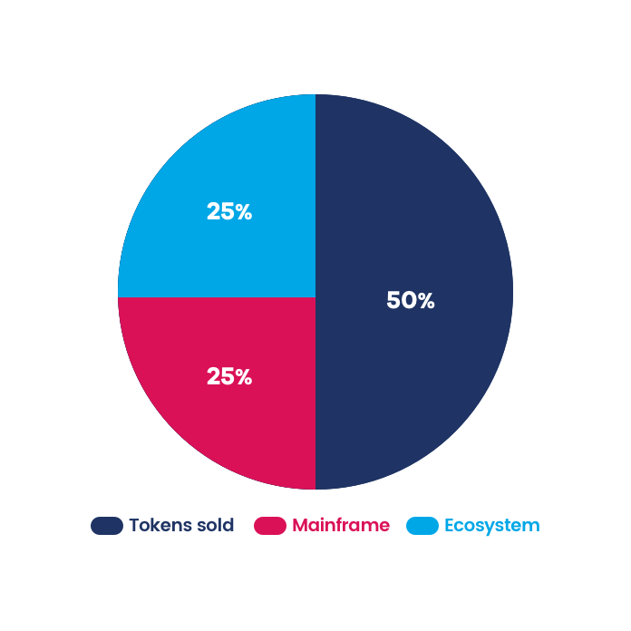

# Mainframe Token Generation Event

Mainframe Token Generation Event

### Yes, it’s happening

We recently opened up the Mainframe kimono by [releasing our White Paper](https://blog.mainframe.com/mainframe-the-web3-communications-layer-47599b2ba07d) and being a bit more public about our vision and tech. We started conversations with potential strategic partners and word is getting out about our plans. We’re humbled by the response so far!

This isn’t a project, this is a movement. We aim to create a new layer of the internet where privacy and freedom are first class citizens. We’re excited to have so many new supporters and fans. Together, you and us, I think we just may be able to pull this off.

So there are a lot of questions coming our way. We weren’t quite prepared for this because we didn’t expect the response to be so quick and explosive! So let’s dive right in…

### Q: So… you’re doing a Token Generation Event?

Yes! We plan to sell tokens so that people can use our amazing network built for privacy and freedom.

### Q: What is your hard cap?

We plan to sell 50% of the total token supply for 30k ETH. Despite there being plenty of demand for that hard cap to be increased, we are sticking with it. When we make a commitment, we plan to stick with it.

### Q: Where will the rest of tokens go?

* 25% will go to Mainframe the company.

* 25% will be to foster growth and adoption within the Mainframe ecosystem

### Q: Will you be doing a private pre-sale?

Yes. However, we would plan to be very, very selective about who we allow to participate. We want people who will actually use MFT, be active on the Mainframe network, and possibly host their own nodes.

Beyond engagement on the Mainframe Network, we want people who are passionate about our mission. We want people who can help us grow our community, spread awareness about our project, and open doors to opportunities (partners, customers, developers, future hires).

Discussion of our pre-sale plans is not intended to be an offer to sell MFT or solicitation to buy MFT in any jurisdiction. Any potential future offer would be made privately to eligible persons in compliance with applicable law.

### Q: Will there be any lock-up or release schedule on private pre-sale participants?

Yes. We want to attract people who believe in our project longterm. So we have set up a structure which would immediately filter out the types of people who don’t *really* believe in us longterm. So for participants in a private pre-sale, around 1/3 of all your MFT tokens will be distributed immediately and the remainder will be released on a monthly basis for the next 11 months.

Very few projects have this type of lock-up or release schedule. For most projects in the space, all tokens are available immediately. We are trying to raise the bar, push the entire industry forward, and perform a higher quality *Token Generation Event*.

*Token Release Schedule for pre-sale participants. Time period in months.*

### Q: Will you be doing a public crowdsale?

We want to do a crowdsale. We have nothing to announce now but go join our [Telegram](https://t.me/MainframeCommunity), follow our [Twitter](https://twitter.com/Mainframe_HQ), and stay tuned for more announcements. Our priority right now is to continue to develop our technology, grow our community and spread awareness about the movement. Privacy matters. Freedom matters. We know that conducting a crowdsale can sometimes be a major distraction. But if it can help spread the message and grow our community, then it is worth it. So we are actively pursuing options here. If you really want to be at the front of the line for the white list, apply to become a [Mainframe Ambassador](https://blog.mainframe.com/announcing-mainframe-ambassadors-449aa613c4c3).

We are a US company. Most of our management team are US citizens. It’s essential that we comply with all US securities regulation and laws. If we can’t come up with a crowdsale structure which we believe can comply with these laws, then we would have to forgo the public crowdsale.

### Q: Will there be any lock-up or release schedule for the founders and team members?

Of course. Vesting will start three months after the *Token Generation Event*. Vesting will be monthly for a three-year period. Most great projects have a similar vesting and release schedule.

### Q: What is Mainframe Token (MFT) and why is it needed?

To create a strongly decentralized network for censorship-resistant message routing, it’s essential that we incentivize and reward *Mainframe Nodes* to keep the network running and perform services (packet routing, packet holding, file storage, database storage). Mainframe Tokens (MFT) will be the currency in which these nodes are rewarded.

MFT is not intended to be a security. Just as Ether is used to keep the Ethereum network running, MFT is intended to be used to keep the Mainframe network running. MFT is intended to be used solely for Mainframe network services and the Mainframe ecosystem, not for any investment or speculative purposes whatsoever.

We are working with some of the top legal professionals in the industry to seek to comply with applicable US securities laws and regulations.

If you have any questions or want to reach out, feel free to ping us on [Telegram](https://t.me/MainframeCommunity) or [Twitter](https://twitter.com/Mainframe_HQ). Thanks for joining us on what should be a really exciting ride! Let’s go!

Source: https://blog.hifi.finance/mainframe-token-generation-event-ad775f509871
