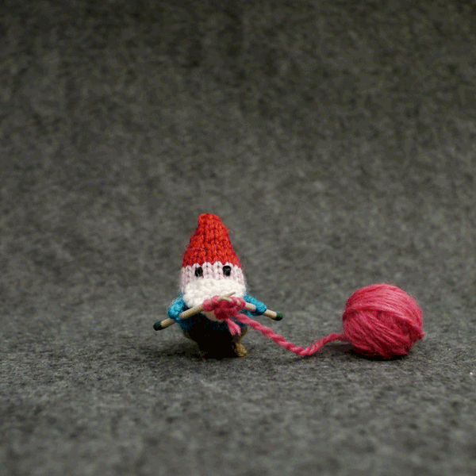

# Three Million Dollars

Three Million Dollars

That’s how much of MFT value we’re giving away to the public in the [three phases](https://blog.mainframe.com/introducing-the-mainframe-crowdsale-9a73ea7ae9d4) of our [*Token Generation Event](https://blog.mainframe.com/mainframe-token-generation-event-ad775f509871)*. Yes, it’s completely free! That’s nearly 10% of our hardcap (depending on ETH price). As far as we know, no other project has given this much away for free before (in terms of USD or ETH value). It’s unprecedented and it reflects the appreciation we have for you. We’ve worked diligently and creatively to come up with a structure where **ALL** of our community can participate. And we believe we are compliant to all applicable securities laws and regulations.

As we’ve previously [mentioned](https://blog.mainframe.com/introducing-the-mainframe-crowdsale-9a73ea7ae9d4), Phase 1 will be unlocked when the [Mainframe Telegram](https://t.me/MainframeCommunity) channel hits 20k members. That is very, very soon! So while we’re waiting for that to happen, we thought we’d share a few quick updates.

## **Crowdgift is the new Crowdsale**

We are a US company and our management team is mostly comprised of US citizens. We are doing everything we can to comply with US securities laws. In recent weeks, the SEC has come out with new [actions](https://www.wsj.com/articles/sec-launches-cryptocurrency-probe-1519856266) or [updates](https://www.sec.gov/news/public-statement/enforcement-tm-statement-potentially-unlawful-online-platforms-trading) and they are [slowly](https://www.coindesk.com/sec-chair-says-we-are-watching-as-companies-launch-icos/) but [surely](https://www.sec.gov/news/testimony/testimony-virtual-currencies-oversight-role-us-securities-and-exchange-commission) making it more clear on how they will treat public crowdsales. It’s challenging to try to work with a moving target, but we will do everything necessary to comply.

Here’s what we said in [our last blog post](https://blog.mainframe.com/introducing-the-mainframe-crowdsale-9a73ea7ae9d4).
> Our lawyers have said that we need to be very careful about doing a **traditional** crowdsale. Fine. It’s a good thing we don’t do anything the traditional way. This is a mission for freedom. And we will keep going until it is achieved. The good news is that we believe we’ve designed a “crowdsale” model that will be both compliant to regulators and also pleasing to you, the public participants.

None of our phases will be changed as a result of the SEC actions. We will move forward as planned. However, out of the abundance of caution, we will no longer refer to these phases as our “crowdsale.” We will refer to these three phases as the **Mainframe Crowdgift**.

## Token Supply

Many of you have been asking about the total token supply. **The total number of Mainframe Tokens (MFT) will be 10 Billion**. As we’ve previously announced, our hardcap is 30k ETH and we’re selling 50% of the total token supply. For more details on allocation breakdown, you can read our [*Token Generation Event* blog post](https://blog.mainframe.com/mainframe-token-generation-event-ad775f509871).

## Private Pre-Sale Pricing

As we’ve discussed in [this blog post](https://blog.mainframe.com/how-to-participate-in-the-mainframe-private-pre-sale-f655bdf1360f), there is indeed a private pre-sale happening. We aren’t ready to announce the state of it (if it’s done) or who the participants are. But what we will announce now is the pricing and structure since many of you have been asking.

**Private Pre-Sale — Tranche 1**
*Value*: 21,000 ETH
*MFT Price*: 0.00000582 ETH
(171,821 MFT per 1 ETH)

**Private Pre-Sale — Tranche 2**
*Value*: 6,000 ETH
*MFT Price*: 0.00000647 ETH
(154,559 MFT per 1 ETH)
> **NOTE**: The price difference between the first and second tranche is **11.17%**. As you can see we didn’t give massive bonuses to any pre-sale participants. We also did our best to have broad distribution so no single entity controls a large portion of the network. Also, all private pre-sale participants will be subject to a token release schedule outlined in [this blog post](https://blog.mainframe.com/mainframe-token-generation-event-ad775f509871).

**Mainframe Crowdgift**
*Value*: 3,000 ETH
*Price: Free*

## The Three Phases

No spoilers. Of course I can’t give you details. You’ll find out soon enough. But I will tell you what each phase is called and I will include a Gif. That will be your hint.

### > Proof of Being

### > Proof of Freedom

### > Proof of Heart

Source: https://blog.hifi.finance/three-million-dollars-53ccc72f3444
