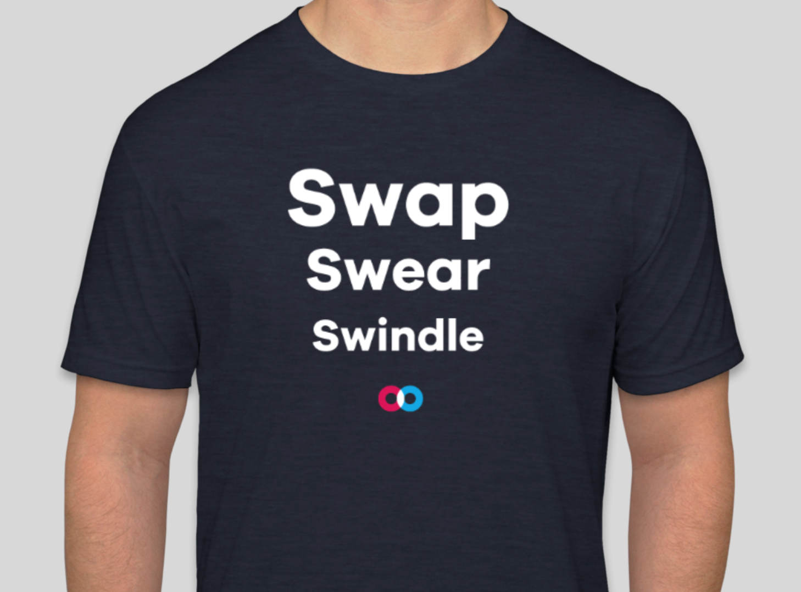

# Swarm Summit Presentation: How to Take Over the Swarm Project.

Swarm Summit Presentation: How to Take Over the Swarm Project.

*This was a talk given at Swarm Summit 2018 in Ljubljana, Slovenia by Doug L. The full video of the presentation is included below.*

## **What is Swarm and why should I care?**

[Swarm](http://swarm-gateways.net/bzz:/swarm-gateways.eth/) is an application that is bundled with [geth](https://www.ethereum.org/cli) (the main ethereum client). It’s primary purpose is to provide a data store for dapps. Let’s take a look at a potential use-case for Swarm:

## **Architecture of my favorite dapp — Cryptokitties.**

For many dapps that exist right now, they consist of two major pieces. The first piece is an on-chain contract. And the second piece is usually a more *traditional* old web 2 infrastructure that provides a front-end interface for the dapp. Using a tool like etherscan you can take a look at the crypto kitty smart contract [here](https://etherscan.io/address/0x06012c8cf97bead5deae237070f9587f8e7a266d). And then to see their frontend you just navigate to their website [here](https://www.cryptokitties.co/). The two pieces of their dapp are tied together using a tool called [metamask](https://metamask.io/). Metamask enables you to interface with the new web 3 from a [web 2 browser](https://www.google.com/chrome/).

## Making Cryptokitties Unstoppable!

Right now if [Amazon’s AWS](https://aws.amazon.com/) service has an outage, you can [kiss your kitties goodbye](https://virtualizationreview.com/articles/2018/03/05/aws-outage.aspx). This is because cryptokitties is trusting a single service provider to serve up their frontend. In the not too distant future there will be an alternative for dapp developers to use in place of existing web and data hosting solutions. Swarm is a decentralized hard drive and hosting service being built into the ethereum ecosystem. So soon cryptokitties will have the option to host their unique art, along with their website, on Swarm rather than AWS. This will make cryptokitties less prone to outages and censorship and more prone to awesomeness.

## Mainframe ❤️ Swarm

This past week a group of our engineers attended Swarm Summit 2018. An event that brings together contributors from around the world for a week of education, hacking, and networking. Mainframe was in fine form, complete with our very own Swap, Swear, Swindle Swag. Which if you’re wondering, is the [incentivisation protocol](https://swarm-gateways.net/bzz:/theswarm.eth/ethersphere/orange-papers/1/sw%5E3.pdf) being built into Swarm.

Swarm will play a key role in our technology stack as we build the mainframe platform. This is why we continue to dedicate engineering resources towards developing the technology. In my presentation at Swarm Summit I outline a unique strategy for new contributors to integrate themselves into the project. Inspiration for the talk came straight out of one of my favorite books written by Clayton Christensen, [*How Will You Measure Your Life?](http://www.claytonchristensen.com/books/how-will-you-measure-your-life/)*

I decided to present on my experiences contributing to the Swarm project so far. I’ve learned what kinds of contributions help an open-source project like Swarm and what kinds of things just waste time. For example, if you post a long message that requires a significant investment of time and energy to understand and process, it’s not likely that you’ll get a response from other developers on the project. But if you take time to ask a short, concise question, or submit a code contribution that is well-documented, focused on fixing or improving a single issue, and easy to process, you’re likely to get a response right away. It all depends on how you engage with the other team members. Feel free to watch my talk for more details.

I think you will find my dynamic presentation of these ideas to be both intellectually stimulating and emotionally engaging. But don’t just take my word for it, look at what other members of the Swarm community had to say about my presentation:
> # “The most unusual talk that I have ever seen.”
> # — Swarm’s lead developer [Viktor Trón](https://twitter.com/zeligf)
> # “[Doug] took us back to the 90’s through a funny and anecdotal talk of how Dell outsourced small value-add components to Asus until Asus was finally able to build their own computers.
> # Through this, he demonstrated how projects like Swarm can turn things upside down for established players. By taking small value-adding chunks, like leftover storage on someone’s hard drive, and bundling them together into something more complex you can offer a service that could eventually scare the big guys.”
> # — **@datafundproject** on [twitter](https://twitter.com/DataFundProject/status/993930830987788288)
> # “I had no idea what you were talking about. Does this have anything to do with those stupid magical internet points™️ you keep talking about? I think it’s time you find a real job. Also, next time you should smile more.”
> # — Doug’s Mom

<iframe src="https://medium.com/media/40638b0eb4d25cf10ac7757d7fbef0a4" frameborder=0></iframe>

Source: https://blog.hifi.finance/swarm-summit-presentation-how-to-take-over-the-swarm-project-2529240b1d05
