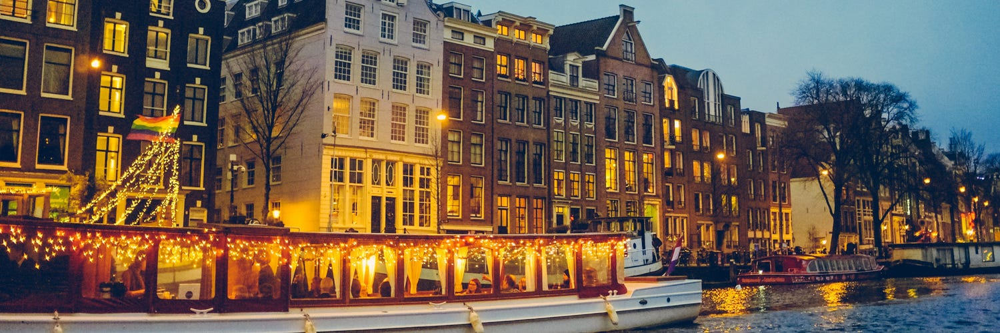

# Mainframe Europe Airdrop Tour — cities announced!

Mainframe Europe Airdrop Tour — cities announced!

Earlier this year, we announced our [Crowdgift Phase 1: Proof of Being](https://blog.mainframe.com/crowdgift-phase-1-proof-of-being-3591a7f52475), where we planned to host physical airdrops in cities across the globe. We kicked it off with our [Asia tour](https://blog.mainframe.com/the-first-ever-physical-airdrops-b22f13f3457a) in March, followed up by our [NYC airdrop](https://blog.mainframe.com/crowdgift-phase-1-continues-new-york-city-airdrop-f3bb81368633) in May. We were overwhelmed by the support of our community and the passion you have for privacy and freedom.

We felt the power and momentum that comes from connecting with our community in person. We’re ready for more. So let’s bring on Europe… 6 cities, 10 days, thousands of you.

## **Warsaw, Poland**

Warsaw was the top ranked European city in our airdrop voting poll. The community has spoken and we’re listening. We’re coming for you, Warsaw.

## **Zug, Switzerland**

Crypto Valley and one of Europe’s hottest crypto hubs. Need we say more?

## **Paris, France**

With the country’s announcement to implement pro-ICO legal frameworks, we’re bullish on France’s crypto game and we think you should be too. (Plus, French pastries).

## **London, UK**

Jolly old England, where [it all started](https://blog.mainframe.com/techstars-london-founder-diaries-ad28c48c30f) for Mainframe. The Mainframe U.S. team is excited to visit our London office, see some familiar faces, and spread Mainframe’s mission to new friends.

## **Amsterdam, Netherlands**

Anne Frank’s global voice for freedom from oppression inspired us to make Amsterdam a stop on our tour. And we heard the [Banksy exhibition](https://mocomuseum.com/exhibitions/) can’t be missed — there is literally a room in the exhibition for anti-surveillance.

## **Berlin, Germany**

Another top crypto hub, plus with such rich history in the fight for freedom taking place in Berlin (1989), it seemed like the perfect place to finish up our tour.

We’ll announce specific dates and venues in the coming weeks. For now, know that this will happen the **last two weeks of June!**

We can’t wait to connect with more of our community and push forward in the fight for freedom and privacy! If you can’t make it to the tour this time around, we’ll miss you but be sure to [vote for a city](https://mainframe.com/airdrop/) near you.

Source: https://blog.hifi.finance/mainframe-europe-airdrop-tour-cities-announced-5bf0b0ab30f7
