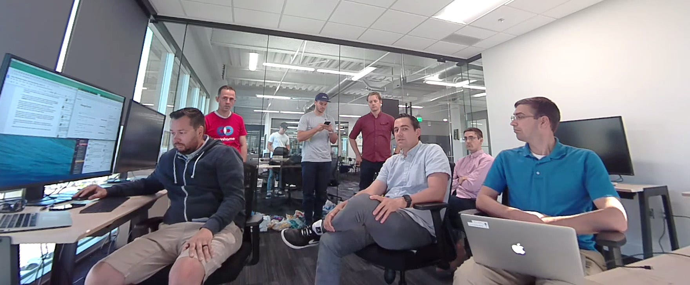

# A New Hire’s visit to Mainframe HQ

A New Hire’s visit to Mainframe HQ

Hi, my name is David Sun and I’ve been managing the Mainframe English and Chinese communities for several months now. I’m the new guy at Mainframe.

Up until this past week, I have only engaged with the main team online remotely by chat and call, and to me they just looked like usernames and text bubbles that occasionally spout out great tidbits of insight and instructions on my community management duties. As far as I knew, they might have just been highly sentient and privacy conscious AI that had me promote their protocol to telegram users to help replicate themselves. I had my suspicions, as the team seemed a bit too highly coordinated and precise on their work execution to not be robots. I had to find out the truth for myself… So I took a trip out to Utah, the new headquarters of Mainframe.

To my relief, upon arrival there sat some very human (looking) fellas typing away on their macbooks who gave me a warm welcome, and eased me into the pace of the Mainframe project. Upon my careful observation that day, I noticed that the Mainframe team is very coordinated and works very efficiently, probably due to their past history of working together on previous startups Spatch, and the Hagen brothers’ first successful exit Zinch. They plan and execute quickly and confidently, there is little hesitation or indecision that you would see at a typical startup, as the team members are all very knowledgeable and sharp, drawing from their seasoned history in the crypto and software industry. At this point, Mainframe is already a mature startup with workflow running like a well oiled machine, and as a new hire on his awkward first day, I did the best I could to seamlessly join in. Luckily the team’s welcoming and laid back demeanors made that go smoother than I expected.

Everyone at Mainframe is quite passionate and involved in crypto, with casual conversations being overheard about yesterday’s (week of May 21st) rising Zilliqa prices or if Libra Credit was listed on Idex yet. It’s no surprise, as Mainframe is staffed with many early crypto adopters, like Austin, our Head of Marketing, who was one of the first people in the world to attempt to live off of Bitcoin as a day-to-day life experiment, recorded in the 2013 documentary “Life On Bitcoin” ([lifeonbitcoin.com](http://lifeonbitcoin.com)), who quite possibly facilitated the first ever bitcoin purchase of gasoline at a gas station (and a cricket granola bar). Our CTO Carl casually mentions an office bounty reward of 50 Bitcoins for helping him retrieve his lost keys to 250 Bitcoins that he mined in the very early days of crypto, you know, just everyday office talk in the crypto-world. The resident non-fungible token collector and software engineer, Doug, spent a good part of lunch pitching the wonderful prospects of investing in rare CryptoKitties and why Metamask is the superior wallet to a bewildered VP Brad, who just wanted to eat his sweet potato fries with Utah’s signature fry sauce in peace. It truly is a crypto-enthusiast’s dream environment to work in.

Mainframe’s call of privacy duty has attracted new team members from all over the world (me included), the culture and team almost felt like something out of a Crypto Silicon Valley TV show, with each team member having an interesting and dynamic story. Mainframe’s mission has even compelled two very accomplished people to come out of early retirement and join our project; our CTO and tech wizard Carl who was an early Bitcoin miner/ Ethereum presale investor who hodled til today, and our new PM Cahlan, who founded a software company and successfully had an 8 figure exit. These guys could easily be outdoors in the sun, sitting at the beach sipping non-alcoholic piña coladas all day, but instead they’re inspired enough to get into the trenches along with us in the fight for privacy and freedom of communication. Very honored to work with them. Over breakfast waffles and yogurt I had the luxury of chatting about the topics at the frontiers of decentralization with Duane “Not the Rock” Johnson, a Canadian software engineer who formerly developed software for famous HFT trading firm Getco, who gave me an enlightening chat about his philosophy towards decentralized identity protocols, quantifying tribal/group identities and how social reputation could be expressed on web3. Definitely much more interesting than the water cooler talks at my previous jobs.

*Mainframe team meeting at the Utah office.*

Furiously typing away on their computers are Matt and Eric, the ever-busy operations/logistics talents at Mainframe, dealing with the important day to day operations and nitty gritty accounting numbers involved with running a cryptocurrency company. They’re the guys who have to sift through thousands of Crowdgift phase 2 and 3 entries, to clean the data and make sure every participants gets contacted and the right awards given. If you ever seen them at an airdrop event, please give them a big hug and a pat on the back, as they do the complicated number crunching and paperwork stuff that is essential to making every event happen.

Founder and CEO Mick Hagen is constantly busy with airpods hanging out his ears, attending to multiple high profile calls and video conferences at any time, and still manages to find time to check in on our Telegram and chat with our community. He operates on a fine balance of being open to taking feedback from other staff and our telegram community, to confidently taking the lead on decisions where it really counts, and encouraging everyone to think outside the box (wait til you see our new marketing campaigns!).

Certain important decisions have to first be decided through the supreme intelligence of what I dub the “Hagen Hivemind ”, aka an organic blockchain consisting of masternodes of the 3 Hagen brothers — Mick, Brad, and occasionally Jeff, all of whom are seasoned entrepreneurs with different viewpoints and ideologies. Project ideas are first put through a good natured brainstorming bout with the other brothers of the Hagen Hivemind to reach consensus on a decision, (no one really knows what their consensus mechanism is, possibly Proof of Voice Volume ), and the end result is a robust and refined decision that has survived the gauntlet of critiques from all 3 Hagen brothers. As they say, three heads are better than one!

Perhaps the most impressive thing I’ve witnessed at Mainframe HQ is the fact that no one drinks coffee, and yet everyone arrives early at the office looking sharp and ready to go (Matt somehow has the energy to bike 20 miles to work and shows up in a cycling bodysuit), driven by what I assume is pure passion for privacy and crypto, and the energetic vibe really flows throughout the office and revs up even the sleepiest morning grumps like myself.

After a few awesome productive days, I return back to the west coast, having gained even more confidence in the Mainframe project due to what I saw at the headquarters. The team is excited, the team is driven, and most of all, the team knows they’re on the right of history in today’s privacy-scandal ridden world, to make a real impact in protecting our privacy and freedom of communication on the upcoming web3. I’m honored and blessed to be onboard.

Onwards!

PS: Shoutout to our London, Brazil, and Serbia teams- I’ve yet to meet you all in person, but am looking forward to it.

(note: Mainframe is actively hiring, if you like what you’ve heard here, see our job listing page at [mainframe.com/jobs](http://mainframe.com/jobs) to get onboard )

Source: https://blog.hifi.finance/a-new-hires-visit-to-mainframe-hq-b54233a9d1db
