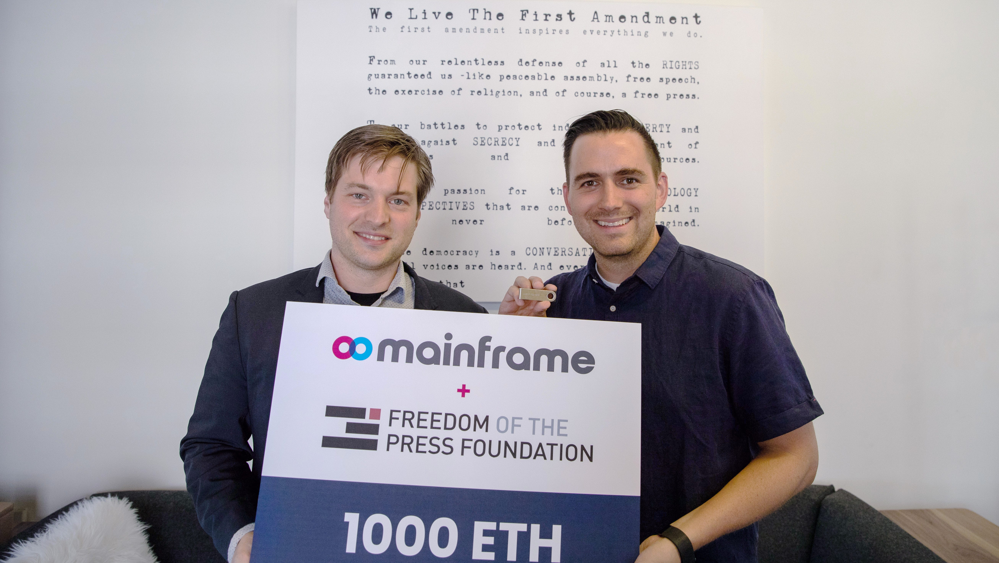
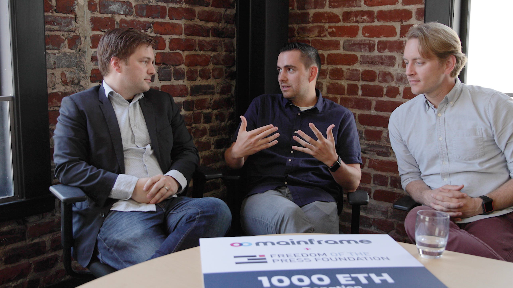

# Freedom of the Press Foundation & Mainframe

Freedom of the Press Foundation & Mainframe

### Why we donated 1000 ETH to Freedom of the Press Foundation and what it means

<iframe width="560" height="315" src="https://www.youtube.com/embed/f0YlYi6nEgo" frameborder="0" allowfullscreen></iframe>

As everything in our lives becomes more digitized, we’re faced with a choice: will we be masters of our tech, or will our tech be used to control and exploit us? Recent history suggests the latter, in the form of mass surveillance, data collection, manipulation, and censorship. But the war’s not over yet. We’re at a historic crossroads, and the choice will be ours to leverage technology to either save privacy and security, or see it float away as a fleeting memory.

**That’s why we’ve made the decision to donate part of the proceeds from our [*Proof of Heart *campaign](https://blog.mainframe.com/1-4m-raised-for-charity-in-proof-of-heart-423e98a05992) to the [Freedom of the Press Foundation](https://freedom.press/)!** Working closely with journalists, activists, and whistleblowers, including Edward Snowden, they’re on the frontlines in this battle. This donation stems from the mutual goal to fight not only for a free press, but for a free people in a digital age: free from the chains of censorship, free from the tyranny of unchecked surveillance, and free to use our data how we want.

*Trevor Timm (Freedom of Press) and Mick Hagen (Mainframe)*

We admire Freedom of the Press Foundation’s passion and approach to these problems. Public advocacy becomes that much more powerful when coupled with innovation and better choices. Both organizations plan to work towards the mutually beneficial goal of tipping the scales in favor of the fight for freedom of information.

In truth, this legendary donation would not have been possible without the backing of our community — you helped us raise a whopping [$1.4 million](https://blog.mainframe.com/1-4m-raised-for-charity-in-proof-of-heart-423e98a05992) in the name of freedom of speech and information! With the Foundation so aligned with our own values, we decided on them for our first donation — 1000 ETH, which is actually the first major cryptocurrency donation in Freedom of Press Foundation’s history!

Freedom of Press was blown away by the generosity of our community, and they’re excited that Mainframe shares such a strong commitment to protecting freedom and privacy. Our aim is to build technology that is invaluable for organizations like theirs and other groups focused on preserving individual rights and liberties.

Here’s some more of what this donation means:

* This community donation will support the Foundation’s ongoing efforts in defending press freedom and promoting digital security, as well as help the Foundation to explore the potential to combat censorship and data compromise through decentralized technologies.

* We will seek feedback from the Freedom of the Press Foundation team, as well as other free expression and privacy experts, to better address the problems related to privacy, surveillance, and censorship.

* As we continue to build our product, we will give Freedom of Press Foundation early access to test new features and functionality of the platform. Having more eyes on our globally disrupting technology will improve security and privacy throughout the network.

We are committed to making the Mainframe network widely available to whistleblowers, journalists, and their sources for use, to provide more private and censorship resistant channels that they can rely on to carry out their sensitive work. We hope this donation to Freedom of Press Foundation will kickstart an ongoing relationship to preserve these ideals amidst the evolution of the digital landscape.

More than anyone, it was Edward Snowden who shined a light on how broken today’s networks have become. So it couldn’t be more fitting that we support the organization he’s working with to change that. We hope to continue to support Freedom of Press Foundation in the years to come as we all work to build a freer, more decentralized future!

This key donation is exciting for Mainframe — another step in an unrelenting drive towards employing our protocol for real use cases with real-world impact, strong enough to transform the world.

Keep an eye out for further developments in regards to our [*Proof of Heart](https://blog.mainframe.com/1-4m-raised-for-charity-in-proof-of-heart-423e98a05992) *campaign donations.

Source: https://blog.hifi.finance/freedom-of-the-press-foundation-mainframe-6ffb39918503
