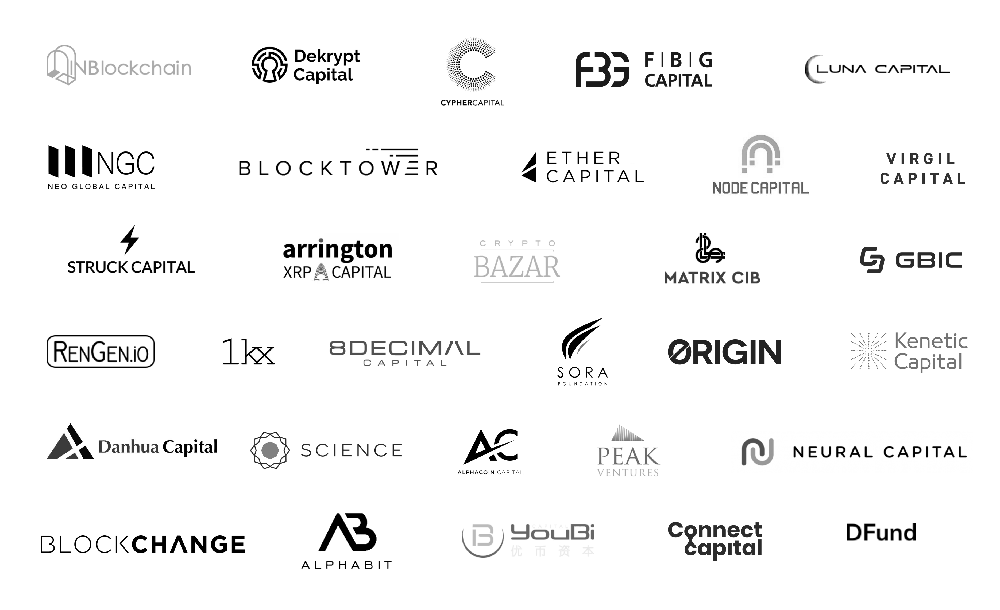
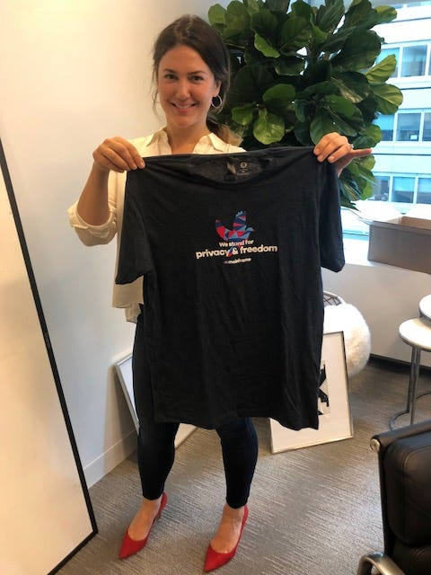

# Pre-Sale Partners: Funds & Angels

Pre-Sale Partners: Funds & Angels

### This is part 2 and 3 of our [four-part series](https://blog.mainframe.com/introducing-the-mainframe-pre-sale-partners-4b0b0bf74ac) highlighting some of our pre-sale partners. Read [Part 1](https://blog.mainframe.com/pre-sale-partners-media-personalities-f23e7549d932).

We’ve partnered with some amazing funds and angels. The full list is simply just too long to share but we’ve highlighted a few of them here. This lineup of strategic partners includes traditional VC powers like [Michael Arrington](http://arringtonxrpcapital.com/), alongside a Who’s Who of the biggest players in crypto: [BlockTower](https://blocktower.com/), [FBG](https://www.fbg.capital/), [NEO Global](http://ngc.fund/), [Kenetic](https://kenetic.capital/), [Danhua](http://danhuacap.com/), [GBIC](https://gbic.io/), and many more.

## Funds

All got small fractions of what they wanted. But we refused to let any one entity, no matter who they were, to be able to assert any sort of control. Below are a few of the more prominent funds involved.

*Kevin Rose*

## Angels

Some of the Angels backing us include:

* [Kevin Rose](https://en.wikipedia.org/wiki/Kevin_Rose) — founder of Digg, a legend

* [Meltem Demirors ](https://twitter.com/Melt_Dem)— thought-leader and prolific investor in crypto, previously DCG

* [Keisuke Honda](https://en.wikipedia.org/wiki/Keisuke_Honda) — the best football player in Japan

* [Stefano Bernardi](https://twitter.com/stefanobernardi) — Founder of [Token Economy](https://tokeneconomy.co/) Newsletter

* [Evan Cheng ](https://www.linkedin.com/in/chengevan/)— Director of Engineering at Facebook, previously Apple

* [Gil Penchina](https://www.crunchbase.com/person/gil-penchina) — legendary angel investor from Silicon Valley

* [Yasmeen Drummond](https://www.linkedin.com/in/yasmeen-drummond-a69a0121/) — Co-founder of Women in Blockchain

* [Blake Mycoskie ](https://www.linkedin.com/in/blakemycoskie/)— Founder of TOMS shoes

* [David Wachsman](https://www.linkedin.com/in/david-wachsman-a3a84652/) — Founder of Wachsman PR

* [Ed Roman](https://www.linkedin.com/in/ed-roman-19686/) — Founder of Hack VC

* [Miko Matsumura](https://www.linkedin.com/in/mikomatsumura/)

* [Binh Tran](https://www.linkedin.com/in/binhqtran/) & [Tim Chae](https://www.linkedin.com/in/timchae/) — both are partners at 500 Startups

* [Yiseul Cho](https://www.linkedin.com/in/yiseulcho/) — cofounder of Hashed

*Meltem Demirors*

<iframe src="https://medium.com/media/be277eccf9518735108f965b95cd553d" frameborder=0></iframe>

## A few of our existing shareholders

* [Data Collective](https://www.dcvc.com/)

* [Pritzker Group](https://www.pritzkergroup.com/)

* [Techstars](https://www.techstars.com/)

* [Hoxton Ventures](https://www.hoxtonventures.com/)

* [FFVC](http://ffvc.com/)

Source: https://blog.hifi.finance/pre-sale-partners-funds-angels-729a48571f10
