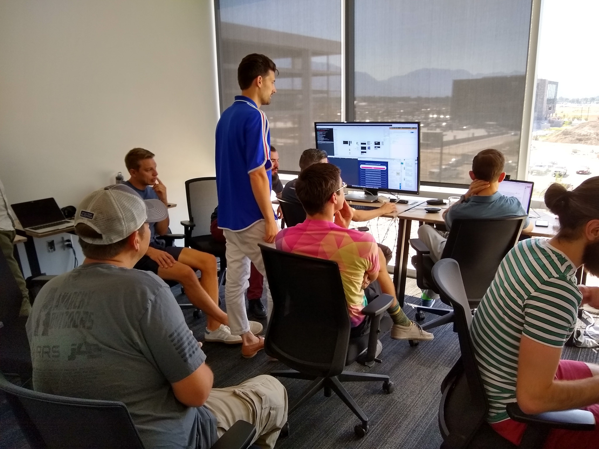

# Claiming Your Global Airdrop

Claiming Your Global Airdrop

With so many tokens coming online, airdrops are a big part of the crypto space today, but *nobody* does an airdrop like Mainframe! We’ve built something of a [reputation](https://www.forbes.com/sites/shermanlee/2018/07/03/the-champions-of-crypto-who-are-the-titans-driving-mainstream-adoption/#29aad41c5988) with [our physical airdrop events](https://blog.mainframe.com/crowdgift-phase-1-proof-of-being-3591a7f52475). Leading up to our [token generation event](https://blog.mainframe.com/mainframe-token-generation-event-ad775f509871), we wanted to make sure people who *really* wanted MFT could get it, so we [found](https://blog.mainframe.com/crowdgift-phase-2-proof-of-freedom-5148b4b44be0) [other](https://blog.mainframe.com/crowdgift-phase-2-proof-of-freedom-wrap-up-89c59b20688c) [creative](https://blog.mainframe.com/crowdgift-phase-3-proof-of-heart-6e6c1557610) [ways](https://blog.mainframe.com/1-4m-raised-for-charity-in-proof-of-heart-423e98a05992) of getting it out in the world. But as we got closer to the actual distribution, we made *one last push* to offer MFT to anyone, anywhere, so they could be part of the Mainframe movement. That’s why we created the [Global Airdrop](https://blog.mainframe.com/global-airdrop-european-tour-update-a5a16059e7cf), a virtual airdrop for everyone, with no physical attendance required, as simple as we could make it.

The response to our Global Airdrop registration was overwhelming! We had *hundreds of thousands* of registrations. But there was some work still to be done on our side. Some registered with incorrect or incomplete information. Some had not joined our Telegram channel by the deadline. And many had taken advantage of the simplicity of our process to automate registration in order to get a bigger piece of the pie. One Telegram account registered over *36,000 times *for the airdrop! In the spirit of decentralization, we’re doing our best to push back on this. After processing all of the entries and removing duplicates and automated registrations, we’re finally ready to send. The delay was unfortunate, but necessary. And after the post-registration processing, we know the amount each recipient can look forward to: 25 MFT.

With that much in hand, a user will be able to stake [Onyx](https://mainframe.com/onyx), the [first application on the Mainframe network](https://blog.mainframe.com/mainframe-pre-alpha-release-fca532317111) ([see demo here](https://youtu.be/eaQyE8m9pKk)). Users should be able to test the network for *weeks* without topping up.

Our engineers from across the globe are all* *at the Mainframe home office for the next couple weeks so they can problem solve, collaborate, and meet our next milestones uninterrupted by time-zone differences. It won’t be too long before you can fire up your own Mainframe node, and even start coding your own unstoppable decentralized applications to deploy on the Mainframe network.

*Battle stations ready ⚔️🛡️*

Claiming your MFT is about as simple as when you registered.
Here’s what you need to do:

1. Click here 👇 to be taken directly to the *Official Mainframe Bot:*
> # [https://t.me/MainframeBot](https://t.me/MainframeBot)

2. Some users will undoubtedly choose to search the bot out themselves instead of using the above link. If that’s the case for you, search for our official bot on Telegram by typing “*Official Mainframe Bot*” in the search box on Telegram. Find the correct avatar and *unique username* (see below). The correct bot will have the unique username of ***@MainframeBot***, which is distinct from the display name of “Official Mainframe Bot”.

***IMPORTANT: Verify the bot username matches *exactly* *@MainframeBot****

3) NOTE: Let’s discuss what will NOT happen during Global Airdrop redemption. The Official Mainframe Bot will ***not*** ask for your email address, or your ETH address, or **ANY INFORMATION WHATSOEVER**. The redemption process asks you *only* to click and confirm information we already have. If a bot asks you for further information to receive your MFT, it is a fake, and you’re being scammed. Start over and find the correct bot if this happens.

4) After navigating to the correct bot, then click “*Start”* in the chat field.

5) Follow the instructions and link given by the Official Mainframe Bot to confirm your ETH address and enter the global airdrop distribution queue.

We’re thrilled to see this movement grow. Many on our team have been in the crypto space for years, and there’s something we’ve each independently learned: as critical as solid technology is, it’s the strength of the *community* that will drive adoption forward. And we’re thrilled to have you as part of this movement. We couldn’t do it without you.

Source: https://blog.hifi.finance/claiming-your-global-airdrop-616da51fca8a
