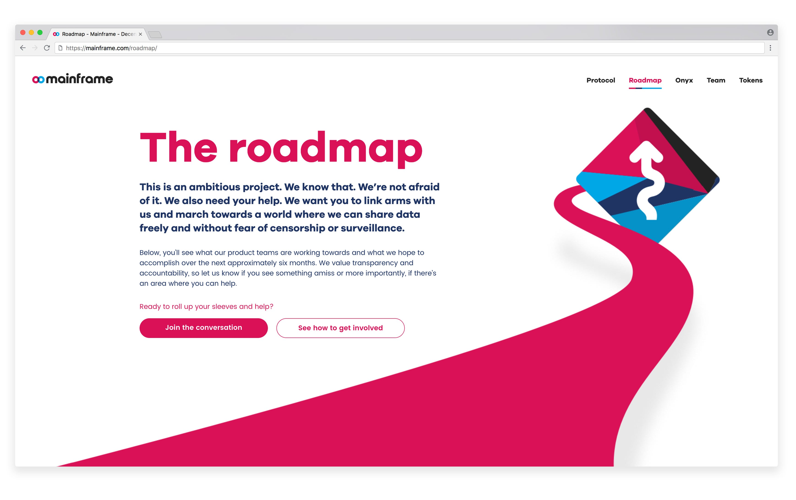

# Announcing the Mainframe Roadmap

## Announcing the Mainframe Roadmap

*UPDATE: Head of Product Cahlan Sharp will conduct an AMA [on our Telegram channel](https://t.me/MainframeCommunity) this coming Monday, 11:00 AM Mountain Time.*

Since last year, our product teams have been heads-down building the infrastructure and layers of Mainframe, the web3 platform for unstoppable applications. There is plenty more to do, but we’re hungry and ready to push blockchain technology to new limits and build something unprecedented. Brick by brick, we’re laying the foundation for a new internet.

We also know that we’re not in this alone. As we’ve collaborated, discussed, and met thousands of you all around the world, we’ve been continually impressed with how willing and eager our community is to support and help our efforts.

We’re excited to share our plans and progress with you. This week we announce some exciting things coming out of our product teams. These efforts will work towards two ends:

1. Increase transparency with what we’re building so we can more effectively communicate our mission and how we’re working towards it

1. Provide channels where we can engage with our community to gather information, listen to feedback, and mobilize willing developers to help us solve the difficult problems

So, here goes.

## Roadmap

We’ve been very thoughtful with how we’re approaching the roadmap. We want something that accurately and transparently communicates our status and current challenges but also doesn’t oversimplify or overstep what we can realistically predict given the stage we’re at in the blockchain industry and where we’re at as a company.

So today we announce our roadmap, which you can see at [https://mainframe.com/roadmap](https://mainframe.com/roadmap)

This is a living, breathing document that will update and change as we tackle new initiatives, run into snags, and re-evaluate our strategy and tactics. As you look through it, you’ll notice how the roadmap’s structure contributes to that goal:

1. **We define milestones**. We’re focused on delivering value. These milestones are exciting, ambitious goals we’ve set for ourselves as we cut our way through the jungle.

1. **We communicate sequential progress**. To the best of our ability, we’ve tried to look into the future to understand what comes after what we’re working on now. This is as much art as science (maybe with some fortune telling mixed in), and it will change as we blaze new trails and find new challenges. We represent these steps as checkpoints on a map (see below).

3. **We provide context and granularity**. Without being overly technical, we give as clear a picture as we can as to what each of our teams are working on. Why? So you know and so you can get involved. Which brings up our next point.

We’re very excited about our roadmap, and we’ve included plenty of links and places for you to engage with and collaborate with us.

## Roundtables and Show-and-Tells

With blockchain being a nascent industry and with our need to communicate and engage community, we’ve decided to put significant effort in our community-facing efforts.

### Weekly Roundtable

This is a weekly, open meeting where we discuss what we’re working on and what challenges we’re facing. Our first is scheduled for [August 23](https://hangouts.google.com/hangouts/_/mainframe.com/mf-roundtable) at 15:00 GMT, mark your calendars!

### Show-and-Tell

We’re also going to be showing off our work, initially on a biweekly basis, in what we’re calling “Show-and-Tells.” Each team will have the opportunity to showcase what they’re working on. We’ll produce and release videos of these sessions for the world to see on our [YouTube channel](https://www.youtube.com/channel/UCOhQaYVAUypRWHucouG3Sjg).

### (At Least) Monthly Updates

We’ll also continue to publish updates on our blog, and we’re increasing our technical and product perspectives there. So you’ll have much more to learn and understand about where we are and how you can get involved.

## How You Can Help

This is a major undertaking and we’re up to the task. But we invite everyone to join us as we forge the web3 future. Here’s how you can get involved:

### Work with us.

Check out our [jobs page](https://mainframe.com/jobs/) and see where you fit. We’d love to talk to you.

### Code with us.

Check out our [Github repositories](https://github.com/MainframeHQ) and see where you can jump in.

### **Listen in on our roundtable.**

We’re holding a weekly [roundtable](https://hangouts.google.com/hangouts/_/mainframe.com/mf-roundtable) where you can get an inside look at what we’re up to and which issues we’re tackling.

### Watch our latest Show-and-Tell.

We’ll release our first Show-and-Tell very soon. Watch our [YouTube](https://www.youtube.com/channel/UCOhQaYVAUypRWHucouG3Sjg), blog and social media channels to be notified of new videos.

### Read up on product updates.

At least once a month, each of our teams will release an update. Keep watching our blog for those updates as they arrive.

### Join the discussion.

Be a part of either our [threaded](http://community.mainframe.com/) (Discourse) or real-time [discussions](https://gitter.im/MainframeHQ/Lobby) (Gitter). Get your questions answered and share your ideas with us.

## What’s Coming

We’re looking forward to releasing our initial documentation, developer portal, and a lot of other updates.

We’re just getting warmed up. We couldn’t be more excited about what we’re building, and now what we’ll be building together. This will revolutionize how we connect and interact with the internet and its applications. It heralds a return to the web’s decentralized roots — and the beginning of a brighter world, the future of the web, and the future of freedom.

Source: https://blog.hifi.finance/announcing-the-mainframe-roadmap-4e2ad31e5a37
