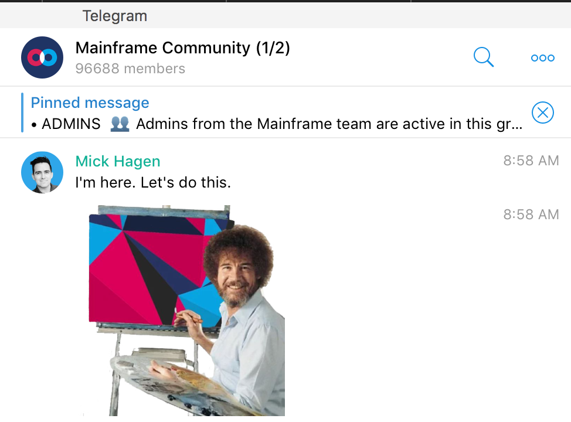

# Community AMA with Mick Hagen

Our founder Mick Hagen found some time in between meetings and recruiting to swing by our Telegram today for a community AMA (Ask me anything). Here are some of the highlights:

*Mick has arrived.*

**Responding to a fan from China *Kelvin Yao* if we should pay more attention to the Chinese community,** Mick says:* “We very much value our Chinese community and actually planning to come back and visit soon. Do you have ideas on what more we can do? I’d love to hear your thoughts/ideas. We are also gonna start doing more translation around our content/videos and will be publishing more on Chinese-specific social media.”*

**A member of our community *Ygg Drasil (Advanced Chemistry) *who is testing out Onyx in asks when we will be able to host nodes and if there will be more nodes in Germany.** Mick responds: *“Of course you will be able to host nodes. We will have more on this in the coming months. Not ready to announce anything yet. But if you’d read our white paper you’ll know that nodes are essential. And you’ll be incentivized and motivated ($MFT) to run nodes.”*

**Astronaut *Jake A* asks “When moon? (kidding, please don’t ban me!) :) Hi Mick. Can you expand on the Ambassador program that David Sun mentioned last week?” **Mick briefs him on our space program: *“I always have my astronaut outfit ready. We are starting to work more closely with our ambassadors and there will be more details coming soon. But we’re building a global community and we will work closely with the ambassadors to help lead it.”*

***Maverick* asks: “Can u share on the type/ domain of companies you are trying to partner with”,** and Mick replies: “*Wide range. Non-profit orgs. Activist groups and political dissidents. Big enterprises who need more privacy and security. Governments who want to protect their state secrets.”*

***Christoph* asks why the token price has not been holding up in this crypto bear market** and Mick responds: “*Tough market. We are focused on building real tech and real value and solving real use-cases. Token price will take care of itself. Brick by brick we’re building something really special here. That will take time. There will be peaks and valleys in the market. We try to not dwell too much on that.”*

**A philosophical member of our community *Slingshot* asks “Untracable communication can be used for good and bad things. Is there something you are doing so that it’s more for good things or do you leave that entirely up to the user?”** Mick replies:** *“**We have this discussion often internally. We’re building a new layer of the web — where privacy and freedom are built in. In a way, creators of a new http. As with the internet today, there will be good and bad actors. But universally I think we all believe overall the internet was net positive. But you probably aren’t satisfied with that answer. So I’ll go deeper. We’re working on identity and reputation management which should help mitigate a lot of these issues. But we will continue to do our part in encouraging positive and good use-cases.”*

***Jake A* asks: “Will $MFT have an ecosystem fund for projects building on top of it? I.e. a $MFT ecosystem VC/grant system that awards money or invests in third party developers who want to build projects that want to expand on or build projects using $MFT?”** Mick replies: *“Great question. We’re having a lot of discussions around this. IMO, grants and bounties and investment are good, but not sustainable. Yes, we’ll do that. Yes, that will help kickstart development. But what next? What will keep developers building and improving their dApps? What will allow them to get paid and rewarded on an ongoing basis? What will feed their family and pay their bills? How do we break out of the weekend hacker? How do we get serious development on our platform? Entrepreneurs. People who want to build serious businesses. There needs to be something bigger, something more substantial. There needs to be a paradigm shift in how developers can create sustainable models. We are exploring this deeply and something I care deeply about. It’s one thing to build a fun tool that people can tinker and experiment with. It’s another to enable a whole new ecosystem where entrepreneurs and developers can build decentralized empires on, and get wealthy in the process. This world is all about incentivization. People need to be properly incentivized to not just start building a dApp, but also to continue to improve and innovate on that dApp. There needs to be a sustainable model. This is a wonderful opportunity for Mainframe!”*

**Local *CryptoGod* asks: “Can you give the community a general idea when you think a new DAPP will be available on your network?”** Mick replies:* “One of our focuses is to cultivate and build our developer ecosystem. We want to focus on the platform, the network and the infrastructure. We want to work with developers all over the world to create the next set of dApps. See my answer above on how we’re thinking about incentivization. But we don’t want to be in the business of creating dozens and dozens of dApps. We want to make sure the underlying protocols and tools and platform are strong and enable them to build strong, sustainable, decentralized and unstaoppable dapps.”*

***Gbouy* asks: “Good work Mick, am hooked even if I just staked some coins post ICO. Any incentives for staking coins?”** Mick replies: *“When we release more about our Mainframe nodes, this will become more clear on why this important and how this works. If you read our WP you’ll learn more about the Swap, Swear and Swindle protocol on how staking is involved. Incentivization layer isn’t just about rewarded good behavior, but also penalizing bad behavior. Staking an important component.”*

***Maverick* asks when we will have a KRW (Korean Won) pairing for our token MFT. **Mick says: *“Korea is a place where we believe we can build a strong community. It’s a focus. We will visit there more often, do meetups, events, and work with partners there. So you can be sure that we want to make it as easy as possible for people there to gain access to $MFT”*

***Judith Polgar *asks if Mainframe will have it’s own blockchain one day. **Mick responds: *“We have not ruled this out. We discuss it internally. If we need to fork an existing blockchain or create our own out of necessity (more privacy features), then we will do this. It’s within possibility. But the important thing to note here is that we want to deliver real value as soon as possible. So we will leverage existing tech and tools to demonstrate value as soon as we can. We don’t need to build and invent and create everything. There are so many others in this ecosystem who we can partner with to achieve our vision and goals. We already have plenty to build. Plenty of work. No need to re-invent wheels unless they are absolutely necessary.”*

***Maverick* asks if there are any announcements coming this month**, and Mick responds: *“Generally our philosophy is that we are in a marathon, not a sprint. Brick by brick we are building a new foundation of the web. We will be publishing a very interactive, living, breathing roadmap very soon and you’ll be able to see us build this, day in and day out. You will see our progress, as detailed or as high level as you want. We don’t want to be working heads down for a year and then come out with some massive, big announcement. We want to work closely with our developer community, understand their needs, engage with them on a daily basis, and make sure we’re building for real use-cases. This will be open, transparent, and not filled with hype. For those looking for some crazy announcement that will create some big pump, you looked in the wrong place. This is a team focused on the tech and focused on solving real problems.”*

***Slingshot* asks: “real value for people comes from developers building useful dApps on Mainframe. How are you going to get many great dApps in the near future?”** Mick replies: *“Great question and something I think about a lot! Here are the things I think are needed:
1) our platform needs to unlock functionality for dApp developers that they simply can’t get anywhere else (privacy features, decentralized, unstoppable, etc)
2) our platform needs to be incredibly easy to use, simple, great documentation, sdks, etc
3) ideally there is a community, easier distribution (people to use your dApp) — this is one reason why we need a strong flagship dApp to attract users into our ecosystem
4) needs to have financial incentive for developer to build on our platform. I’ve already spoken about this earlier: t.me/MainframeCommunity/243651 Each of those merit their own discussion. But those are high level.”*

***std::cout* asks if we will have a token burn. **Mick replies: *“Everyone here needs to understand that this project is not like any other project. This is something special. Something that will fundamentally change how everyone connects and interacts with the internet, and with applications. This is not some fly-by-night project. Changing the world takes time. Unlocking true privacy and freedom takes time. I’m confident that anyone who sticks with us long term will be very happy. Anyone who is super short-term focused… I’m sorry maybe this isn’t the project for you.”*

***Adam *asks: “Has mainframe thought about collaborating with an entity delivering free wifi capabilities and such, like Galactic Sky?”** Mick says: *“Not yet. But we definitely know some mesh networking projects well like RightMesh and Open Garden (this one my favorite)”*

***Andrew *asks: “Jackson Palmer recently had a video where he appeared to say blockchain-file-storage solutions are likely prohibitively expensive, do you think MFT might have a similar issue, and perhaps only be useful/affordable by governments etc?”** Mick replies: *“Our observations with what we’re seeing with early proof of concepts with Swarm is that it’s actually quite affordable and smooth. Not seeing significant overhead in our swarm tests. People will always choose cheapest storage solutions assuming equal quality of service. Large providers will likely even start hosting decentralized service solutions since they have economies of scale.”*

***Jake A* says: “It isn’t a question, but more of a comment. I’ve put some money on this and I support your project. I really hope you guys remain mindful of how important marketing and incintives are. I know a lot of people call it ‘shilling’ or ‘hype’, but this is a very emotional and very young market. I’ve watched a lot of my portfolio disappear from another project that was hell bent on a ‘Build-it-they-will-come’ mindset that crypto doesn’t have yet. In 10 years, it will be different, but for now it is 100% speculation. I think there’s some balance between a Justin S. approach and a Min K. approach and I hope that you can strike that balance. Thanks again for taking the time to do this, I know you folks are busy.” **Mick replies: *“We put out a lot of content. We do great marketing. We will continue to do this. We aren’t gonna bury our heads in the sand at all. We will continue to work hard to share our journey, our progress, our challenges, and be very external about this whole process. We will be out there. Marketing. Public. Community. Somewhere between Justin S and Min K is I think where we’ll land. Great communication and marketing, but also real substance and tech behind it.I have to run into another meeting right now.*

*Let’s do this more often!*

*If you don’t grind, you don’t shine. Let’s do big things together.”*

Our next AMAs will be announced on Twitter or Telegram announcements. It might take place on [Reddit.com/r/mainframehq](http://Reddit.com/r/mainframehq) as well. Please subscribe for permanent discussions and news updates.

*And that’s all for this week folks!*

Source: https://blog.hifi.finance/community-ama-with-mick-hagen-5354b6db51f2
