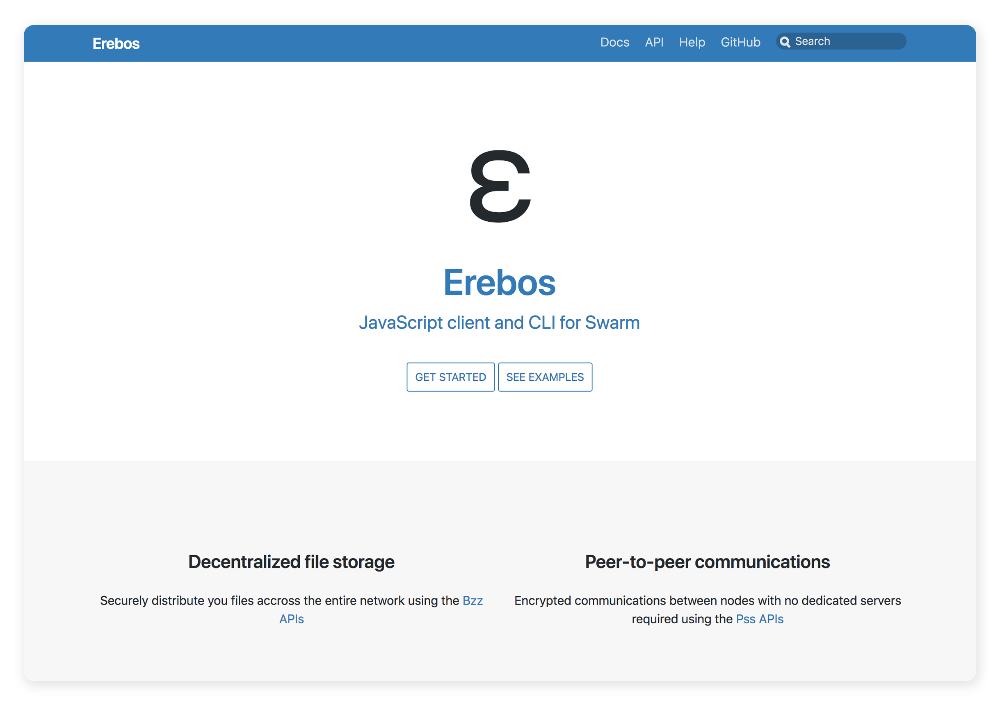

# Introducing Erebos — a JavaScript client and CLI for Swarm

Erebos is a new JavaScript client library to interact with Swarm file storage (bzz) and communication (pss) APIs.

## What is Swarm?

As presented [in its guide](https://swarm-guide.readthedocs.io/en/latest/),
> Swarm is a distributed storage platform and content distribution network, a native base layer service of the Ethereum **web3** stack.

You might see it as an alternative to [IPFS](https://ipfs.io/) as they share some of the same objectives, even though Swarm started as a project from the Ethereum foundation aimed to support storing the Ethereum blockchain data in a distributed storage, before trying to support wider application use cases.

## From Swarm to Erebos

At Mainframe, we’ve been experimenting with Swarm for about a year now, first in the [Onyx](https://github.com/MainframeHQ/onyx) messaging prototype we presented at Devcon 3, and later in other projects.

While Onyx was at first interacting with Swarm directly, we started extracting this logic into a separate library we could use in other projects and have recently given more focus on making available for the community: [Erebos](https://erebos.js.org).

Erebos provides a set of tools to interact with Swarm:

* Standalone APIs for file storage and communications.

* Platform-specific APIs, such as the ability to interact with the filesystem when using node.

* Both a browser-specific and a node-specific clients.

* A command-line interface.

### What does it looks like?

The [documentation website](https://erebos.js.org) includes [some simple examples](https://erebos.js.org/docs/examples), and for a more complex use of the communication features, you can check our [SwarmChat prototype app](https://github.com/MainframeHQ/swarmchat/tree/master/dapp).

## Current features

### [File storage APIs](https://erebos.js.org/docs/api-bzz)

The current implementation allows to upload and download files using Swarm’s infrastructure, along with other utility functions.

When using node, [additional APIs](https://erebos.js.org/docs/api-bzz#node-specific-apis) are provided to interact with the filesystem.

### [Communications APIs](https://erebos.js.org/docs/api-pss)

Swarm exposes encrypted datagram-based communication primitives, that are usable when connecting Erebos over a WebSocket or IPC connection.

These APIs allow consumers to implement secure communications between nodes based on public-key cryptography and addressing in the Kademlia network used by Swarm.

### [Command-line interface](https://erebos.js.org/docs/cli)

Erebos provides a simple CLI using the file storage APIs, allowing to simply upload and download individual files or entire folders.

## Future plans

Swarm is a very active project with lots of exciting new features on the roadmap that the Mainframe team is eager to bring to Erebos and hopefully help the web3 community.

Contributions from the community are more than welcome in our [GitHub repository](https://github.com/MainframeHQ/erebos), and don’t hesitate to come by our [Gitter channel](https://gitter.im/MainframeHQ/erebos) if you have any question!

### Swarm links

* [Documentation](https://swarm-guide.readthedocs.io/en/latest/)

* [GitHub repository](https://github.com/ethersphere/go-ethereum)

* [Gitter channel](https://gitter.im/ethereum/swarm)

### Erebos links

* [Documentation](https://erebos.js.org)

* [GitHub repository](https://github.com/MainframeHQ/erebos)

* [Gitter channel](https://gitter.im/MainframeHQ/erebos)

Source: https://blog.hifi.finance/introducing-erebos-a-javascript-client-and-cli-for-swarm-356a59595916
