# Just #Buidl: Eth San Francisco Hackathon

I just had one of the best weekends of my professional career.

One of my strategic priorities at [Mainframe](https://mainframe.com/) is to build a rich, thriving, developer community. And one of the ways to involve developers in our journey is the hackathon.

But I’ve never been to a hackathon.

Luckily, the ETH San Francisco hackathon was just around the corner. I became a volunteer to really be on the inside, behind-the-scenes. And what an amazing experience it was.

Here’s what I wanted to accomplish by volunteering for ETH San Francisco:

1. Add value and proactively help the ETH Global team and ensure that things go smoothly. Add value wherever and however I can.

1. Learn how to plan and manage a hackathon.

1. Spend a ton of time with the developers and be in the trenches with them. Gain a better understanding for what is important to developers; what they care about; what gets them excited; what motivates them; and their viewpoint of community and what participation means to them.

So, for the next 2.5 days, I didn’t shower, slept under tables, and became part of the largest Ethereum hackathon in the world.

The weekend was a huge success — I learned a lot, made some friends, and brought home key learnings that will* **benefit the users of dApps built on Mainframe and the developers that build them***.

## The Calm Before the Storm

My day started on Thursday, the day before the hackathon. We did a lot of setup, including furniture, tables, linens, chairs, signs, workshop rooms, conference rooms, audio/video — everything.

**Lesson #1**: getting a facility ready for 1000 developers is a lot of work and the more hands that can help, the better. No work should ever be beneath you. Just get it done.

## Day 1

ETH San Francisco this year was held at the beautiful Palace of Fine Arts.

*ETH San Francisco 2018*

My shift began at 2 PM on Friday, and doors opened at 4PM. Developers had to be registered and pre-approved in order to enter, but what we didn’t know was whether all 1000 would show up at 4PM or whether it would be more spread out. We prepared for the former.

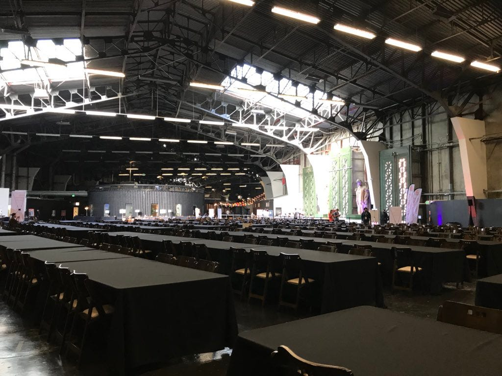

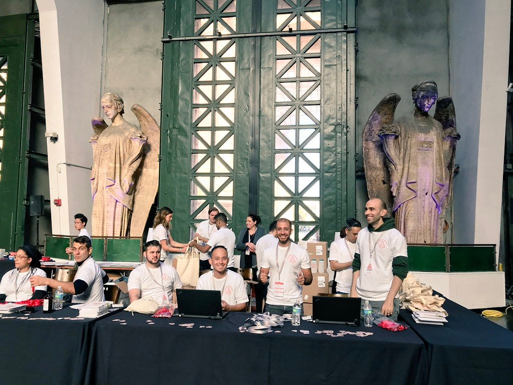

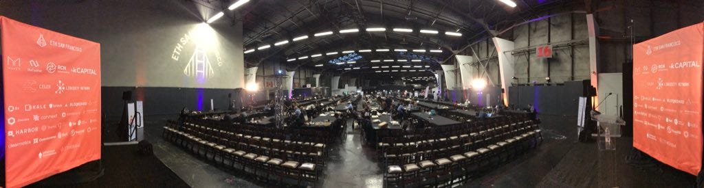*ETH San Francisco 2018, Calm Before the Storm*

Expecting a big rush of developers checking in right as the doors opened, we made sure that the check-in area was ready. So, we were trained on how to check developers in and to set up the flow from the door to check-in to finding a table. During the 2.5 days, the developers’ main job was to #buidl but to also learn from each other and to participate in workshops and classes throughout the 2.5 days on various topics from “How to Create your First dApp” to “What is Solidity”.

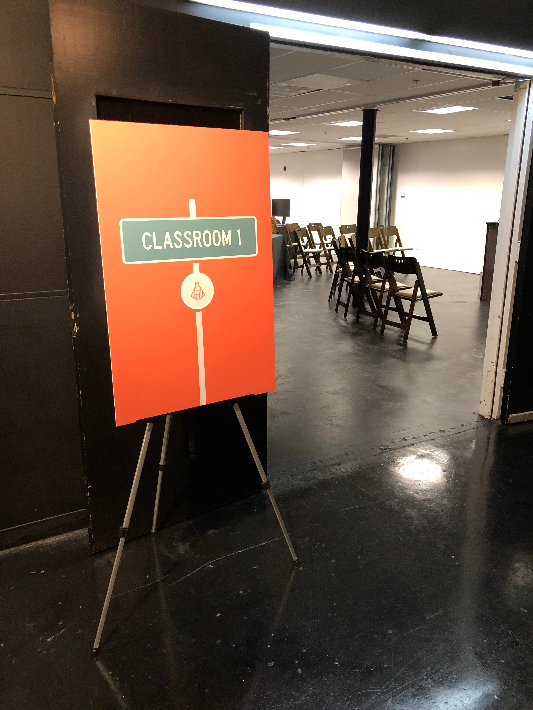

*Various signs at ETH San Francisco*

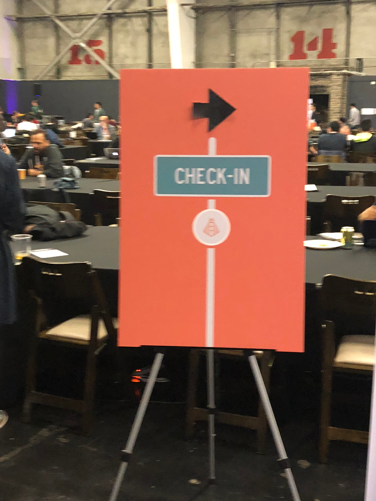

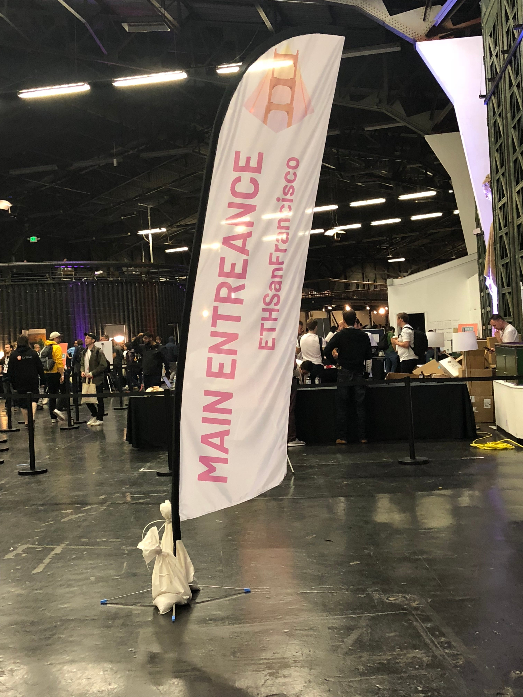

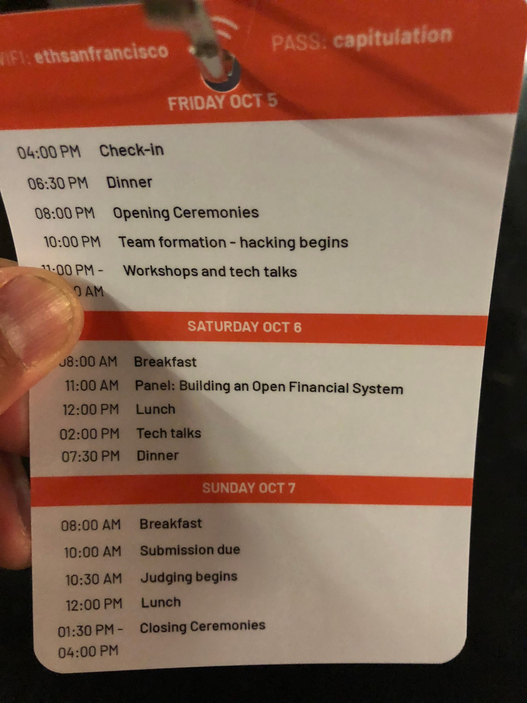*More signs and also our badge, which showed the Agenda and wifi password*

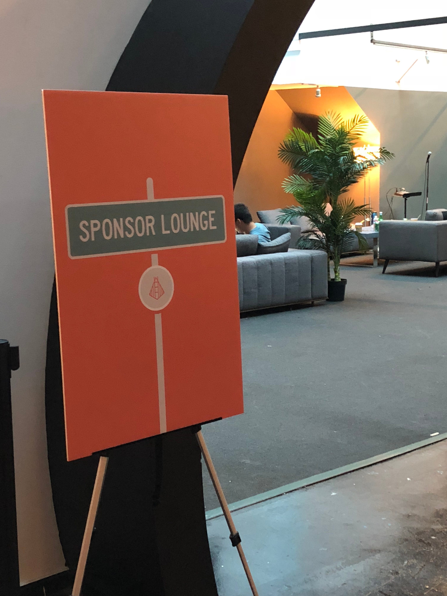

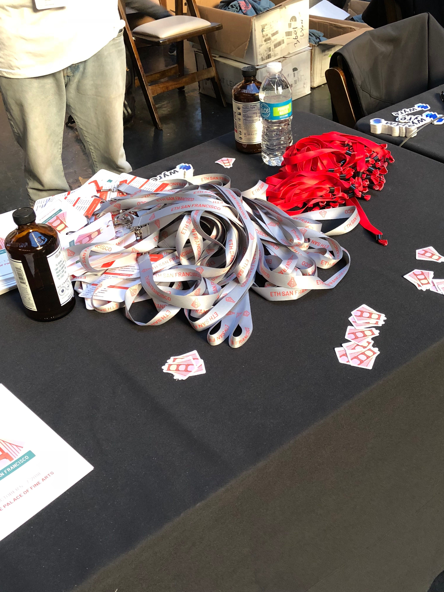

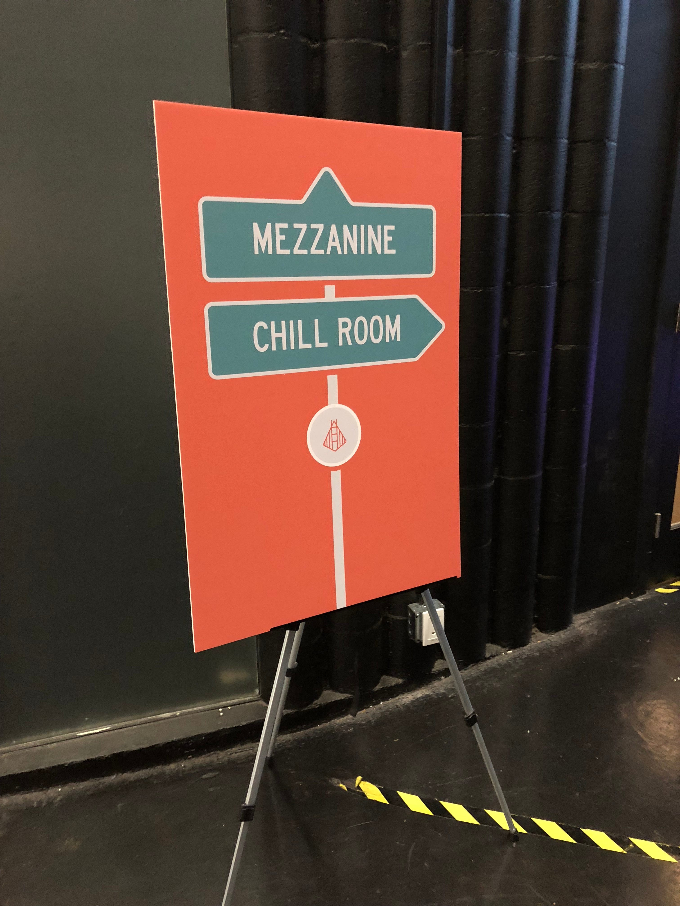*ETH Global Hackathon in San Francisco*

**Lesson #2**: The details matter.

Here’s an example: in front of the bathrooms, there was a table with first aid items, headache medicine, ear plugs, feminine sanitary items, and even deodorant — yes, deodorant. I guess after 2.5 days of little to no sleep and coding non-stop, body odor becomes an issue and the team at ETH Global anticipated this.

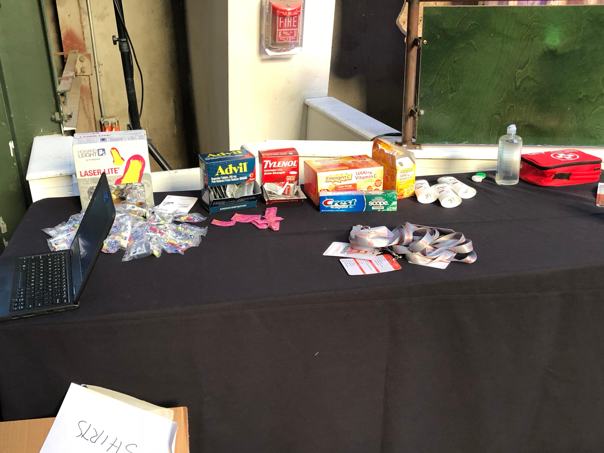

Finally, 4PM comes around and the doors open. Here come the developers!

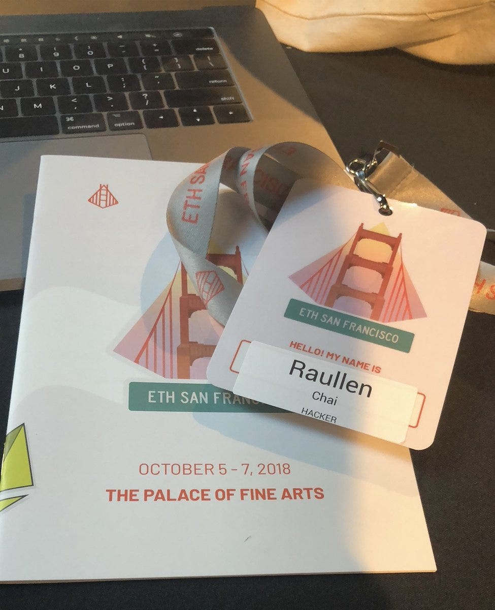

From 4PM to 10PM, the hackers just relaxed, walked around, had dinner, spoke with sponsors at the booths. At registration, we instructed them that they couldn’t start coding until after the opening ceremonies at 10PM.

Oh, and dinner was also served. I thought they’d be serving Pizza non-stop for 2.5 days but, no, they had pretty good food.

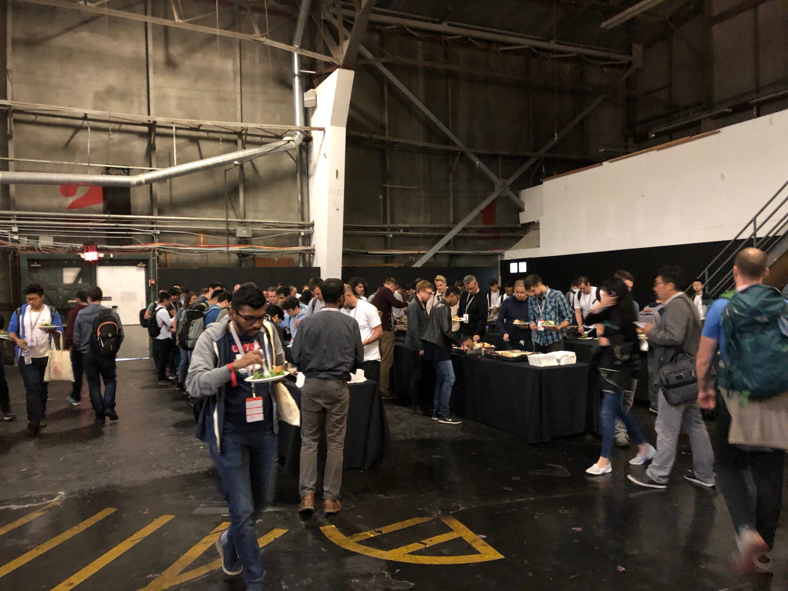

## Opening Ceremonies

The largest ethereum hackathon has begun!

At 10PM, the opening ceremonies started promptly. Evan Van Ness, an enterprise evangelist at Consensys and, Anna Rose, a popular podcaster in the blockchain space, were the hosts.

*Evan Van Ness and Anna Rose, ETH San Francisco 2018, Image taken from Twitter somewhere*

Joining Evan Van Ness and Anna Rose for the Opening Ceremonies was a panel consisting of Vitalik Buterin, Ethereum Founder, and Balaji Srinivasan, formerly of Earn.com and now the Chief Technology Officer of Coinbase, and moderated by Kartik Talwar of ETH Global and SV Angels.

*Balaji Srinivasan of Coinbase, Vitalik Buterin, Kartik Talwar of ETH Global and SV Angels*

After the opening ceremonies, each sponsor got on stage and explained what their protocol does and provided a wish list of what they’d like hackers to build. If the hackers chose to build on any of the sponsors’ platforms, then the team would be eligible for one of the prizes that the sponsor was offering.

*Rules of the ETH San Francisco Hackathon*

*Sponsors: Chainlink, POA, Celer, Dharma Protocol, Kyber Network, Loopring, Coinbase Wallet, The Graph, Bloqboard*

*Sponsors: 0x, Quanstamp, Connext, NuCypher, Consensys, Shyft, RCN, Maker Dao, Set Protocol, Bloom Protocol*

*Criteria by which projects would be judged*

*Agenda after Opening Ceremonies*

Hackers could be in a team of no more than 4 people. For the most part, most of these hackers didn’t know each other, so they had to socialize and become familiar with each other as they formed teams.

And the hacking begins.

Like little bees, everybody just got busy planning and building. But during the evening and the next 2 days, there were workshops and speakers. You can see the workshop titles below and notice the breadth of topics and the focus on building [1]. Even if the topic was specific to a platform or protocol, it was about actually building on it, nothing navel-gazing, self-promotional, or cheesy marketing. The focus is on building. I love that.

Throughout the night, besides doing my duties to help the ETH Global team, I walked around, spent time with developers in the trenches, and interviewed them, really trying to get into their heads.

*Peter Abilla and Loi Luu from Kyber Network*

## Day 2

Day 1 and Day 2 seem like a blur and indistinguishable from each other. I didn’t sleep much, but when I did, I slept under a table.

Besides workshops and more #buidling, nothing eventful happened except for this: Vitalik Buterin handed me a fork and a napkin.

*Peter Abilla + Vitalik Buterin*

I know what you’re thinking: “Pete, you should’ve said a ‘Fork’ pun or joke when you had the chance”. Believe me, I kicked myself for not having done so afterwards.

**Lesson #3**: Wifi needs to be super fast. Despite several announcements, many hackers still downloaded large files and some probably downloaded the entire ethereum blockchain.

**Lesson#4**: Needless to say, before attending a hackathon, make sure the hackers have any large files on their local machine and do not, if at all possible, download the entire blockchain. Send reminders to the hackers with suggestions of which large files should be on their machines before the hackathon.

## **Who Goes To These Hackathons Anyway?**

Here’s a quick cross-section of the people I met and their backgrounds.

* I met a Peter Thiel fellow. She asked me to watch her backpack while she went to the bathroom. Her project had something to do with medical records.

* I met several people that flew to San Francisco just for the hackathon. I met people from Turkey, Czechia, Germany, London, Canada (plenty of Canadians), and other places too — just for the hackathon.

* I met a guy that was a 62 years old game developer. As expected, his project had to do with a game — the non-fungible token kind.

* I met a designer from Denver.

* I met a mechanical engineer who works at Google, interested in learning how to develop on the Ethereum Blockchain.

One thing I noticed, which seems really obvious now but not at the time, was this: there aren’t very many females here.

**Lesson #5**: Variety and different backgrounds matter. Make sure attendees are developers, designers, and other backgrounds also (but they must know how to code) and make a really concerted attempt at recruiting females to attend the hackathon.

## **Day 3, Judgment Day**

All code had to be submitted by 10AM to be considered valid. All the project teams were also placed into sections where each section had 3 judges. Then the teams were to write down a short description on a placard for the judges.

*Large index card to write down project description for the judges*

I was fortunate enough to sit in on the the judges training — yes, they trained the judges on how to judge. Very thorough.

*A few slides for the judges*

And here’s the criteria sheet that the judges used to evaluate team projects:

*ETH Global, Judging Sheet*

## **Project Evaluations Begin**

The teams have 7 minutes each: 5 minutes to present and 2 minutes for questions. Below are the judges in the act of judging (*judges in motion*, to be more poetic):

*Vitalik Buterin, Dan Elitzer (IDEO), Yaniv Tal, Joey Krug, Simon de la Rouviere, Linda Xie, Yin Wu, Ethan Wilding, Siddharth Coelho-Prabhu*

*Robbie Bent, Kyle Samani, Mert Celebi, Bjorn Wagner, Cassandra Shi, Anna Rose, Mitch Kosowski, Avichal Garg*

*Eleazar Galano, Jeff Coleman, Vlad Zamfir (hiding behind that guy), Lasse Clausen, Cassandra Shi, Alejo Salles*

## The Finalists

At the end, there were 10 finalists.

**Lesson #6**: Judging at hackathons is a subjective process. But that’s okay. A few really important items that make for good business and good product management still apply in Blockchain.

* Does what you are building solve a current problem that, if solved, would really help users or enterprises? How?

* Does what you are building make use of the protocol in novel and new ways and help us see new possibilities in blockchain than we previously knew?

Each of the ten finalists qualified because of some novel innovation either in approach, use of technology, or a problem they solved. I’m going to do my best re-capping who won and use the description snippet used by the team to submit to Devpost. You can also try each dApp below by going to the [ETH San Francisco Devpost](https://ethsanfrancisco.devpost.com/submissions).

**SayToshi**
> SayToshi lets crypto influencers make money from their networks by selling access to their Twitter accounts. The SayToshi network is a decentralized social media manager, collectively deciding on what tweets to publish using primitives similar to a token-curated registry.

<iframe src="https://medium.com/media/950481fffb898a5650ffd6e746449c29" frameborder=0></iframe>

**SAFU**
> Safu is a browser extension that easily lets you keep track of your accounts. You can check the balance, get quick links and QR codes, copy the address, and securely store your keys. Chrome extension was built using Typescript, React, Redux w/ Sagas, Ethers.js, LESS, and a custom contract for balance queries.

<iframe src="https://medium.com/media/2da311f6dd0d4a38bfd4390c6c842c36" frameborder=0></iframe>

**Atomic XShard**
> Sharding is a natural way to scale the Ethereum Virtual Machine, and we try to show the feasibility of sharding by implementing a proof-of-concept of protocols previously only available in theory!

<iframe src="https://medium.com/media/cd1f166f9736a70ac10299a666fb98d1" frameborder=0></iframe>

**Harbeger Ads**
> Harberger taxes have been a hot topic since E. Glen Weyl’s new book Radical Markets and his paper published with Vitalik Buterin and Zoë Hitzig. It’s been described by Simon de la Rouvier as “an economic policy that aims to strike a balance between pure private ownership & total commons ownership in order to increase general welfare of society.”
> Blockchains provide great testing grounds for economic experiments like Harberger Taxes, so we’ve done just that using online advertisements to apply the concept.
> Harberger Ads is an ad serving utility that prices ad space using Harberger Taxes. Ad space can be purchased and tax is paid at a self assigned “property value”.
> Reasonable pricing is encouraged as each property is for sale at the set value. If priced too low (with the goal of avoiding taxes), the property could be bought unexpectedly. If priced too high, respectively high tax payments will follow. The model also allows a property lister to easily monetize a space without the complications of preset complex advertising pricing models and contracts, and without the need to work with a centralized high-commission marketing platform.

<iframe src="https://medium.com/media/56be856d42c32078b32b2cedfbcc1b10" frameborder=0></iframe>

**Gifty**
> Gifting friends crypto-assets is harder than it needs to be. Wouldn’t it be nice to send your gifts via SMS? Well now you can with gifty.gifty is an open protocol for sending redeemable vouchers for NFTs. Users can share NFTs from their wallets by sending a URL with scheme gifty://. The receiver can redeem the NFT by clicking on the link, which deep-links into the user's wallet application. Now, you can introduce your friends to crypto by gifting them a CryptoKitty! (=ↀωↀ=)

<iframe src="https://medium.com/media/73c619a462e7ab2d7dac5923a27794b1" frameborder=0></iframe>

**Sendput**
> Get your business expenses reimbursed faster. MVP was built on **Bloom** and **Dharma Protocol, **and **MakerDAO**. They integrated with 3 different protocols.

<iframe src="https://medium.com/media/6c86960fef0c054453e36d1e8def1ef2" frameborder=0></iframe>

**Kora**
> We’ve heard excellent theoretical dialogue around distributed “Governance”, but its time to shift the focus to building tools facilitating distributed decision-making in practice.
> Engaging all relevant stakeholders inevitably leads to better governance, stronger/loyal communities, and a diversity of insights fostering innovation. To align diverse sets of goals, varying stakeholder groups should remain informed about one another, and their participation in relevant decisions should be facilitated.
> The lack of structured discourse and debate forums that can enable distributed conversation and engagement hinders the subsequent decision-making process. An on-chain governance tool for structured discourse and dialogue, preceding voting and other signaling processes, enabled by structured decision-making templates that outline clear goals, expectations, next steps, and follow up. The goal is to encourage transparency, engagement, and discussion for all relevant stakeholders across the Web3 stack who are navigating the complex governance processes of crypto networks and project ecosystems.

<iframe src="https://medium.com/media/32b47046c0c06a29a2f06d7fec027728" frameborder=0></iframe>

**SplitterConverter**
> Suppose you hire me to build a FOMO3D clone for you, and offer me 10% of all profits forever. I don’t have an appetite for risk, so I want to receive DAI. Can this be done entirely in solidity? This project is a frontend that lets you deploy a SplitterConverter with a list of receivers, their percentage shares, and the desired currency they each want. Then, send ETH and/or DAI to the deployed contract address. When someone calls withdraw() on the contract, the ETH and DAI are converted and split according to the parameters passed in when the contract was deployed.

<iframe src="https://medium.com/media/0185457039fcd8f9989317c837f494a7" frameborder=0></iframe>

**CryptoPay**
> Blockchain is a revolutionary technology and it has the ability to transform businesses, with so much activity there is still a lot has to be done to make this technology mainstream, we are developing this MVP of CryptoPay which lets anyone accept payments in Crypto, we are using Kyber Network on chain liquidity and MakerDAO / $DAI stable coin to accept payments in Any token / Anywhere, using our Smart Contracts we automatically swap any ERC20 token to $DAI & ETH based on the user preferences, we also have a feature for users to Pay By Loan and Manager CDP (work in progress).

<iframe src="https://medium.com/media/49a91157a5baa1ea7774e9c3909883a7" frameborder=0></iframe>

**AugurPro**
> We love Augur, but the existing Augur UIs are not mobile-friendly. Also, they are designed to mimic trading UIs, whereas Augur should be able to also attract users that are more familiar with gambling odds and sports betting websites. Our user-friendly iPhone app allows you to: 1) view stats on featured Augur markets such as ETH at stake and market end date 2) view American-style betting odds on each market 3) click any market to see more information (including time-series pricing charts) 4) navigate to the most popular markets in a list of popular market categories.

<iframe src="https://medium.com/media/4221f7a849c4ec0f70907b7b1a0afcf9" frameborder=0></iframe>

## **Other Projects**

There were many other projects that didn’t make it in the finals. I tried to capture some of them.

*This was interesting. It’s a ballot voting machine using Bloom for identity.*

## What Comes Up, Must Come Down

Two and a half days later, it was time for us to take everything down. I was responsible for the “Chill Rooms”, which consisted of a bunch of air beds, blankets, pillows, and bean bags. Below are the blankets I folded and 15 air beds I deflated, folded, and stuffed into their case.

*Pete Abilla deflated 15 air mattresses and folded 30 blankets. Just for fun.*

## Conclusion

First off, again I want to thank ETH Global for such an amazing weekend. I also want to highlight several things I learned.

1. **A blockchain developer is pretty much just a developer**: One of my assumptions going into the hackathon was that most of the developers already had previous experience building on the ethereum protocol. This wasn’t true at all. In fact, most of the developers I spoke with and interviewed were normal, everyday, developers in the web2 world, but wanted an immersion into blockchain development.

1. **Amazing things can be built in 2.5 days**: I was impressed and shocked by some of the amazing things developers built in just two and a half days. It taught me that with ingenuity, hard work, time, talent, good mentors, magic can happen in a very short amount of time.

1. **Teams built on multiple protocols**: This was a key learning that I didn’t expect. I was very surprised to see so many projects building on multiple protocols. One project built their dApp using Bloom, Dharma, and MakerDAO — 3 protocols. My perspective about blockchain completely changed after seeing what can possibly be built in a short amount of time and on multiple protocols.

And, of course, I learned a lot from the developers themselves which I’m going to apply as key items to consider as Mainframe builds out its developer network.

The weekend was a huge success — I learned a lot, made some friends, and brought home key learnings that will ***benefit the users of dApps built on Mainframe and the developers that build them***.

## Footnotes

[1] Workshop Titles at ETH San Francisco 2018:

* How to Buidl a Mesh Network

* Using Ethereum’s Whisper Protocol to Bootstrap a WebRTC Connection

* Ion and Continuous Execution

* CryptoFinance: How Smart Contract will Change Wall Street.

* Using Off-chain Data Sources to Trigger Smart Contracts

* Solidity and Smart Contracts 101

* Tapping into 0x’s Liquidity

* Building your first Subgraph

* Liquidity SDK: Build apps with free and instant off-chain transactions

* Research Development Toolkit: Building out Models and Frameworks to Robustly Design and Evaluate Protocols

* NuCypher — How to use proxy re-encryption to enable permission management over encrypted data

* Creating a scalable payment dApp with a Connext Hub

* Build with Loopring

* Celer Network SDK: Build fast, private, secure and easy-to-use off-chain dApps

* Intro to Set Protocol

* Dai.js: How and why to build your dApp with Dai

* RCN API Workshop

* Build Global Finance and Identity Applications with Bloom API

* Building borderless lending services on the Dharma Protocol

* Smart Contract Security

* Intro to POA Network

* Wyre: The API for Payments and Compliance

* State Channels

* Connecting blockchain to the Real World

Source: https://blog.hifi.finance/just-buidl-eth-san-francisco-hackathon-ae16dc0ffb92
