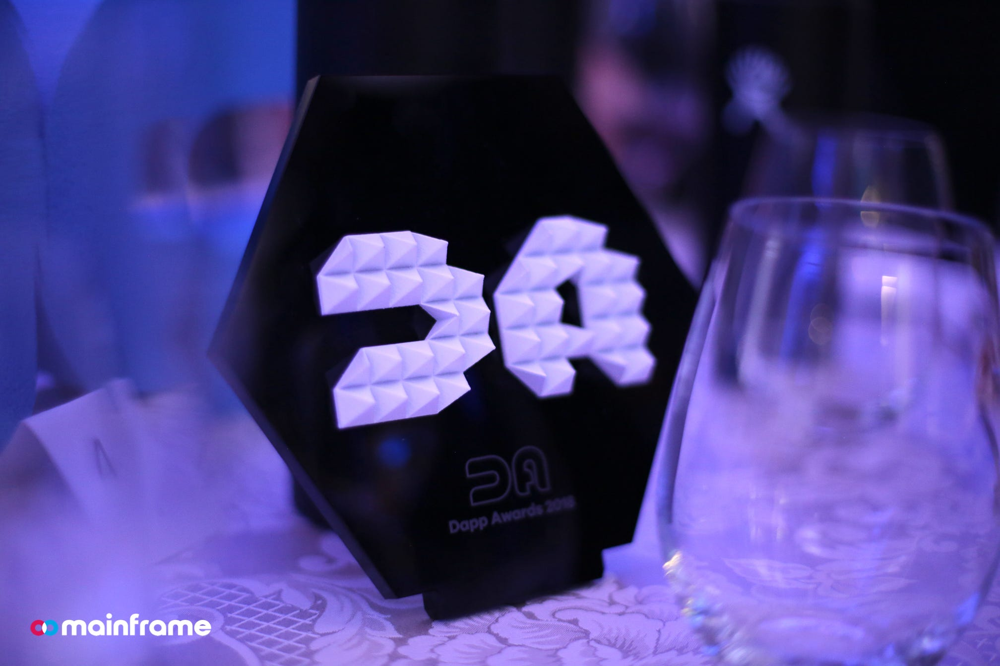
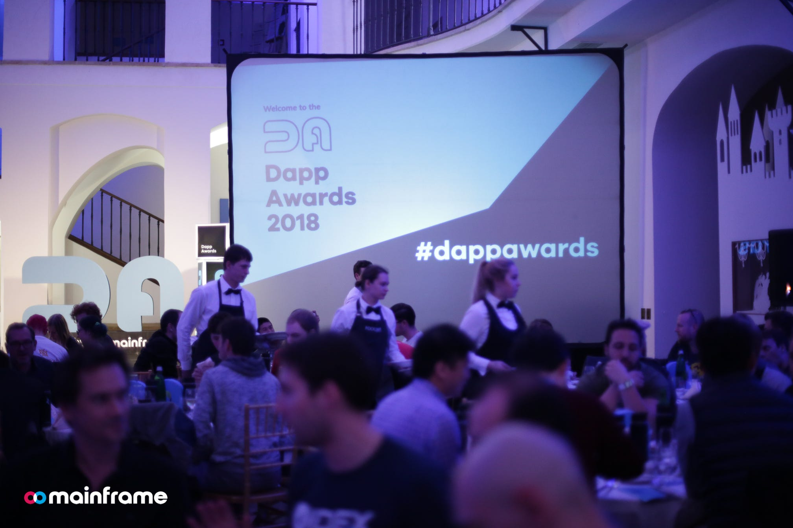
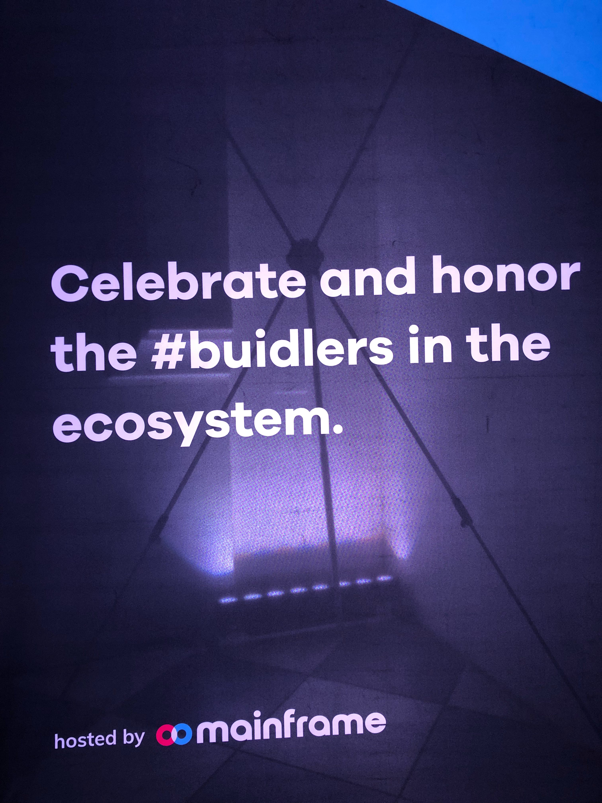
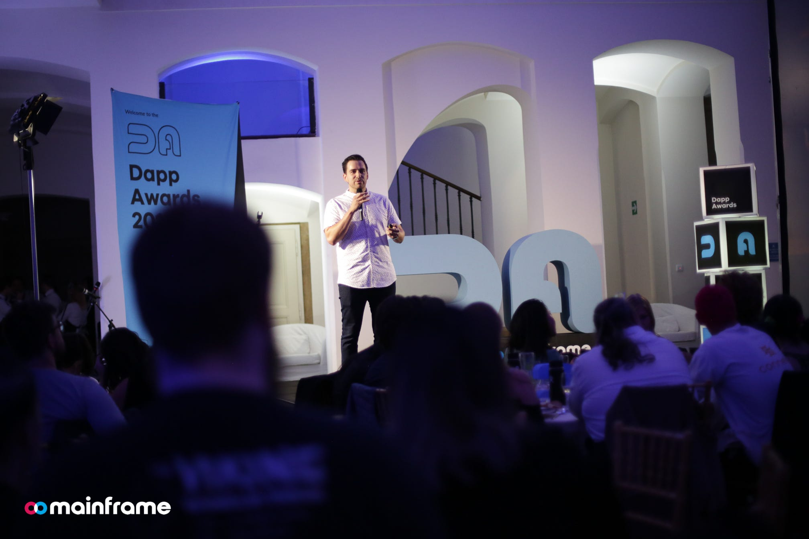
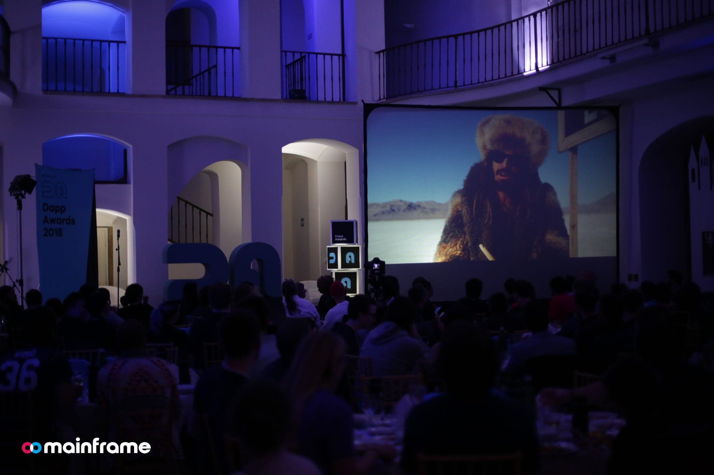
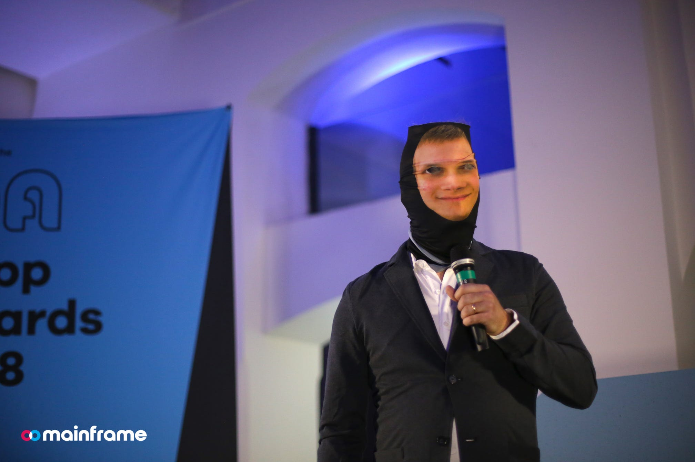
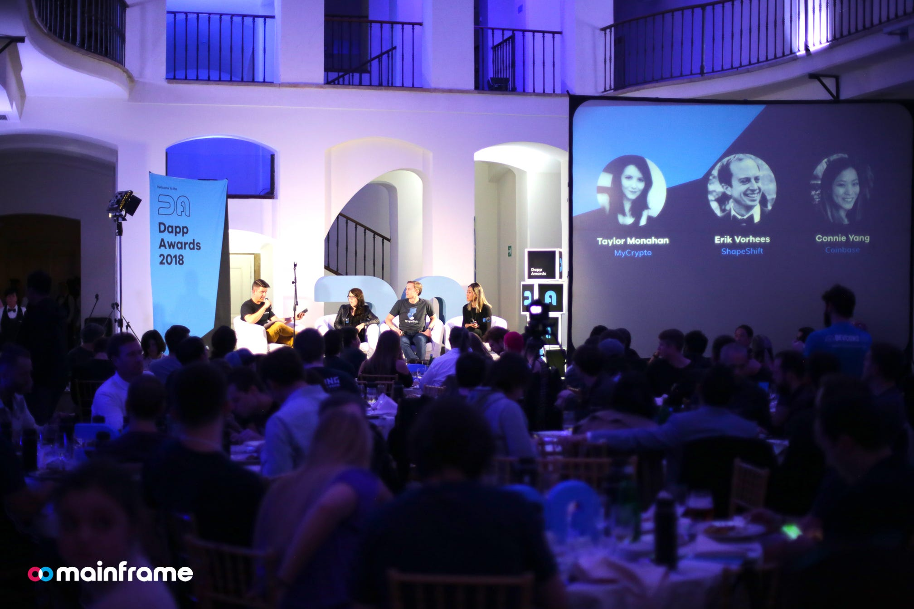
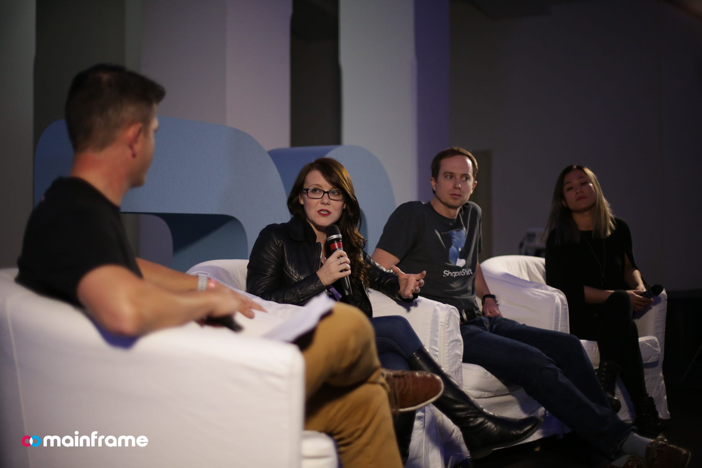
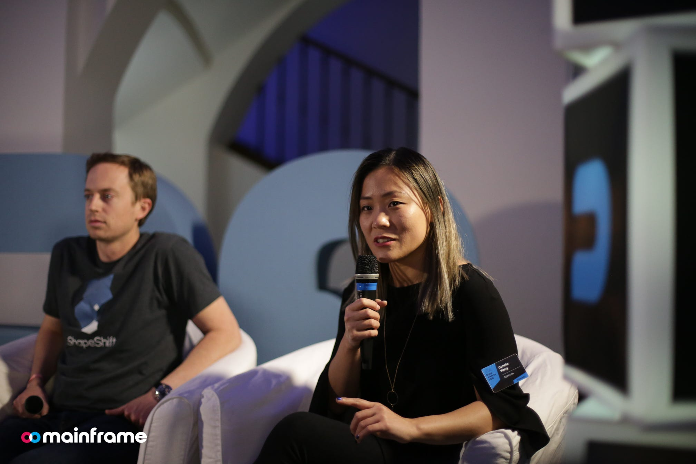

# The Dapp Awards — Highlights & Recap

We had a fantastic time hosting the Dapp Awards last week. It was an evening to celebrate and honor the doers, makers, creators and buidlers. The event was a packed house with founders, developers, and executives from leading projects in the space. Below is a recap of the night.

## **The Setup**

The event was at Czech Museum of Music in Prague. Our team did a great job booking the venue and getting the whole place setup for a fantastic night. The decor, the swag, the food, the lighting, the side accessories like the photo booth… it was a high-class setup for a high-class event.

## **The Keynote**

I delivered the keynote address. I’ll write a blog post later with a more comprehensive recap of my remarks. But my main message was to the [#buidlers](https://www.facebook.com/hashtag/buidlers?source=feed_text). I talked a lot about the WHY. Why we are in the space. What it means. The impact we can have. The vision we should have. It can be boiled down to one word: **freedom**.

There are many shapes and sizes of freedom but the freedom that I talked about and the one I’m most excited about is economic freedom.

Freedom for entrepreneurs, builders, makers, creators to participate in a global economy — one where trade sanctions, government censorship or bureaucracy simply won’t get in the way. Freedom for people of all skills to open a dapp, to contribute and help cultivate new micro-economies — working, earning, saving and providing. A global, digital marketplace that transcends jurisdictions. Freedom from the local corruption, oppression or incompetence that often stands in the way in many parts of the developing world. Freedom to provide for one’s family. Freedom to build a small business. Freedom to build an empire. Freedom to change the world, because now you truly have access to it.

Economic freedom creates a more fertile ground for democracy and better societies. If you have economic freedom you create conditions for so much more (less crime, less poverty, etc). You allow people to take destiny into their own hands… to create their own luck, to create their own opportunities, and to create their own prosperity.

Brilliance is equally distributed, but opportunity is not. Web3 changes that. Expect to hear a lot more from me on this subject.

*Founder/CEO of Mainframe, Mick Hagen*

## **Dawn of the Dapps Video**

We did the full screening of our Dawn of the Dapps video. Based on the laughs, I think it was a hit! We had previously released [the teaser](https://www.youtube.com/watch?v=Q7xucSg5n8U) and that caused quite a bit of chatter on social media. Below is an example of the type of responses we saw. Click through to see the replies.

<iframe src="https://medium.com/media/1885fdaafd74a8b3b81d2a81e156c19a" frameborder=0></iframe>

This is just the teaser.

To see the full video, [**join us at our Release Party — sign up here!](https://www.eventbrite.com/e/dawn-of-the-dapps-release-party-tickets-52235948127)**

<iframe width="560" height="315" src="https://www.youtube.com/embed/Q7xucSg5n8U" frameborder="0" allowfullscreen></iframe>

## The Emcee

Austin Craig is not only a star in our [Dawn of the Dapps video](https://www.youtube.com/watch?v=Q7xucSg5n8U) (see above), but he’s a star wherever he takes the stage. Austin (Head of Marketing at Mainframe) was the emcee for the event. He helped the program move along (even when there were minor hiccups), performed a hilarious skit with Doug (costar in the Dawn of the Dapps video), and delivered a fiery speech at the end. Great work Austin!

*Austin even featured masks of Vitalik Buterin and Mark Zuckerberg*

## **The Panels**

The evening was focused on celebrating the #buidlers. But with so many of the industry’s leading thinkers in attendance, we decided to have some discussion on a few topics.

**~ Product Panel ~**

This discussion was focused on a product and usability in the space — exploring challenges and opportunities on getting wider adoption of crypto/dapps. Participants on the panel were [**Taylor Monahan](https://twitter.com/tayvano_) **(Founder/CEO, [*MyCrypto](https://mycrypto.com)*), [**Erik Voorhees](https://twitter.com/ErikVoorhees) **(Founder/CEO, [*ShapeShift](https://shapeshift.io/)*) and [**Connie Yang](https://twitter.com/ConnieCurious) **(Director of Design, [*Coinbase](https://www.coinbase.com)*). This panel was moderated by [**Cahlan Sharp](https://twitter.com/cahlan)**, (VP of Product, [*Mainframe](https://mainframe.com/)*).

**~ Investor Panel ~**

This discussion was focused on a high-level view of the space — what trends they are seeing and where they believe things are headed. Participants on the panel were [**Kyle Samani](https://twitter.com/KyleSamani)** (Managing Partner, [*Multicoin](https://multicoin.capital/)*), [**Alex Shin](https://twitter.com/AlexShin)** (Partner, [*Hashed](https://www.hashed.com/)*) and [**Ari Paul](https://twitter.com/AriDavidPaul)** (Managing Partner, [*BlockTower](https://www.blocktower.com/)*). This panel was moderated by [**Matt Larson](https://twitter.com/mattylar12) **(VP of Strategy/Operations*, [Mainframe](https://mainframe.com/))*.

***Kyle Samani** (*Multicoin*), **Alex Shin** (*Hashed*), **Ari Paul** (*BlockTower*)*

Okay let’s get to the juicy stuff. Let’s discuss the **awards** segment of the evening where we celebrated and honored the people who make it all happen! Below are the awards given in the first annual Dapp Awards. To see a list of all nominees go to the [Dapp Awards](https://da18.mainframe.com/) website.

## **Best Utility Token**

**Winner**: [Spankchain](https://spankchain.com/)
**Recipient**: [Ameen Soleimani](https://twitter.com/ameensol) (CEO/Founder)
**Award Presenters**: [Katherine Wu](https://twitter.com/katherineykwu) (Director of Business Development, [*Messari](https://messari.io/)*) and [Shawn Wilkinson](https://twitter.com/super3) (CEO/Founder, [*Storj](https://storj.io/)*)

***Katherine Wu** (Director of Business Development, *Messari*), **Ameen Soleimani** (CEO/Founder, Spankchain), **Mick Hagen** (CEO/Founder, Mainframe), **Shawn Wilkinson** (CEO/Founder, *Storj*)*

***Chelsea Palmer** and **Ameen Soleimani** from Spankchain*

## Investor of the Year

**Winner**: [Multicoin Capital](https://multicoin.capital/)
**Recipient**: [Kyle Samani](https://twitter.com/KyleSamani) (Managing Partner)
**Award Presenters**: [Katherine Wu](https://twitter.com/katherineykwu) (Director of Business Development, [*Messari](https://messari.io/)*) and [Shawn Wilkinson](https://twitter.com/super3) (CEO/Founder, [*Storj](https://storj.io/)*)

***Katherine Wu** (Director of Business Development, *Messari*), **Kyle Samani** (Managing Partner, Multicoin), **Shawn Wilkinson** (CEO/Founder, *Storj*), **Mick Hagen** (CEO/Founder, Mainframe)*

***Mick Hagen** (CEO/Founder, Mainframe) and **Kyle Samani** (Managing Partner, Multicoin)*

## Best Blockchain Coverage by Mainstream Media

**Winner**: [Bloomberg](https://www.bloomberg.com/)
**Recipient**: [Camila Russo](https://twitter.com/CamiRusso) (Markets Reporter)
**Award Presenters**: [Karyl Fowler](https://twitter.com/TheKaryl) (CEO/Founder*, [Transmute](https://www.transmute.industries/)*) and [Alex Wearn](https://twitter.com/AlexWearn) (CEO/Founder, [*IDEX](https://idex.market/)*)

***Camilla Russo** (Markets Reporter at Bloomberg), **Karyl Fowler** (CEO/Founder, Transmute), **Alex Wearn** (CEO/Founder, IDEX), **Mick Hagen** (CEO/Founder, Mainframe)*

***Camilla Russo** (Markets Reporter at Bloomberg)*

## Testnet Launch of the Year

**Winner**: [ThunderCore](https://www.thundercore.com/)
**Recipient**: [Elaine Shi](https://twitter.com/ElaineRShi) (Cofounder / Chief Scientist)
**Award Presenters**: [Karyl Fowler](https://twitter.com/TheKaryl) (CEO/Founder*, [Transmute](https://www.transmute.industries/)*) and [Alex Wearn](https://twitter.com/AlexWearn) (CEO/Founder, [*IDEX](https://idex.market/)*)

***Alex Wearn** (CEO/Founder, *IDEX*), **Kingsley Advani** (ThunderCore), **Elaine Shi** (Cofounder, ThunderCore), **Yiseul Cho** (ThunderCore), **Karyl Fowler** (CEO/Founder*, Transmute*), **Mick Hagen** (CEO/Founder, Mainframe)*

***Yiseul Cho** (ThunderCore), **Elaine Shi** (Cofounder, ThunderCore), **Kingsley Advani** (ThunderCore)*

## Most Essential

**Winner**: [Etherscan](https://etherscan.io/)
**Recipient**: Matthew Tan (CEO/Founder)
**Award Presenters**: [Amber Baldet](https://twitter.com/AmberBaldet) (CEO/Cofounder*, [Clovyr](https://clovyr.io/)*) and [Vinay Gupta](https://twitter.com/leashless) (CEO/Founder, [*Mattereum](https://www.mattereum.com/)*)

***Matthew Tan **(CEO/Founder, Etherscan), **Mick Hagen** (CEO/Founder, Mainframe), **Vinay Gupta **(CEO/Founder, Mattereum), **Amber Baldet** (CEO/Cofounder*, Clovyr*)*

***Etherscan Team** and **Mick Hagen** (Mainframe)*

## Game of the Year

**Winner**: [CryptoKitties](https://www.cryptokitties.co/)
**Recipient**: [Nick Salloum](https://twitter.com/nicksalloum_)** **(Engineer)
**Award Presenters**: [Amber Baldet](https://twitter.com/AmberBaldet) (CEO/Cofounder*, [Clovyr](https://clovyr.io/)*) and [Vinay Gupta](https://twitter.com/leashless) (CEO/Founder, [*Mattereum](https://www.mattereum.com/)*)

***Mick Hagen** (CEO/Founder, Mainframe), **Nick Salloum **(Engineer, CryptoKitties), **Vinay Gupta **(CEO/Founder, Mattereum), **Amber Baldet** (CEO/Cofounder*, Clovyr*)*

## Exchange of the Year

**Winner**: [Coinbase](https://www.coinbase.com)
**Recipient**: [Connie Yang](https://twitter.com/ConnieCurious)** **(Director of Design)
**Award Presenters**: [Taylor Monahan](https://twitter.com/tayvano_) (CEO/Founder*, [MyCrypto](https://mycrypto.com)*) and John Fiorelli (Head of Advisory, [*Kenetic Capital](https://twitter.com/KeneticCapital)*)

***John Fiorelli** (Head of Advisory, *Kenetic Capital*), **Connie Yang **(Director of Design, *Coinbase*), **Taylor Monahan** (CEO/Founder*, MyCrypto*), **Mick Hagen** (CEO/Founder, Mainframe)*

***Mick Hagen** (CEO/Founder, Mainframe) and **Connie Yang **(Director of Design, *Coinbase*)*

## Developer Tools & Infrastructure

**Winner**: [Truffle](https://truffleframework.com/)
**Recipient**: [Tim Coulter](https://twitter.com/timothyjcoulter) (Founder/CEO)
**Award Presenters**: [Taylor Monahan](https://twitter.com/tayvano_) (CEO/Founder*, [MyCrypto](https://mycrypto.com)*) and John Fiorelli (Head of Advisory, [*Kenetic Capital](https://twitter.com/KeneticCapital)*)

***John Fiorelli** (Head of Advisory, *Kenetic Capital*), **Tim Coulter **(CEO/Founder, Truffle), **Taylor Monahan** (CEO/Founder*, MyCrypto*), **Mick Hagen** (CEO/Founder, Mainframe)*

***Truffle Team** and **Mick Hagen** (Mainframe)*

The following projects were awarded as **winners** prior to the Dapp Awards event.

**Mainnet Launch:** [Tezos](https://tezos.com/)
**Blockchain Publication:** [Coindesk](https://www.coindesk.com/)
**Social Network / Marketplace:** [Peepeth](https://peepeth.com)
**Crypto Wallet:** [Ledger](https://www.ledger.com/)

## Inside the Photo Booth

Impossible to show everyone who attended the event but here are a few of the projects or groups who jumped into the photo booth!

*Messari, Solana, Clovyr*

*Next year need a “CryptoKiddy” category. MyCrypto crew is the best.*

*ShapeShift crew in the house.*

*Giveth, Transmute, IDEX*

*Many Swarm and Ethereum core developers on the left. Aion/Truffle on right.*

*Hashed, INBlockchain, 1kx, LivePeer, Cluster/PPC*

*Mithril*

 (Ethereum Core Developer)](https://cdn-images-1.medium.com/max/3830/1*Oob-UBkkr48tiFDlYSF_Pw.jpeg)*Some of my favorite Brazilians in the world. And new friend [Alex Van De Sand](https://twitter.com/avsa) (Ethereum Core Developer)*

Cheers to all the makers out there laying the groundwork for the decentralized web. You are amazing. Keep dreaming, keep experimenting, keep #buidling. Can’t wait to see where we all are a year from now. And yes, of course the Dapp Awards will be an annual thing.

## Special Thanks

Special thanks to those on the Mainframe team who helped organize this fantastic event. There were a lot of moving pieces, but the crew executed with precision. It was amazing to see.

*The Marketing/Community team pictured here took on much of the responsibility on organizing the Dapp Awards. There are a few others not pictured here (or who didn’t come to DevCon) who also helped on writing/design/preparation. This team did a great job pulling this event together. Major props to them!*

***Left**: Brad, Matt, Cahlan (business/product leadership). **Right**: Those on our Engineering team who came to DevCon.*

*All the Mainframe crew who came to DevCon*

*And special shout out to this guy who originally pitched the Dapp Awards idea. Doug, when is the LemonCoin pre-sale? You know where to send that SAFT.*

Beyond the Dapp Awards, we had a super productive time at DevCon4. Expect to hear more on this later.

That’s it for now… if you don’t grind, you don’t shine. Let’s gooooo!

Source: https://blog.hifi.finance/the-dapp-awards-highlights-recap-45d29747d15c
