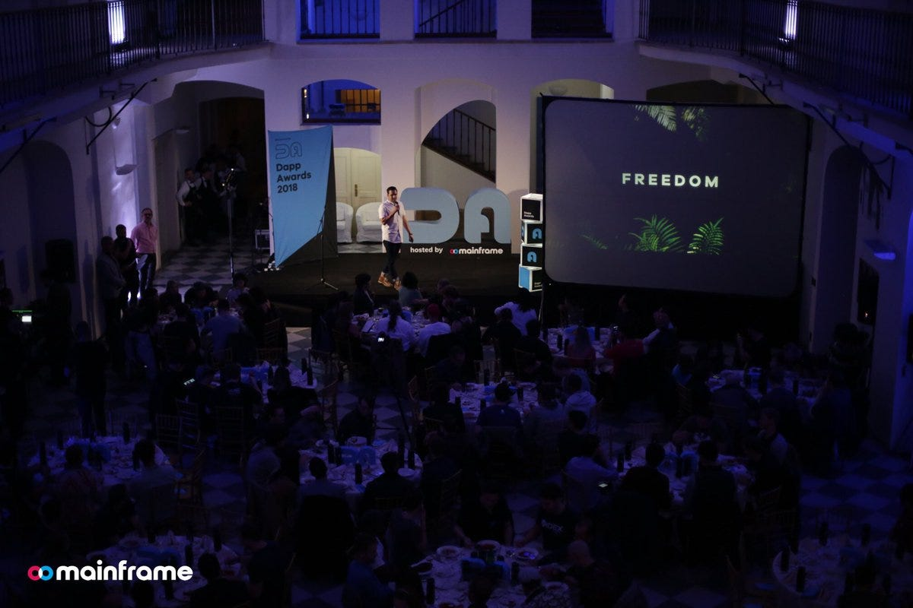
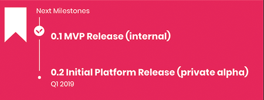
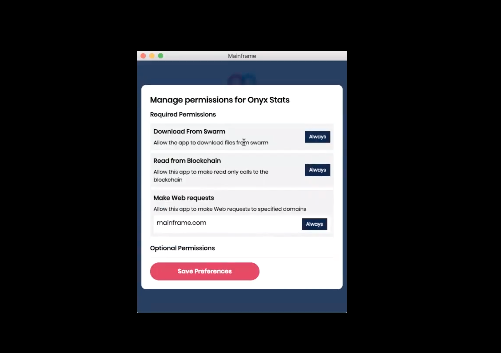
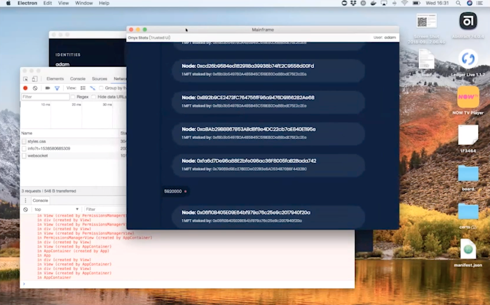

# Announcing the 0.1 Milestone Release

Announcing the 0.1 Milestone Release

### Read what the 0.1 Release means for our community of #buidlers

We just got back from DevCon iv, where our team was out in full force, learning, sharing, connecting, and celebrating the #buidlers of the crypto community.

*At Devcon iv, we hosted the inaugural Dapp Awards, a celebration of #buidlers*

We had a great week and made a lot of important connections. We talked about important technical and non-technical challenges we and others are trying to overcome in this space. Overall, it was an extremely productive and successful week.

Now that we’re back, we’re back to heads down #buidl mode. We can’t wait to build the future of the decentralized web with you, and we’ve got some exciting news to share.

Today we’re announcing the full details around our 0.1 Release.

## What’s included in the 0.1 Release?

*Major milestones as outline in our roadmap (click to see roadmap)*

As one of our lead engineers, Paul Le Cam, [recently discussed](https://youtu.be/6JOP0hRsuQQ?t=102) in one of our Roundtable discussions, 0.1 is primarily an alpha release, meaning it’s meant for internal use. It’s an internal release, but it’s still an important step forward.

This release gets us what we need internally to more rapidly create dApps, test permissions and installation flows, and run these dApps inside secure our sandbox native application we’ve named the Mainframe OS.

*Setting up a new dApp in the Mainframe OS*

There are two primary use cases highlighted in the 0.1 Release:

### The Mainframe OS

The decentralized web is much more than browsing HTML pages. Wallets, identity, application architecture are no longer on the “back end,” out of the control and permissions of the end user.

We’re building the Mainframe OS so that dApp users can download verified, signed dApps and run them. They’ll be able to navigate between dApps, all the while having a seamless user experience that integrates their crypto wallets, their identity, their contacts, and much more — all without fear of who is in control or who is watching.

*Installation of a sample dApp asking for permissions from the user*

In the 0.1 Release, the Mainframe OS downloads signed dApps from developers from decentralized storage and runs them in the Mainframe OS sandbox. It’s simple, but it’s a powerful next step in our journey.

### Developer Mode

Using the same Mainframe OS client, developers can create dApps, add desired permissions and publish their dApp to decentralized storage. For now, we have a quick way to access “Developer Mode,” where developers can author and sign applications and also see they will look to the end user.

*Launching a sample dApp in “developer mode”*

Developers are able to quickly test their dApps locally using our developer mode which enables for more rapid feedback and testing of the Mainframe OS sandbox.

There will be more and more tools available for developers, but this is an important start.

## What does this release mean?

Very soon, we’ll be building our platform alongside dApp developers. Our first major external release will include a few dApps of our own. This release was critical so that we can shorten the feedback loop between platform and dApp. Our platform team can continue to iterate on decentralized infrastructure and SDKs, while our dApp teams and partners can build against these releases to bring their code to life.

There’s so much more to come here, but for now we’re just excited that we have the basics working so we can more quickly test and iterate on the process.

## What’s Next?

We’re now aiming for our 0.2 Initial Platform Release. Don’t let the versioning fool you — there is **a lot** in store here. Our goal is to have our initial platform fully functional for a wide variety of dApp use cases. Certain features will be forthcoming, others will be a bit rudimentary, but as we work out the kinks and start populating our dApp marketplace with powerful applications and getting users onboarded and using the decentralized web, the 0.2 Release marks the beginning of an exciting new era for Mainframe.

If you want to follow along more closely, be watching our weekly Roundtable discussions or our monthly Show & Tells on our [YouTube channel ](http://youtube.com/channel/UCOhQaYVAUypRWHucouG3Sjg/)so you can see the progress we’re making. You can also join a discussion at our [community forum](http://community.mainframe.com).

## Dive In

If you’re dying to see what’s being shown in the videos and get your hands dirty, you can check out the 0.1 Release at our Github:
[**MainframeHQ/js-mainframe**
*Mainframe platform. Contribute to MainframeHQ/js-mainframe development by creating an account on GitHub.*github.com](https://github.com/MainframeHQ/js-mainframe/releases)

Again, since this is an “internal” release, there is very little documentation to support people who are using this software for the first time. It’s rough and raw.

Source: https://blog.hifi.finance/announcing-the-0-1-milestone-release-8d07036da76a
