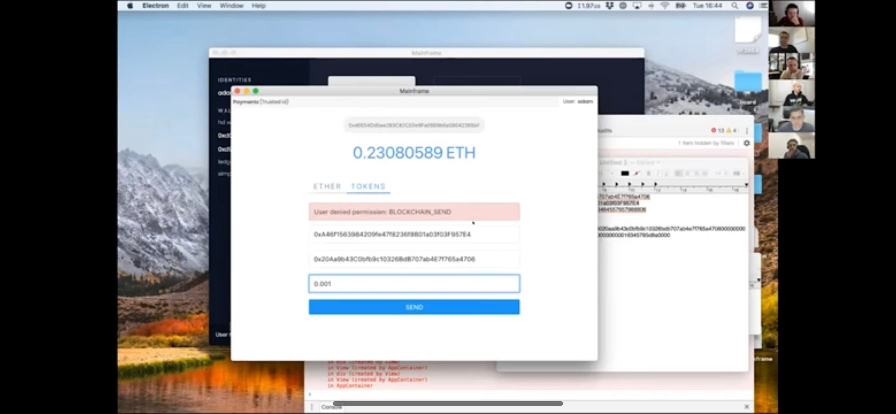
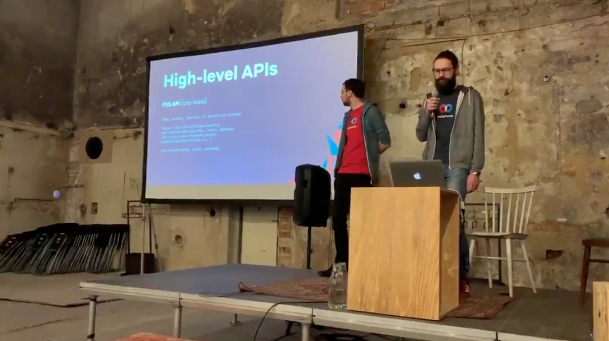
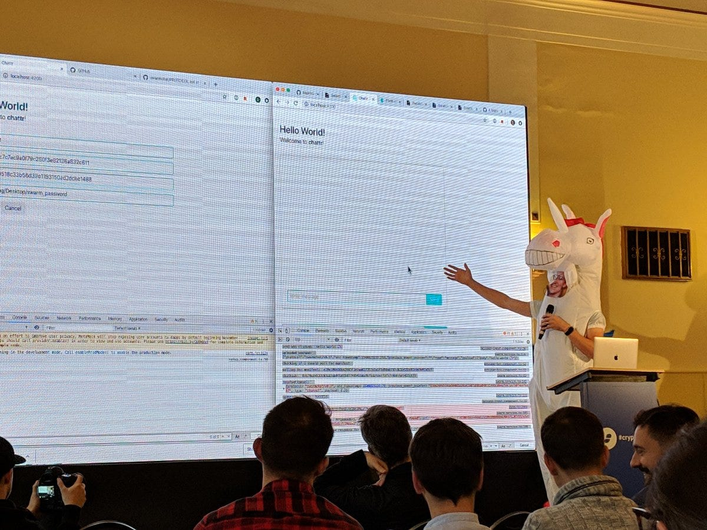
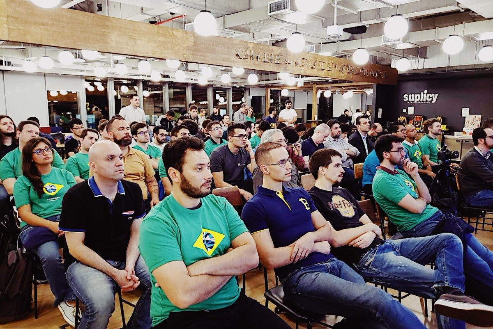

# Mainframe Product Update: October

Mainframe Product Update: October

### DevCon and #buidling the future

We’re gearing up for our biggest release yet. Stay tuned as we continue pushing forward, iterating, building, debugging, and shipping. We love telling our story, but it’s in execution where we’ll shine the brightest.

Here’s what we’ve been up to in October.

## DevCon iv

In many ways, the modern chapter of Mainframe began last year at DevCon iii. This is an important event for the entire crypto community, and it’s no different for us.

Even though we sacrificed coding hours for prepping and participating in the event, we felt that it was absolutely necessary to accomplish some very important goals, including forging new relationships, strengthening important partnerships, #buidling customer base, and positioning ourselves for a big launch next year.

As you’ve probably already read, we hosted the inaugural Dapp Awards — an event held in Prague that celebrated the #buidlers in the ecosystem; recognizing how far we have to go, but celebrating how far we’ve come and the people and organizations who’ve helped us get here. Read a more in-depth recap [here](https://medium.com/@austinmcraig/devcon-recap-dappawards-and-more-e08eb59c2130).

<iframe width="560" height="315" src="https://www.youtube.com/embed/3fCL1zcZsFI" frameborder="0" allowfullscreen></iframe>

At the event, we premiered our YouTube [video](https://www.youtube.com/watch?v=XVZxjVJz4ds) that highlights some of the challenges we face in crypto while still being able to smile about where we are. It even features one of our engineers, Doug Leonard, as the LemonCoin founder.

<iframe width="560" height="315" src="https://www.youtube.com/embed/XVZxjVJz4ds" frameborder="0" allowfullscreen></iframe>

## Show & Tell

DevCon4 was a critical focus for us in October as well as some other events, but we still had a great Show & Tell. So much more to come here.

Check out our October Show & Tell [here](https://youtu.be/jj3gLRtwBUc).

## Roundtables

Every week we spend time on air discussing various engineering topics. Some are theoretical, some are very close to the ground level of the problems we’re solving. We had some great discussions this month on topics such as:

* [service integration platform architecture](https://youtu.be/PRFQL2TjVGQ?t=776) (easter egg: Carl’s Halloween costume)

* [onboarding new users into crypto: risks and opportunities](https://youtu.be/PRFQL2TjVGQ?t=2051)

* [sneak peek of initial mockups of the Mainframe OS](https://youtu.be/e7aO1Iieh4A?t=284) (also discussion on discoverability)

* [the problem of “first contact”](https://youtu.be/MqptbgZMuqw?t=80)

* [challenges around account “recovery”](https://youtu.be/eaxoJ0jTMps?t=141)

* [potential dapp ideas](https://youtu.be/eaxoJ0jTMps?t=1235)

## Team and Service Layer Updates

Mainframe is a platform for developers that enables them to build bulletproof decentralized applications. Our platform is a big undertaking that consists of SDKs, service layers that provide developers needed functionality in their dApps, and components, services and tools developers will need to easily author, sign, ship, and deploy their dApps to the decentralized ecosystem.

*A snapshot of the Mainframe platform*

## Service Layer Update: Communications

*Shane Howley*

October was a busy month for the Comms team, not just planning and prepping for our upcoming 0.2 release but also spending time spreading the good word.

Shane and Paul, two of our principal architects, spoke at both [DevCon iv](https://twitter.com/FaridRached/status/1058682429630750720) as well as “Building the Free Web” in Berlin.

*Paul le Cam and Shane Howley doing their thing*

## Service Layer Update: Architecture and Tooling

*Paul Le Cam and Adam Clarke*

Besides the prep, discussions, sessions, and presentations at DevCon, important work was done in the Mainframe OS.

Watch/listen to Adam introducing some of the wallet and payments work he’s done towards the 0.2 release in a recent [Show & Tell](https://m.youtube.com/watch?t=1560&v=jj3gLRtwBUc&feature=youtu.be).

## Service Layer Update: Storage

*Miloš Mošić and Doug Leonard*

Among much of the conference prep and starring in “Dawn of the Dapps,” Doug Leonard also gave an [important talk](https://twitter.com/_samuelgbrooks/status/1056916304979025920) prior to DevCon on updates in Swarm. He just happened to do so in both a unicorn costume *and *a mask of our CTO, Carl Youngblood. Why not?

*Doug channeling his inner “DevCon Carl”*

## Other Updates

Our CTO, Carl Youngblood, spent some time in Brazil recruiting and building our developer community. As a part of this experience he showed a simple application that uses smart contracts to simulate a voting experience using the blockchain.

*Brazilians excited about the future of the web*

Watch Carl demo his simple dApp in a recent [Show & Tell](https://m.youtube.com/watch?t=280&v=jj3gLRtwBUc&feature=youtu.be).

Participating in the ETH San Francisco Hackathon was also an important networking and learning experience. Our VP of Marketing Pete Abilla tells [the whole story](https://blog.mainframe.com/just-buidl-eth-san-francisco-hackathon-ae16dc0ffb92).

## How to Get Involved

We can’t wait to share our work with you. In the meantime, come and help us build a secure, private world. The new age of communication, finance, and data. Here’s how you can help.

* Check out our [Jobs](https://mainframe.com/jobs) page

* Participate in our weekly Roundtable on our [YouTube channel](http://youtube.com/channel/UCOhQaYVAUypRWHucouG3Sjg/)

* Join our developer [discussion forum](http://community.mainframe.com)

* Ask a question in our [real-time chat](https://gitter.im/MainframeHQ/Lobby)

* Watch for Show & Tell’s being broadcast on our [YouTube channel](http://youtube.com/channel/UCOhQaYVAUypRWHucouG3Sjg/)

Here’s to the #buidlers! 🥂

Source: https://blog.hifi.finance/mainframe-product-update-october-6cdc07e5df42
