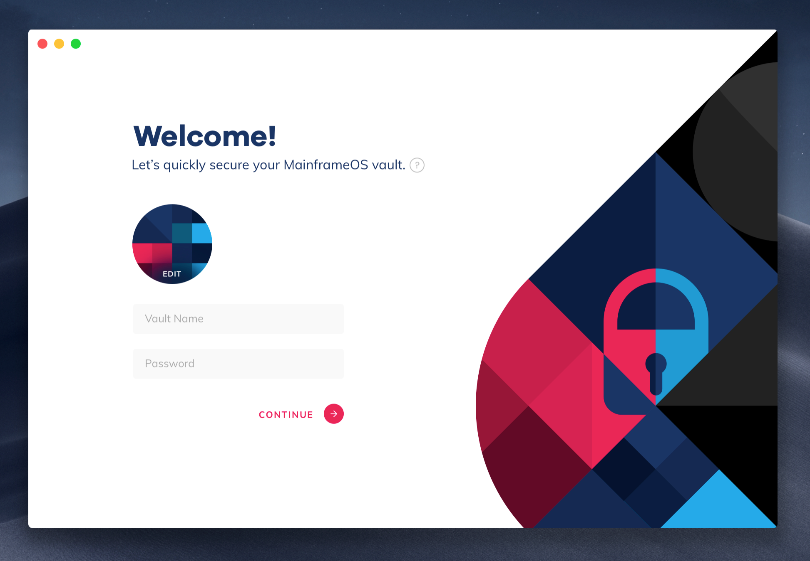

# Mainframe Product Update: November

Mainframe Product Update: November

What a month! Our teams are busy working towards our first major release. There’s plenty to do, but we feel it’s important to keep you in the loop. We’ve got plenty of updates to share.

Here’s what we’ve been up to in November.

## Show & Tell

We had an exciting Show & Tell this month, with a lot of critical updates posted and progress shown towards our 0.2 platform release.

Check out our November Show & Tell below.

<iframe width="560" height="315" src="https://www.youtube.com/embed/I4S0YPdlH28" frameborder="0" allowfullscreen></iframe>

## Roundtables

Given how much needs to be done and how quickly we’re moving, we haven’t been as consistent on our weekly roundtables. This will likely continue as we push hard towards our 0.2 platform release. Of the sessions that we had, we covered:

* [favorite moments from DevCon](https://www.youtube.com/watch?v=Lxx9UzDLCdw)

* [dApps and access to data](https://youtu.be/4Igh8EvoLYo?t=211)

* [Identity correlation in Swarm](https://youtu.be/4Igh8EvoLYo?t=1219)

* [Current (Nov 15) architecture for identity](https://youtu.be/4Igh8EvoLYo?t=2142)

## Team and Service Layer Updates

Mainframe is a platform for developers that enables them to build bulletproof decentralized applications. Our platform is a big undertaking that consists of SDKs, service layers that provide developers needed functionality in their dApps, and components, services and tools developers will need to easily author, sign, ship, and deploy their dApps to the decentralized ecosystem.

*A snapshot of the Mainframe platform*

You may have noticed that we also reorganized engineering teams a bit to better organize efforts around critical components and needs of the platform.

## Mainframe SDK/Service Integration Team

*Shane Howley, Duane Johnson, Paul Le Cam, Doug Leonard, Camron Levanger, Miloš Mošić*

A lot of exciting news on the SDK/Service Integration front.

Miloš has been working hard on data encryption, helping ensure a safe and secure environment for dApps to access and share files on the decentralized web. See his demo of a POC from our recent Show & Tell [here](https://youtu.be/I4S0YPdlH28?t=1242).

Shane also demonstrated an exciting POC that demonstrates how “first contact” will occur in Mainframe OS. We refer to *first contact *as what takes place when two users who don’t currently have a relationship on the decentralized web make a first connection. To ensure security, privacy, usability, and discoverability, this is a tricky problem. Shane has made great progress in this regard, however, and you can see his demo [here](https://youtu.be/I4S0YPdlH28?t=1488).

*Shane demoing “first contact”*

Camron also made good progress on PSS integrated with Swarm Feeds. This will be an important component in our communications service layer, as communications need to be both persistent and performant. See his demo [here](https://youtu.be/I4S0YPdlH28?t=2195).

## Erebos v0.5 Release

If you’re unfamiliar, Erebos is our own fully supported Swarm CLI and Javascript library. It plays a key role in supporting service layers on our platform.

You can dive deeper into the Erebos release [blog post](https://blog.mainframe.com/erebos-v0-5-whats-new-4d0516d83461), but here are some highlights:

1. Swarm feeds are now supported, a key feature needed for our platform

1. New CLI commands are supported

1. Hexadecimal encoding package included

To check out our Erebos releases, go [here](https://github.com/MainframeHQ/erebos/releases). You can also hear Paul Le Cam describe the changes [here](https://youtu.be/I4S0YPdlH28?t=161).

## MorpheusUI

*Diogo Perillo*

MorpheusUI is a UI component library built for the Mainframe OS platform. It is meant to be leveraged by dApp developers of all kinds to help bootstrap their dApps and align their own code and visual style with the standards and visual direction of the Mainframe OS. It is extensible, customizable, theme-able (is that a word?) and will be a big help as developers look to create powerful dApps that present themselves well inside Mainframe OS.

*Diogo Perillo demoing some MorpheusUI components*

This month, we released version 0.0.4, including packages **core, fonts, forms, **and** icons**. These ship with a few basic components:

* Form

* Button

* Icon

* Text Input

* Grid layout

We intend to continue adding components as they are available and tested. We also intend to be the first users of Morpheus UI as we develop our own sample dApps for the platform. You can listen to Diogo describe his work [here](https://youtu.be/I4S0YPdlH28?t=223). Also, check out MorpheusUI [on Github](https://github.com/MainframeHQ/morpheus-ui).

## Mainframe OS Update

*Adam Clarke, Clement Jacquier, Paul Le Cam*

Mainframe OS is the user-facing client through which users will experience dApps on the Mainframe network. Developers will also use the client to test and deploy their dApps.

The team has been hard at work designing and developing this product as it’s at the heart of our 0.2 Release.

Updates for November included modifications in data structures to allow for easier internal changes in the Mainframe OS Daemon. Hear Paul explain the updates [here](https://youtu.be/I4S0YPdlH28?t=721).

Also inside the Mainframe OS internal (non-UI) code, Adam spent time working on the lower levels of Mainframe OS architecture to define and facilitate contacts, identity, and relationships. Adam explains the updates himself [here](https://youtu.be/I4S0YPdlH28?t=671).

Clement, our head of design, is also hard at work turning wireframes into beautiful user experiences. Initially focused on the onboarding state of Mainframe OS, Clement created the introductory screens a user will experience when then they start using the software for the first time.

*An early design for the onboarding experience on Mainframe OS*

Hear Clement explain his designs and next steps [here](https://youtu.be/I4S0YPdlH28?t=923).

## dApps Update: Noted

*Jordan Croxton, Megan Jezewski, Duane Johnson*

Our first dApp that we’re building internally for the Mainframe Platform is called Noted. This is meant to be a simple, note taking application that will feature the storage service layer.

*Design for the Noted dApp*

Megan primarily is working on the front-end logic, while Duane has been filling in holes and identifying gaps between the web app and integration with the Mainframe OS. Jordan has provided important design direction. You can see their demo [here](https://youtu.be/I4S0YPdlH28?t=2545).

## dApps Update: Paymo

*Doug Leonard*

Our second dApp is called Paymo, and is a simple payment application that allows people to easily send crypto assets to others, primarily contacts they already know and trust. Think Venmo for crypto.

*Doug demoing an early version of Paymo*

Doug Leonard has been working on implementing the first features, the UI, the core logic for transactions using initially just a web3 provider, and other updates. It currently works with Metamask and allows for sending of ETH to an ETH address. Soon, it will be able to work inside the Mainframe OS to send assets to contacts that a person has already established without the need of pasting ETH addresses.

See Doug’s demo [here](https://youtu.be/I4S0YPdlH28?t=2905).

## How to Get Involved

As we’ve said before, we’re up to the task, but we want to work with you to build the future. Come and help us build a secure, private world, the way data was meant to be shared. Here’s how you can help.

* Check out our [Jobs](https://mainframe.com/jobs) page

* Participate in our weekly Roundtable on our [YouTube channel](http://youtube.com/channel/UCOhQaYVAUypRWHucouG3Sjg/)

* Join our developer [discussion forum](http://community.mainframe.com)

* Ask a question in our [real-time chat](https://gitter.im/MainframeHQ/Lobby)

* Watch for Show & Tell’s being broadcast on our [YouTube channel](http://youtube.com/channel/UCOhQaYVAUypRWHucouG3Sjg/)

Thanks for reading, and here’s to the future! 🥂

Source: https://blog.hifi.finance/mainframe-product-update-november-37d25112240a
