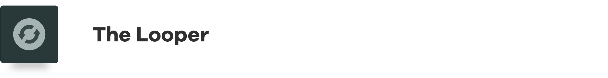

# Mainframe OS Public Release is Live!

Mainframe OS Public Release is Live!

<iframe width="560" height="315" src="https://www.youtube.com/embed/eNIjfK8cycQ" frameborder="0" allowfullscreen></iframe>

Mainframe OS is the portal to a new web. To a new and brighter future where privacy is automatic and users enjoy complete control.

This public release is a major milestone, but also just the beginning. We’re laying the foundation for a decentralized web that’s easier to use and build on. Current core features set the stage for *much* more to come.

This is the power of technology at your fingertips. This is the power to interact with new applications that don’t rely on compromised infrastructure or the benevolence of centralized monopolies.

Read on for a user guide, or check it out now!
— [Download Mainframe OS](https://download.mainframeos.com/os/releases/MainframeOS.dmg) ⟶

## Introducing Mainframe OS

Here is more info to help you get started and learn more about the product: 
— [See full FAQ](https://docs.mainframe.com/docs/faq) ⟶

**What is Mainframe OS?**

Mainframe OS is a platform for end users to find and use dapps, and for developers to build and deploy dapps. Mainframe OS provides users with the elegant and cohesive UI comforts they have come to expect from a modern platform. Users can manage identity, wallets, contacts, and other security features in a single, integrated experience.

Mainframe OS takes care of all underlying web3 infrastructure and services, removing friction and making blockchain functionality accessible and seamless.

**Is Mainframe OS really an operating system?**

No, it’s not an operating system in the standard sense. It is actually an application that is available on MacOS (other platforms supported soon).

We call it an OS because 1) it has system-level utilities similar to other OS’s (namely integrated decentralized identity, contacts, and wallets), and 2) once you install and run Mainframe OS, you can then discover, install, and run dapps within that environment. So it is essentially an Operating System for your decentralized experience.

**How do I start using it?**

The installation process is two steps. First you’ll have to setup your environment, then you can install the application. Don’t worry, we’ll guide you through it.

Once Mainframe OS is installed, users are guided through a simple and elegant onboarding experience. You’ll set up your vault password, your identity, and your wallet (you can create a new one, or import an existing Ethereum wallet).

That’s it. Now you’re ready to use Mainframe OS. First, explore the system utilities, connect with other Mainframe OS users, create or import additional wallets, and view/edit settings.

Next, it’s time to use some dapps. Mainframe OS comes pre-built with several dapps. Some are intended for exploration, inspiration, and reference. Others give access to cutting-edge defi protocols. Access your installed dapps and Mainframe’s “Suggested Apps” from the Applications tab. They are simple to install, use, and update.

**What dapps are included?**

There are seven “suggested apps” included currently in Mainframe OS.

***Produced by Mainframe:***

Arguably the easiest way to create and manage a MakerDAO CDP.

Arguably the easiest way to access Compound’s protocols to earn interest on ETH or DAI.

A simple app that facilitates sending ETH or MFT to integrated contacts

A text editor that stores encrypted notes in the decentralized Swarm network

***Produced by Nonsense Tech :**
(winners of our recent Dapp Developer Bounties Challenge)*

The popular MakerDAO CDP dapp, ported to Mainframe OS

The popular exchange dapp, ported to Mainframe OS

Leverage your assets (using Instadapp’s smart contracts)

**What makes Mainframe dapps unstoppable?**

Dapps are not published or accessed in the traditional way, from a web server that is vulnerable to attack and is a single point of failure. Once a dapp is published in Mainframe OS, it’s out there in the immutable decentralized Swarm network and cannot be “stopped” (i.e. deleted, censored, blocked, etc). We provide a mechanism for dapp developers to deploy updates to a published dapp and for users to easily upgrade, but even then, the old versions actually are still out there.

**What blockchains does Mainframe OS support?**

Mainframe SDK is currently only integrated with Ethereum. However, the underlying service architecture is designed to be modular and pluggable, able to integrate with any other blockchain. No matter where the industry goes, we’ll support the popular blockchains and programming languages, so builders can use it anywhere. Learn more about blockchain integration on our roadmap.

**How does MFT integrate with Mainframe OS?**

MFT tokens are integrated in Mainframe OS to power underlying services. In this initial release, users can stake MFT to send invitations to other users to connect.

Coming soon, developers can stake MFT to submit their dapps to be included in the Mainframe App Store. We are also exploring subscription models for app users and developers, facilitating in-app purchases or upgrades, and tiered/paid dapps, all powered by MFT. More on all of this to come.

As additional underlying services are enhanced to include incentivization functionality, MFT will be integrated more and more to power those services and create a seamless experience for users. Mainframe continues to be dedicated to a frictionless experience for users of our platform.

**Is Mainframe OS perfect?**

Of course not. While we know our concepts and designs are solid, Mainframe OS is still very much in an early “alpha” state. Swarm, the underlying storage layer powering much of Mainframe OS, is itself still an alpha project. That means there are no guarantees at this stage that things will always work smoothly. This is the reality of decentralized development today.

When we started a few years ago, the goal was to build a decentralized, unstoppable, private, secure messaging app. Step by step we went down the stack to realize the plumbing to facilitate all this smoothly simply didn’t exist yet, so we got to work helping to build it from the ground up. A lot has gone into Mainframe OS and we’re proud of its design. Even so, it’s still early and incomplete. But with this first user release, we’re now on the path of continual improvements and enhancements towards a very bright future.

**What are some of the goals and plans for the team going forward?**

We have a multi-pronged approach to support our long-term vision of moving the world to web3, and making Mainframe OS its home. That includes:

1. Killer dapps to bring users into the Mainframe OS ecosystem. We’ll help build or incentivize them initially to showcase capabilities, inspire other devs, and seed the offering. We are prepared to continue being the primary dapp devs, or being heavily involved in this as momentum builds.

1. Continual improvements to Mainframe OS to support users and increase capabilities

1. Increased integration of MFT in Mainframe OS (see section on token utility)

1. Continued involvement with the decentralized development community, including Ethereum and Swarm and others, to stay aligned in vision, intention, and roadmap.

1. Execute on our roadmap as well as possible and as appropriate for the market/resources.

It’s going to take some work to build up to the demand we ultimately expect. But we have a long-term view and are invested to see it through.

**How can I help?**

* Help us improve Mainframe OS by giving us constructive feedback on our gitter channel

* Mainframe OS is an open source project. Jump in and give us a hand!

* Try it out. Spread the word. Tell us what you think. Become a part of the Mainframe family.

— [Download Mainframe OS](https://download.mainframeos.com/os/releases/MainframeOS.dmg) ⟶

— [Find more answers to questions](https://docs.mainframe.com/docs/faq) ⟶

Source: https://blog.hifi.finance/mainframe-os-public-release-is-live-d5cd339f490c
