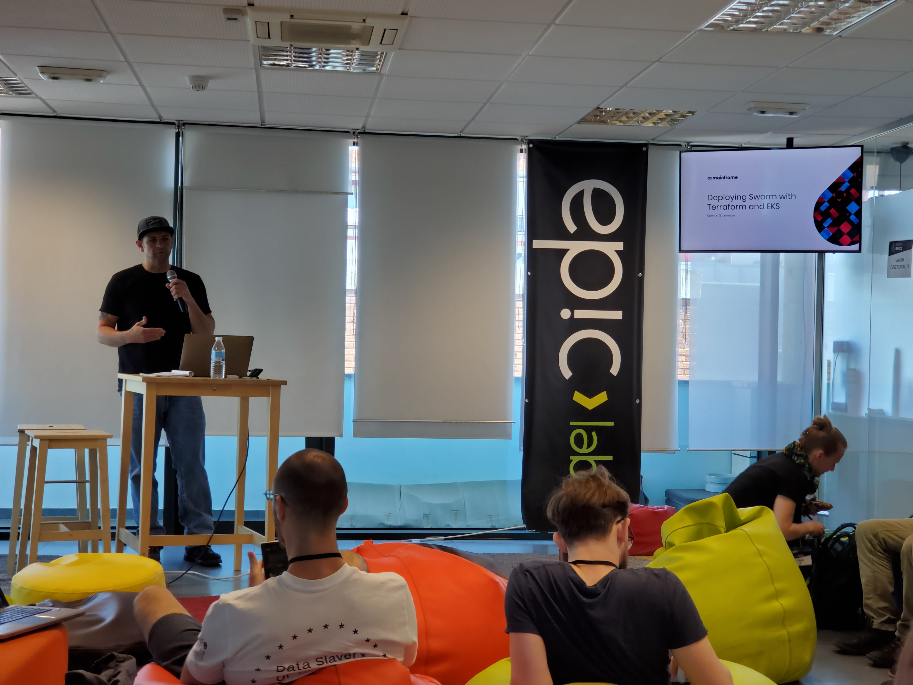
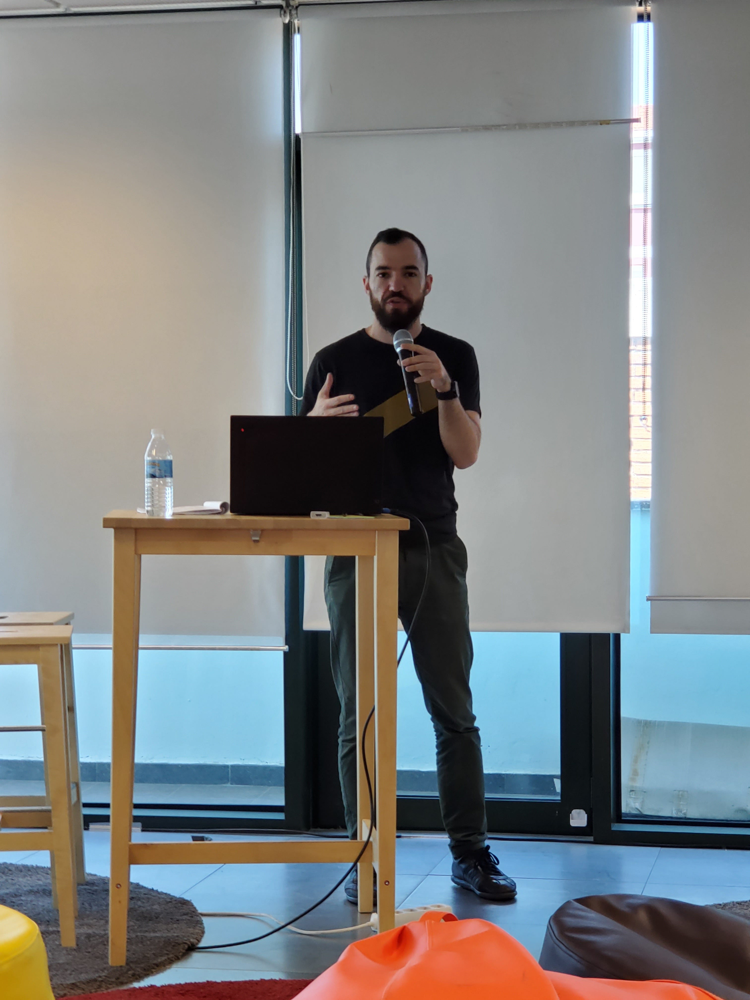
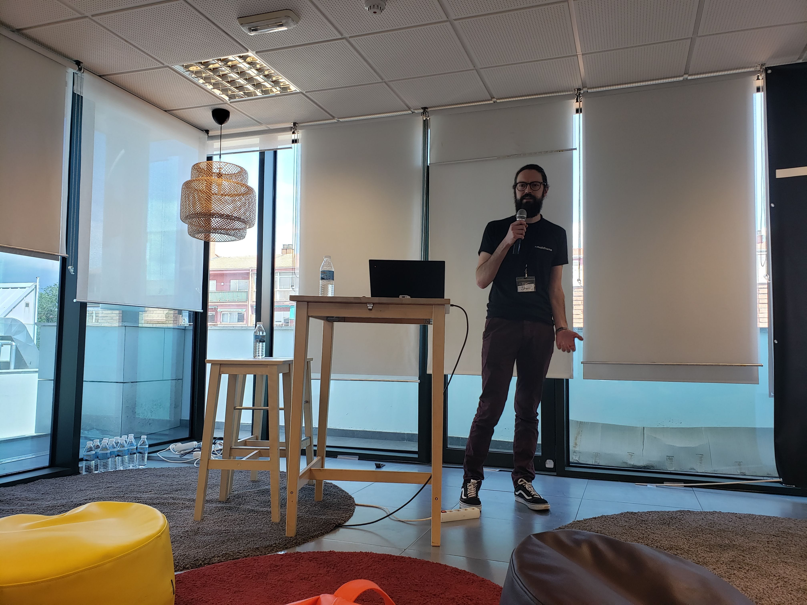
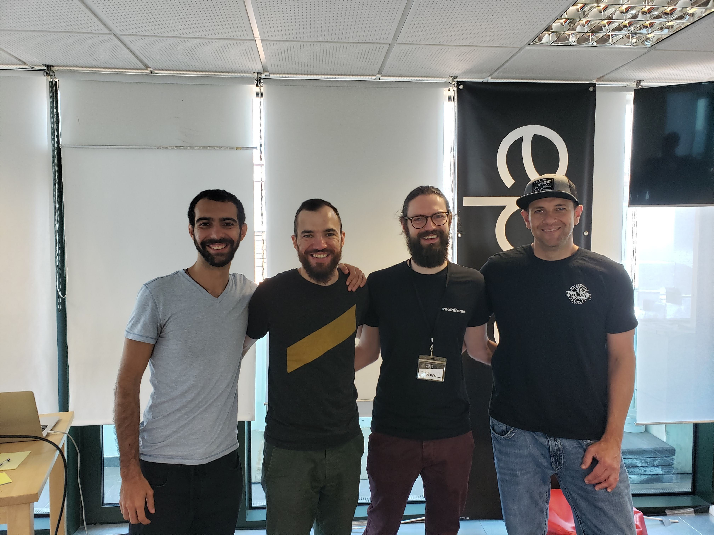

# Swarm Orange Summit 2019

Swarm Orange Summit 2019

We have spoken here about Swarm before, but as a reminder, Swarm is the distributed storage and communications platform, funded by the Ethereum Foundation, that underpins a lot of the functionality that exists in Mainframe OS today. In May, we had the opportunity to send 4 of our engineers to the annual [Swarm Orange Summit](https://summit.ethswarm.org/) (hosted by [Epic Labs](https://www.epiclabs.io/) in Madrid) to discuss the latest on Swarm development, meet with the Swarm community and share ideas.

Our main contribution to the summit was to deliver 4 talks covering some of the novel ways we are using Swarm and presenting some tools we have developed that can be of further benefit to other projects building on Swarm.

Camron Levanger gave 2 talks: *Deploying and Managing Swarm with Kubernetes* where he demystified the steps needed for anyone to be able to deploy and monitor a cluster of Swarm nodes on AWS; and *Treating Swarm as a Project Dependency* presenting a development tool called [Swarmer](https://github.com/MainframeHQ/swarmer) which makes it easy for multiple developers working with swarm to share setup and configuration information, ensuring that they each have similar development environments.

Miloš Mošić presented the latest iteration of our JavaScript library for Swarm called [Erebos](https://erebos.js.org/) in his talk *Introduction to Erebos: a JavaScript client for Swarm*. Rather than being a simple wrapper around the Swarm API, Miloš detailed some of the unique convenience functionality and higher-level abstractions that are provided inside Erebos to make it easier to build on Swarm.

My talk, *Mainframe OS × Swarm* focused on looking under the hood of [Mainframe OS](https://mainframeos.com) — examining some of the core functionality and how we have utilitised the primitives supplied by Swarm to implement it. A portion of the talk was given to demos showing the user-side of this functionality in action.

The summit was a great opportunity to meet and discuss ideas both with people trying to solve the hard technology problems and with people who care about privacy and ownership of data. In particular there there was a strong focus on figuring out what steps can be taken now to begin moving Swarm from being an experimental project with few guarantees for its users, to becoming a robust piece of core infrastructure, even if some features are incomplete.

Thanks, as always, to [Viktor Trón](https://twitter.com/zeligf) & everyone on the Swarm team for everything they do developing this essential technology & working together with Mainframe, and to [Javier Peletier](https://github.com/jpeletier) & the team at Epic Labs for generously hosting the summit at their wonderful offices in Madrid!

Source: https://blog.hifi.finance/swarm-orange-summit-2019-5bbb43711759
