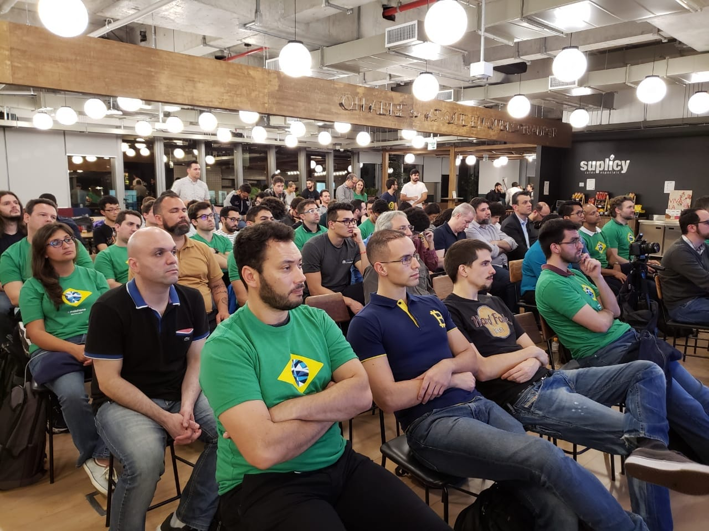
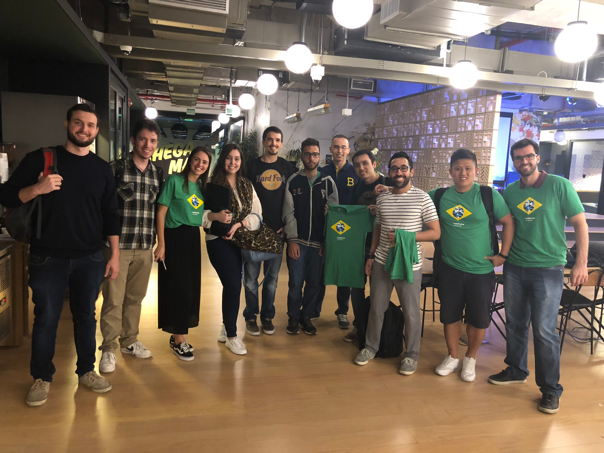
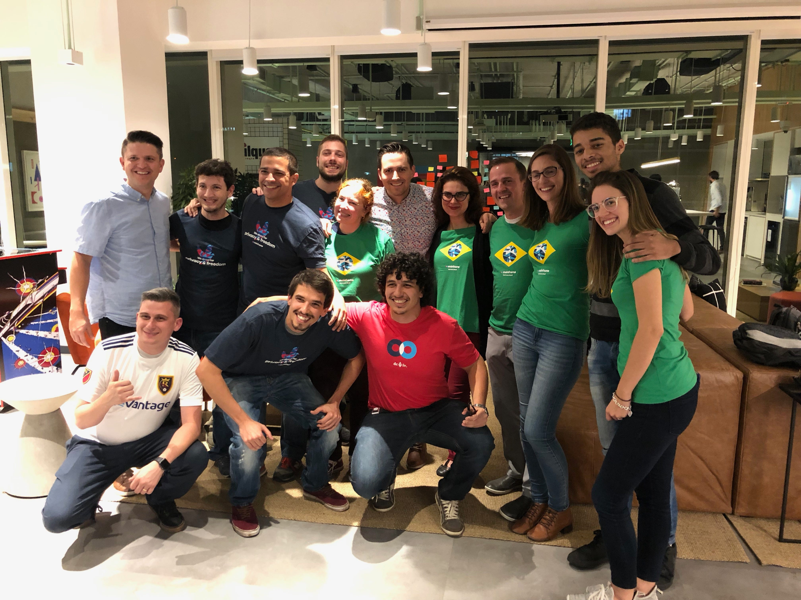
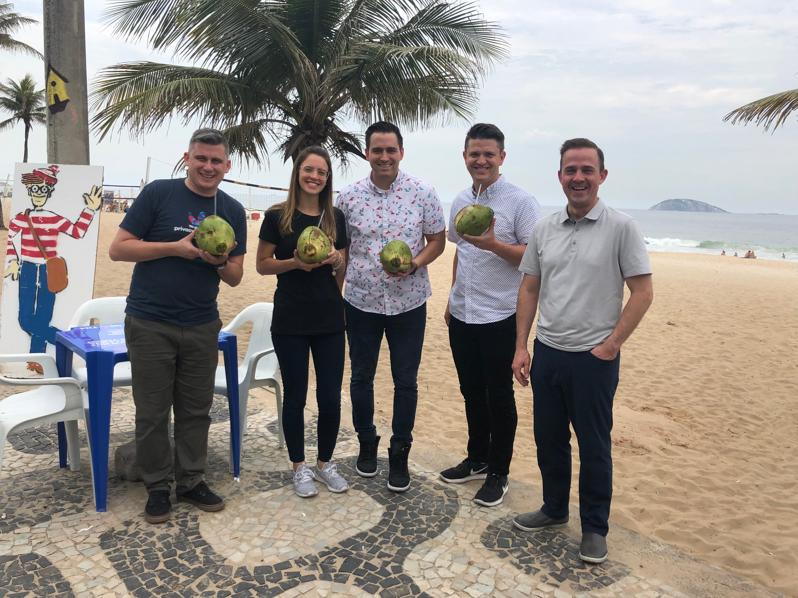
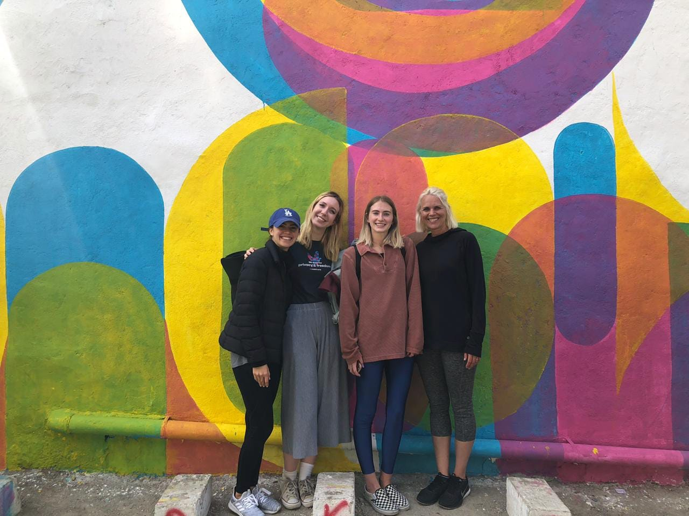

# Mainframe & Brasil 🇧🇷

Mainframe & Brasil 🇧🇷

Many of you have noticed that we’ve been traveling more frequently to Brasil in the last 6–9 months. We’ve shared publicly that we’ve opened an office in São Paulo, but we haven’t shared much detail beyond that. Having just gotten back from a great trip last week, I thought I’d share more.

### **Why Brasil?**

I personally lived in Brasil for two years during my early 20’s. I speak fluent Portuguese. I love the country and the people. Talent is equally distributed, but opportunity is not. One place that’s become abundantly clear to me is Brasil. It’s a country that is so rich in culture, creativity, talent, drive and potential. Yet, due to a lot of different factors (economic, political, etc), they just haven’t been given the same opportunities.

But that hasn’t stopped them. Brazilians are scrappy and resilient. They are hackers in every sense of the word — always finding ways to beat the odds and overcome broken systems. Brazilians work through challenges with joy and delight — and they work hard. We have learned that first-hand working with various Brasil-based dev partners and then with our first native Brazilian employee, Diogo Perillo (originally from Belo Horizonte). He is one of the most reliable and talented front-end developers I’ve ever worked with.

### Our Past Visits

Last year we traveled to many different cities in Brasil — speaking at events, organizing Mainframe meetups, participating in hackathons and more. We wanted to better get to know the different startup/blockchain communities in Brasil and evaluate where we should open an office. In the end we opened our office in São Paulo. That decision was difficult — there are so many amazing startups and entrepreneurs all over Brasil helping build web3. They are tackling major, real-world problems that are native to their country. I think we could have chosen a few different cities. The Decentralized Web can and will have a major impact on the country of Brasil. Like so many other parts of the world —young Brazilians have a growing distrust for government leaders, financial institutions, media companies and more. We love the rhythm and pace of São Paulo — it’s a big city filled with hungry, driven and ambitious people. Constant movement. Perfect for our first Brazilian office.

### Current Team

We now have a team of 4 talented people working from our São Paulo office (currently in Spaces Vila Madalena coworking space in the Pinheiros neighborhood). Willian comes to Mainframe with years of full-stack experience and valuable blockchain expertise; Robson is a great engineer, big-picture thinker, and certified Product Owner; Guilherme is a talented web applications developer critical to implementing the uncompromising UX & polished design Mainframe is famous for; and Babi covers product management, marketing, and operations. Together they bring valuable experience from the world of fintech, payments, banking, and blockchain. We couldn’t ask for a better combination of skills, talents, and personalities. They are excited and committed to help Mainframe pursue the promise of web3. Our office in Brasil is just getting started — if you’re interested please reach out to us.

Last week we had a wonderful time in São Paulo with the entire Mainframe OS development team. We had strong product, marketing, strategy and technical discussions throughout the week. I don’t think I’ve ever been more excited and optimistic about the future of Mainframe OS, and the future of Mainframe in Brasil. I can’t wait to share more when the time is right!

Cheers, 
Mick

*The amazing women at Mainframe. Picture taken in São Paulo.*

Source: https://blog.hifi.finance/mainframe-brasil-c7acd099205a
