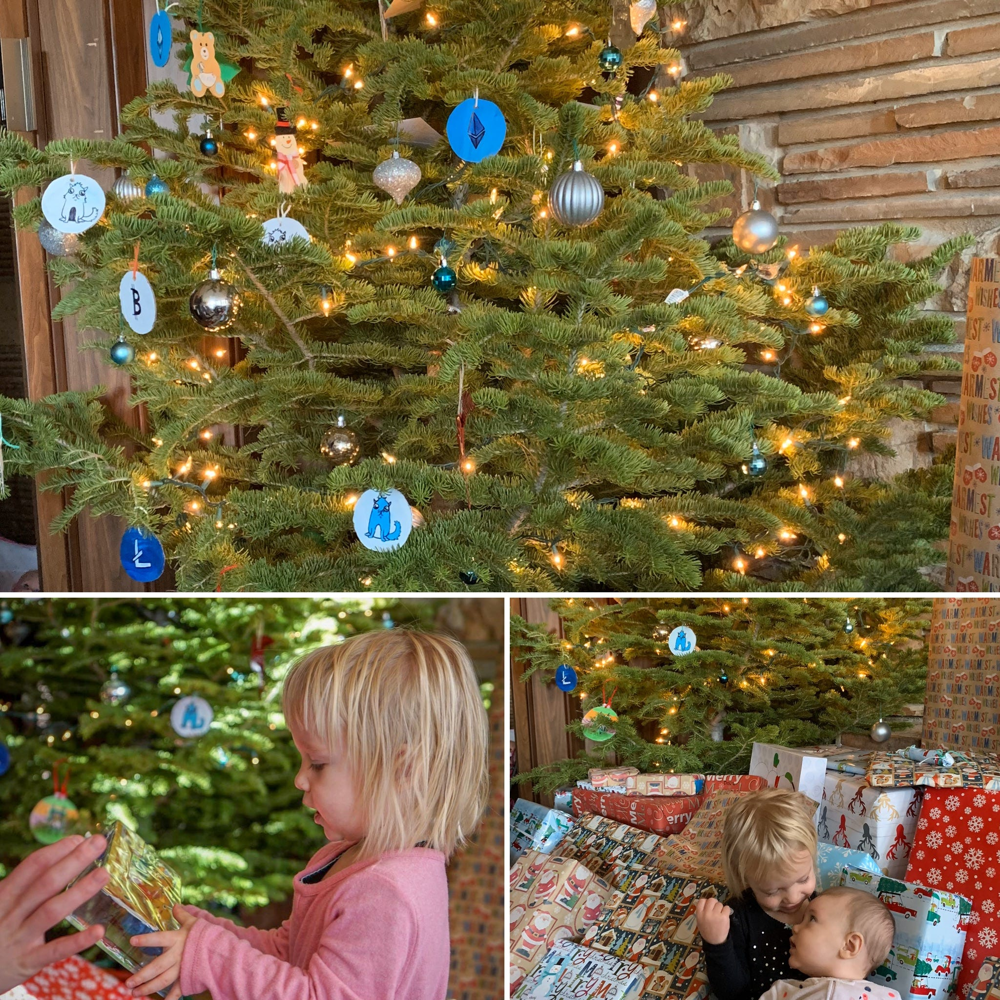

# Shareholder Letter February 2020

*Doug shared the following with employees, shareholders, pre-sale participants, MFT holders, and the members of the community on February 10, 2020. In tandem with this letter is the announcement that [Doug will be replacing Mick as CEO of Mainframe](https://blog.mainframe.com/new-chapter-new-ceo-1aebe86a63f6).*

Hi everyone,

Working for a startup, many have observed that the only constant in this space is change itself. Like the broader blockchain ecosystem, the process of continual evolution continues at Mainframe. Let me introduce myself by sharing some of the experiences that shape my frame of reference and layout the priorities I’ll be focusing our efforts on.

Mainframe is in a very different position today than it was when I first joined the company. Our opportunity is much clearer today as a participant in the decentralized finance (DeFi) ecosystem. It’s no wonder that on the internet of money, as some have referred to the blockchain vertical, it would be financial tools to emerge as the frontrunners of utility and innovation.

As an early adopter of bitcoin, I’ve spent my fair share of time at gatherings of family and friends “helping” them see the decentralized, permissionless light. From those efforts, I only ever convinced my wife, Chandler, to purchase a measly $13.76 of Bitcoin. It’s clear to me that those of us in this space see and think differently than the rest of the world. To Chandler’s credit, though, she would later support me in turning our basement apartment into a full-on bitcoin mining operation. Even with free electricity, that operation wouldn’t turn out much of a profit. Over the years, I’ve been quick to make attempts at adopting any trustless products I could get my hands on. Most of these offerings come with some obvious trade-off.

*A few years ago, I woke up on Christmas morning to a redecorated Christmas tree. My Sister-in-law spent the night handcrafting images of some of my favorite things and decorating our tree with them.*

Notably, I’ve had the “opportunity” to account for BTC capital gains taxes on purchases I made at Costco with my [Coinbase connected Shift card](https://web.archive.org/web/20190226185231/https://www.shiftpayments.com/card) (which today is no longer available in the US for good reasons). Then, there was the time I made the mistake of paying for dinner using a Bitcoin wallet on my phone. It was a cool experience if you are into awkwardly waiting as you and the waitress (in my case) stare at a spinning wheel of “progress” while digesting the various warnings that explain the potential consequences of navigating away from or refreshing the current webpage! Thankfully, no one else in the restaurant wanted to pay for their meal as we patiently waited for consensus on the granddaddy of all blockchains. I’m an enthusiastic fan of immutable integers, who collectively express themselves as digital cats. No, Chandler does not know how much I spent on breeding [cryptokitties](https://www.cryptokitties.co/) in an attempt to create the purrfect racing specimen. But in fairness, she also does not know how much I earned sire’ing them out for their desirable pedigree, nor how much I won during my [competitive kitty racing](https://kittyrace.com/) days.
> # Blockchain is exceptionally difficult to understand.

Along the way, I’ve learned a few things. Blockchain is exceptionally difficult to understand. When standing in line at the checkout stand of Costco, people want to pay for their groceries, not make investment decisions with capital gains tax consequences. No matter how good our marketing is, hexadecimal was never intended for human consumption. Dressing up immutable integers as cats may be a million-dollar idea, but explaining the concept to any sane person will make establishing credibility with them more of an uphill battle. And finally, it takes a particular type of person to stomach the volatility that has come to define this space.

I do not intend to be flippant about the real innovation that blockchain is. But, I find myself as one of the early adopters who potentially, much like yourselves, are willing to jump through the trustless hoops and do the decentralized dance, all the while telling myself these are just minor inconveniences on the road to new horizons.

It is my observation that currently, there are not enough Doug Leonard’s in the world to sustain another wave of massive growth and adoption of reasonably technical blockchain products. But this is fine. Appropriately, I will be using this frame of reference as I work with Mick and other stakeholders in defining Mainframe’s strategy through this transition and set aim on our future.

## Mainframe’s immediate priorities:

* Sustainability

* MFT Utility

* Extending the unique benefits of blockchain to a non-technical audience.

While our balance sheet, runway, and burn rate are healthy and within reasonable ranges, it still is our reality that Mainframe is yet a viable business. Appropriately, Mainframe will become a sustainable operation. Next, MFT is underutilized. No secret here, this will be addressed immediately. And Finally, to position ourselves with the highest probability of success, we will not be relying on the relatively small number of “Doug Leonard’s” that exist in the world today. The beneficiaries of our ecosystem will extend itself to individuals who are unaware and uninterested in the reality that the unique capabilities of blockchain are benefiting them.
> # “I believe blockchain will, with the same order of magnitude, impact and change our world on par with the internet.”

*Close up of my clay bitcoin plate I painted and fired. Apparently, I like to revisit this instagram post every few years and comment to myself.*

I joined Mainframe in response to my wife, being tired of my big talk, explaining yet again all the grandiose promises that blockchain holds. In the context of our conversation, I shared something I’d expressed many times previously, “I believe blockchain will, with the same order of magnitude, impact and change our world on par with the internet.” To which she responded, “If you believe that, then why aren’t you doing something in blockchain?” A few weeks later, I’d leave my consulting work behind and start my journey at Mainframe.
> # The vast majority of these customers will neither know or care that they are a beneficiary of blockchain, any more than you care that you are the beneficiary of NoSQL databases when you use your real-time banking and finance applications.

Then like now, I continue to eat the proverbial blockchain dog food or catnip as it were and participate in our ecosystem beyond just speculation. For us to experience massive growth, we will position ourselves to serve a much larger audience than currently exists in blockchain today. The vast majority of these customers will neither know or care that they are a beneficiary of blockchain, any more than you care that you are the beneficiary of NoSQL databases when you use your real-time banking and finance applications. Mainframe will make the necessary investments and changes to become self-sufficient, ensuring our ability to make right on our long-term commitment to equity investors, MFT holders, and other vital ecosystem stakeholders. I look forward in the coming days to outlining in more detail the specifics of this strategy, in a series of blog posts that my mother-in-law can understand, since that’s a real commitment I’ve made to her.

Mick and I will do a [live AMA](https://youtu.be/oKtXxSKqtVI) this Wednesday, February 12th at 10 AM MST. Bring your questions for either one of us and we will dive deeper into any of the details you’d like to explore.

-Doug

Source: https://blog.hifi.finance/shareholder-letter-february-2020-36fdb310a82d
