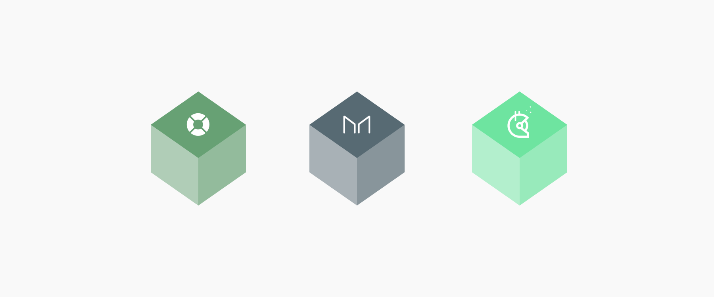

# Mainframe Lending Protocol: A Primer

In the coming weeks, I will publish the next iteration of Mainframe’s Credit Protocol. The protocol takes on a slightly altered name to align with its core value proposition as the Mainframe Lending Protocol. Below I share its abstract as a preview.
> The Mainframe Lending Protocol allows anyone to generate yTokens by leveraging collateral assets approved by Mainframe Governance. yTokens are a zero-coupon bond-like instrument, representing an on-chain obligation that settles on a specific future date. Buying and selling yTokens enables fixed-rate lending and borrowing — something much needed in decentralized finance today. Mainframe Governance is the community organized process of managing the various aspects of the Mainframe Lending Protocol. Unique to the Mainframe Lending Protocol is the liquidation mechanism, rehypothecation of collateral accounts, and a settlement priority based on Mainframe Token (MFT) staking. The system provides resources and incentives to Uniswap liquidity providers and avoids unnecessary sell pressure during liquidations. Together, the strategies for liquidation, rehypothecation, and settlement enables lower collateral requirements and allows for a more efficient increase in leveraged exposure to base assets.

### Accelerated Innovation Through Open Development

What makes decentralized finance (DeFI) revolutionary is the way it separates itself from traditional finance. The defining characteristic of decentralized finance is that by nature, it is open. This open development brings with it transparency, auditability, and accelerated innovation.

For example, we observe many projects that depend on MakerDAO’s price feed as a critical part of their infrastructure. Rather than reinventing the wheel, teams can focus on the domain-specific innovations unique to their project. This interdependence forges symbiotic relationships. MakerDAO now has a large pool of invested participants willing to contribute to the success of that critical part of their infrastructure. The additional attention from aligned ecosystem participants contributes to a higher likelihood of responsibly disclosed vulnerabilities and a greater number of improvement proposals to consider.

*DeFi building blocks.*

Other examples include dApps like [DeFi Saver](https://defisaver.com/). These dApps extend existing building blocks to enable new or improved experiences for end-users. DeFi Saver extends the Maker Protocol with a new layer of tools that make it easy to leverage ETH and helps lower the probability of liquidation for Maker Vaults.

Each DeFi protocol helps forge reusable infrastructure and define trustless financial primitives that can be used directly or repackaged into new forms that serve a broader audience to meet emerging user needs. [Chai](https://chai.money/) is an excellent example of a project that took the DAI savings rate and repackaged it into a more portable form factor. This building block architecture baked into the core of our ecosystem lowers the cost to innovation, and makes DeFi special.

With this context of what defines DeFi and makes it the home to so much innovation, I returned to our [previously published white paper](https://blog.mainframe.com/mainframe-credit-protocol-unlocking-economic-freedom-financial-access-for-all-753a9590692f) for the Mainframe Credit Protocol and have iterated on it. The next iteration maximizes the use of existing protocols and infrastructure. This change in approach will accelerate delivery and allow us to benefit from existing knowledge and interfaces within the broader community.

### Gitcoin Bounties

Effective immediately, Mainframe will dramatically change its approach to development. As previously mentioned, the next iteration of our protocol borrows extensively from others. Specifically, we make use of [MakerDAO’s ](https://twitter.com/MakerDAO)[Maker Protocol](https://docs.makerdao.com/), [Dan Robison’s](https://twitter.com/danrobinson/status/1169689525536215040?lang=en) [Yield Protocol](https://research.paradigm.xyz/Yield.pdf), and [Hayden Adams](https://twitter.com/haydenzadams/status/1242185649341554689?s=20)’ [Uniswap Protocol v2](https://uniswap.org/blog/uniswap-v2/). To ensure the value and contributions we drive back to each of these projects is as large as possible, Mainframe will leverage the [Gitcoin](https://gitcoin.co/landing) community for all future development needs.

### An Open Invitation for Collaboration

This effort is an open invitation for collaboration. For example, [Paradigm announced](https://twitter.com/niemerg/status/1258488654437195779?s=20) recently its investment in Yield, a company that will work to implement Dan Robison’s Yield Protocol. Since we will be implementing at least in part, some of the ideas expressed in Dan’s paper, Yield is welcome to collect the bounties we post that overlap their implementation and offset some of their development costs. I am open to as much or little direct collaboration between anyone implementing overlapping parts of the protocols we intend on leveraging.

### Conclusion

The Mainframe Lending Protocol will be published in the coming weeks. Mainframe continues its commitment to shaping the trustless future and helping break down the barriers to entry that exist for blockchain today. We want more than ever to help decentralized finance become the toolset that the vast majority of the world will use to unlock economic freedom.

Source: https://blog.hifi.finance/mainframe-lending-protocol-a-primer-c8e5241efce7
