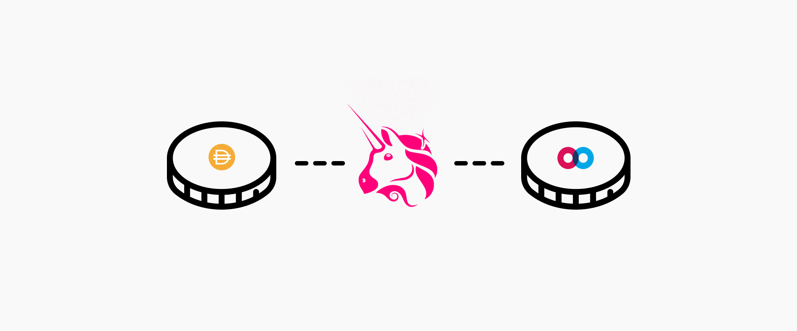

# Progress Report: Incoming Airdrops

The next iteration of the Mainframe Lending protocol will bring huge changes to the token economics and utilization of Mainframe Tokens (MFT). In anticipation of the upcoming changes, it’s time to begin ramping up engagement with the community and the attention we want focused on MFT. It’s time for some Airdrops!

## Progress Report

Here is a brief update on the progress being made on delivering fixed-rate lending and borrowing to Decentralized Finance. Notably, we’ve reduced the system’s exposure to liquidation risk and updated the liquidation mechanism for greater usability. MFT Staking based priority for settlement is no longer necessary and was removed. Here’s an updated version of abstract.
> The Mainframe Lending Protocol allows anyone to generate yTokens by leveraging collateral assets approved by Mainframe Governance. yTokens are a zero-coupon bond-like instrument, representing an on-chain obligation that settles on a specific future date. Buying and selling yTokens enables fixed-rate lending and borrowing — something much needed in decentralized finance today. Mainframe Governance is the community organized process of managing the various aspects of the Mainframe Lending Protocol. Unique to the Mainframe Lending Protocol is the liquidation mechanism, rehypothecation of collateral accounts, and an incentivization layer powered by staking Mainframe Tokens (MFT). The system avoids unnecessary sell pressure during liquidations. Together, the strategies for rehypothecation, liquidation, and settlement enable lower collateral requirements and allow for a more efficient increase in leveraged exposure to base assets.

## Airdrops, Airdrops, Airdrops!

Now is the time for community members to reengage. To help catalyze this, Mainframe will be airdropping MFT to community members who choose to participate. Given that the protocol is still being finalized before we begin development, how can you engage when the protocol isn’t quite ready yet? And how can our efforts help drive positive attention towards MFT?

### Incentivised DeFi Engagement

The plan is to airdrop MFT to Uniswap Liquidity Providers, who contribute to the [MFT/DAI market](https://uniswap.info/pair/0xe8056b83ba7daf027414b58048a48911acf1b2a9). For many, this will be a new experience, and appropriately I’ll publish a tutorial on how to add liquidity to Uniswap shortly. With our pivot into DeFi, DAI was the natural choice for us to promote alongside MFT since the Maker Protocol, which brings us DAI, is the most utilized DeFi protocol.

Our objective here is to increase MFT’s exposure, specifically to the DeFi ecosystem. One way this can be accomplished is by pairing MFT to other DeFi tokens on Uniswap. When some combination of MFT liquidity pairs delivers a better price for traders seeking other DeFi tokens, MFT gets a small amount of exposure in front of the right audience. Mainframe has started seeding many of these markets and will continue to do so.

> Mainframe will airdrop an additional $10,000 in MFT if, together, we rank and maintain a first-page placement on [uniswap.info](https://uniswap.info/home).

Another desirable position of exposure is the [uniswap.info](https://uniswap.info/home) liquidity rankings. Ideally, by pooling together, MFT/DAI rank on the first page. Mainframe will airdrop an additional $10,000 in MFT if, together, we rank and maintain a first-page placement on [uniswap.info](https://uniswap.info/home).

A couple of days each week, Mainframe will airdrop approximately $100 worth of MFT to liquidity providers. Airdroped MFT will be in proportion to each participant’s stake of the MFT/DAI liquidity pool. Mainframe’s contribution to the pool will be properly accounted for such that it does not dilute how much community participants receive.

Part of the new token economic model that governs MFT involves streaming staking rewards overtime to those who choose to stake. As an introduction to streaming tokens, airdropped MFT will stream to liquidity providers over approximately three months. Withdrawing your position from the pool may cause the stream to stop. Airdrops will begin the day after I publish the tutorial for adding liquidity to Uniswap. Airdrop recipients qualify for early access to the protocol during a session of community feedback and review before the Mainframe Lending Protocol is officially published.

### $10,000 Bonus Incentive

If the MFT/DAI pair maintains a spot on the first page of [Uniswap.info](https://uniswap.info/home), Mainframe will stream an additional $10,000 worth of MFT to contributing liquidity providers. The duration of this larger bonus stream will be approximately six months.

As you can see, it’s time to fire up the MFT hype train. As we inch closer to the next milestone, we witness improvements to the simplicity and usability of the Mainframe Lending Protocol. The incentives introduced today are here to help drive community engagement and positive attention to MFT. If you are new to Uniswap, keep an eye out for our upcoming tutorial.

Source: https://blog.hifi.finance/progress-report-incoming-airdrops-1fd1081d3797
