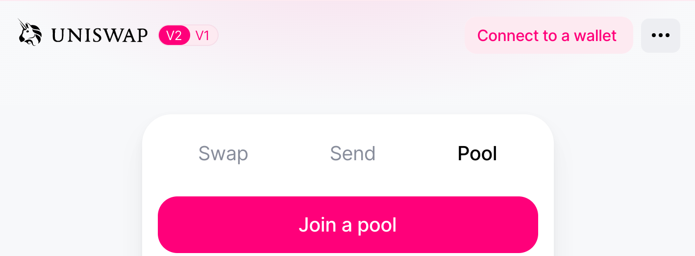
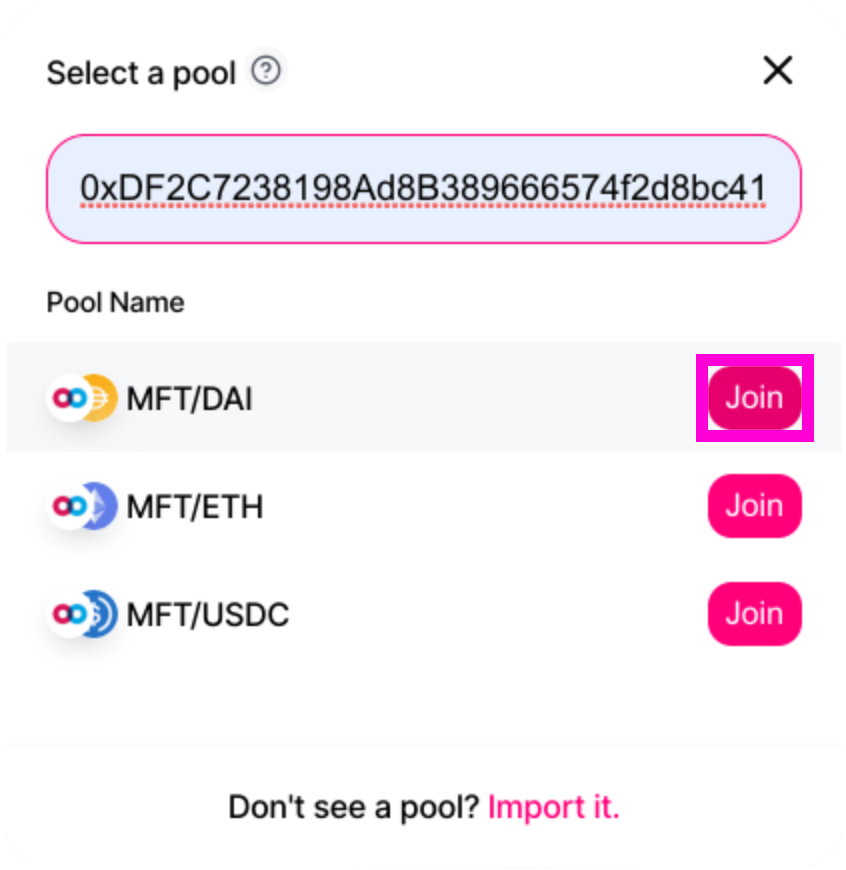
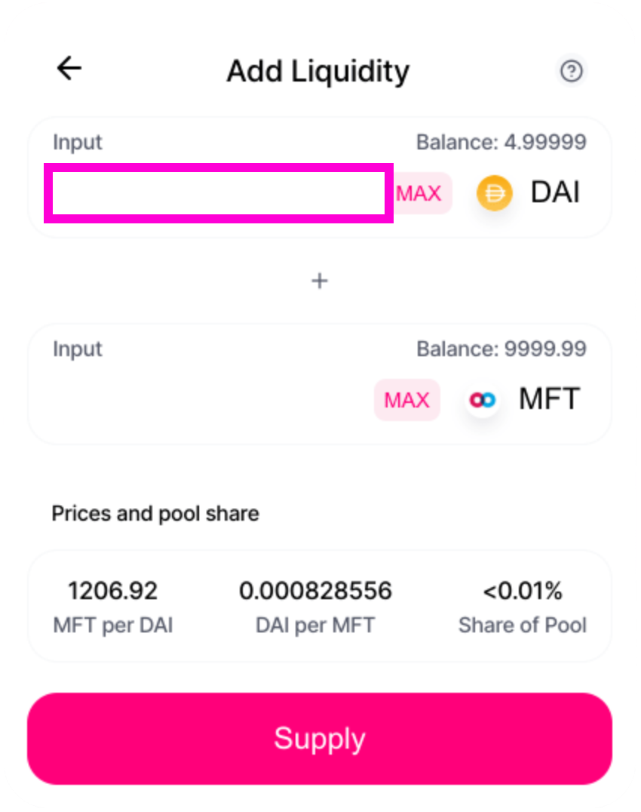
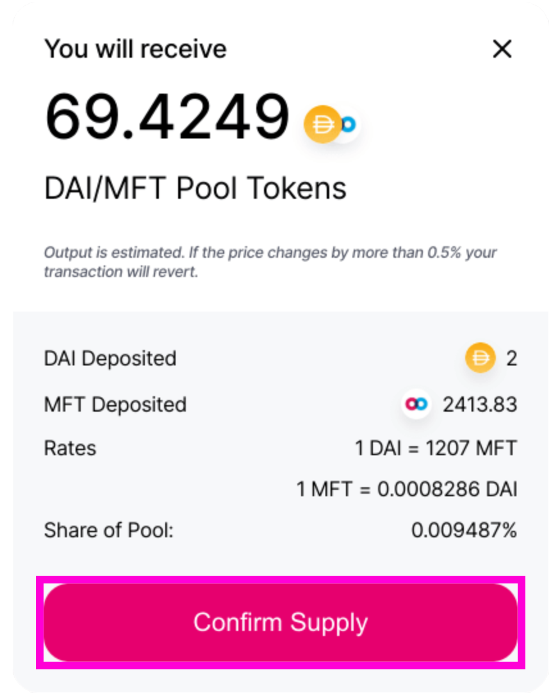

# Tutorial: Adding Liquidity to Uniswap v2

Tutorial: Adding Liquidity to Uniswap v2

Earlier this week [Doug Leonard](undefined) announced [Mainframe](undefined) will [Airdrop MFT to liquidity providers](https://blog.mainframe.com/progress-report-incoming-airdrops-1fd1081d3797) on the [Uniswap MFT/DAI market](https://uniswap.exchange/pool). This tutorial will guide you through the steps necessary to add liquidity to Uniswap version 2.

### **Requirements:**

1. [Metamask](https://metamask.io/) wallet

1. [DAI](https://uniswap.exchange/swap?outputCurrency=0x6b175474e89094c44da98b954eedeac495271d0f) tokens/[MFT](https://uniswap.exchange/swap?outputCurrency=0xdf2c7238198ad8b389666574f2d8bc411a4b7428) tokens

1. [Uniswap](https://uniswap.exchange/swap)

## Step by step instructions

To begin, you will need DAI and MFT in your Metamask wallet and some ETH for the gas fees. If you need more MFT you can swap DAI, ETH, or other tokens for it in Uniswap.

### **Step 1. Go to [https://uniswap.exchange/pool](https://uniswap.exchange/pool)**

Once you are on the Uniswap website connect your Metamask wallet by clicking on “Connect to a Wallet” in the top right corner.

Confirm this interaction in your Metamask wallet.

### **Step 2. Join a Pool**

Click on the bright pink “Join a pool” button.

### **Step 3. Select the pool**

Search for the MFT/DAI liquidity pool by pasting the smart contract address for MFT into the search bar. Here it is for easy reference. [**0xdf2c7238198ad8b389666574f2d8bc411a4b7428](https://etherscan.io/token/0xdf2c7238198ad8b389666574f2d8bc411a4b7428)**

****0xdf2c7238198ad8b389666574f2d8bc411a4b7428****

Then click the “Join” button for the MFT/DAI pool.

### **Step 4. Add Liquidity**

Enter the amount of DAI you want to add to the liquidity pool. Uniswap will automatically fill the MFT input box with an equivalent amount.

Click on the “Supply” button.

### **Step 5. Confirm Supply**

Uniswap will show you the details of the transaction.

If you are satisfied, click Confirm Supply.

### **Step 6. Confirm the transaction in Metamask**

You will also need to confirm the transaction in your Metamask wallet. Your wallet will show you the gas fee and the total transaction amount.

If everything looks correct click on Confirm.

**Congratulations, as soon as the transaction is confirmed you are now a liquidity provider. **You earn a liquidity fee for every transaction in the MFT/DAI market.

You can view the transaction on Etherscan or close the window.

Note: You may choose to add or remove liquidity by selecting ‘Add’ or ‘Remove’ respectively.

### **Other options:**

* Try our [**Interactive Tutorial](http://ior.ad/71Fv)**

* Watch our [**Video Tutorial](http://ior.ad/71Fv)**

### **Knowledge Base**

* [Uniswap Whitepaper](https://hackmd.io/@477aQ9OrQTCbVR3fq1Qzxg/HJ9jLsfTz?type=view#Introduction)

* [https://uniswap.io/](https://uniswap.io/)

* [https://docs.uniswap.io/](https://docs.uniswap.io/)

* [https://mainframe.com/](https://mainframe.com/)

* Reach out to us in our [telegram group.](https://t.me/MainframeCommunity)

* [https://blog.mainframe.com/progress-report-incoming-airdrops-1fd1081d3797](https://blog.mainframe.com/progress-report-incoming-airdrops-1fd1081d3797)

Source: https://blog.hifi.finance/tutorial-adding-liquidity-to-uniswap-v2-2bb641f2bbc0
