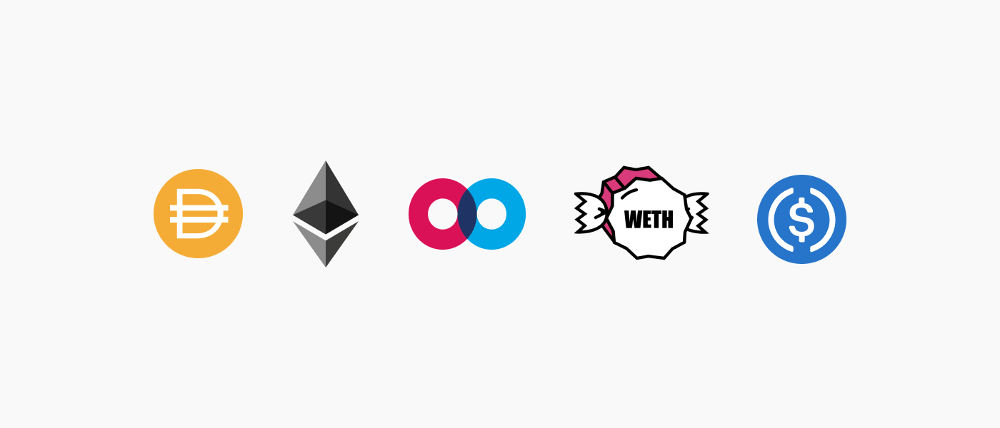

# MFT Airdrop Update: Realigning Incentives

MFT Airdrop Update: Realigning Incentives

Thanks to all our MFT Liquidity providers! So far, we have airdropped over 8,000,000 MFT! As we listened to community feedback shared with us in discord and looked for ways to improve the incentive program, we are now ready to introduce the next iteration. New changes will go into effect beginning August 24, 2020.

### Changes

To consolidate liquidity and provide more clarity around which pools will receive rewards, we have published links to the pools that qualify below. These pools are all 50/50 balanced pools, and each has a fee of 0.3%. Please migrate your liquidity before August 24, 2020. If you have liquidity in any other pools than the ones linked below, you will not qualify for the airdrops.

Mainframe will continue to airdrop 1,000,000 MFT each week. Typically, two snapshots are taken throughout each week, and rewards are distributed once gas prices are below 50 Gwei. Snapshots are posted in the Liquidity Mining channel on our [Discord server](https://discord.gg/mhtSRz6) for your reference.

### Qualifying Uniswap Pools

* [MFT-ETH](https://uniswap.info/pair/0x2084c8115d97a12114a70a27198c3591b6df7d3e)

* [MFT-DAI](https://uniswap.info/pair/0xe8056b83ba7daf027414b58048a48911acf1b2a9)

### Qualifying Balancer Pools

* [MFT-WETH](https://pools.balancer.exchange/#/pool/0x2eb6cfbffc8785cd0d9f2d233d0a617bf4269eef/)

* [MFT-USDC](https://pools.balancer.exchange/#/pool/0x19db8e1a8553955757e87bc2620b76cca4262577/)

### Other Incentives

Mainframe gives away [$3000 to liquidity providers each month](https://blog.mainframe.com/new-liquidity-mining-campaign-for-mainframe-mft-going-live-on-june-16-2020-7aa1d316e8f6) through our Hummingbot campaign. [Join our Discord server](https://discord.gg/mhtSRz6) if you need any help participating.

Source: https://blog.hifi.finance/mft-airdrop-update-realigning-incentives-35ebf83a43ab
