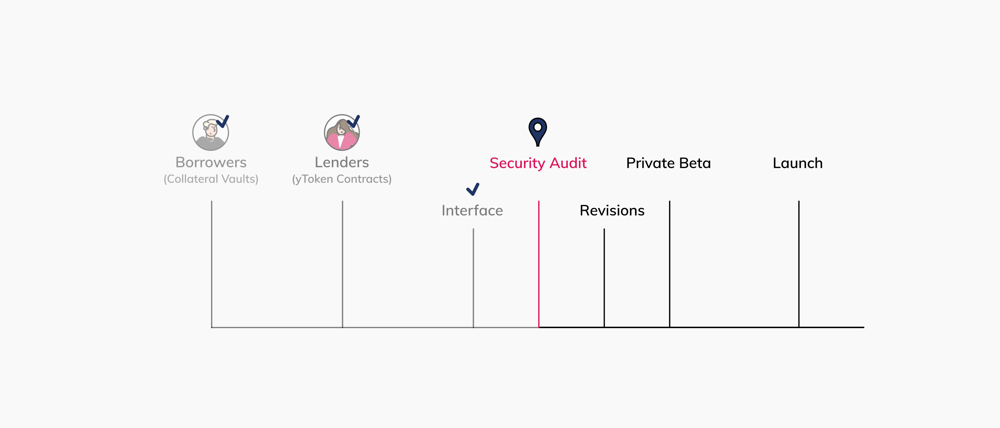

# Progress Report: Security Audit — Round One

Progress Report: Security Audit — Round One

### **The first round of our security audit is back from Quantstamp**

<iframe width="560" height="315" src="https://www.youtube.com/embed/CsQC6nRg0UI" frameborder="0" allowfullscreen></iframe>

Recently there have been some significant developments at Mainframe, including more talented engineers to the team, our audit report from Quantstamp, and an updated roadmap to launch.

### Team Growth

We’ve added two talented engineers to the team to handle our front-end development and our liquidation bots. They are busy at work as we prepare for the beta launch.

### Updated Roadmap

Here’s where we are at on our roadmap to launch. Our interface is out of the design phase and is currently being implemented. Shortly we expect to begin a round of private beta testing. To join our private beta, head to [our Discord server](https://discord.gg/mhtSRz6), and keep an eye out for updates.

### Audit Report

Our focus on simplicity and time to market is paying off. Usually, when you receive an audit report back for a protocol like ours, there would be a laundry list of items that need attention. These items rank from High to low risk. We received six low-risk points of feedback that have been acknowledged and re-submitted for the next round of scrutiny.

Source: https://blog.hifi.finance/progress-report-security-audit-round-one-9352dc37feb1
