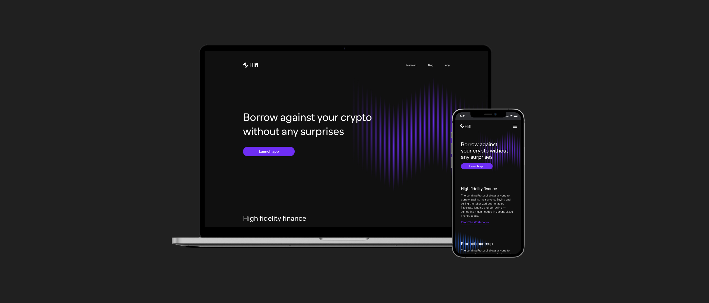
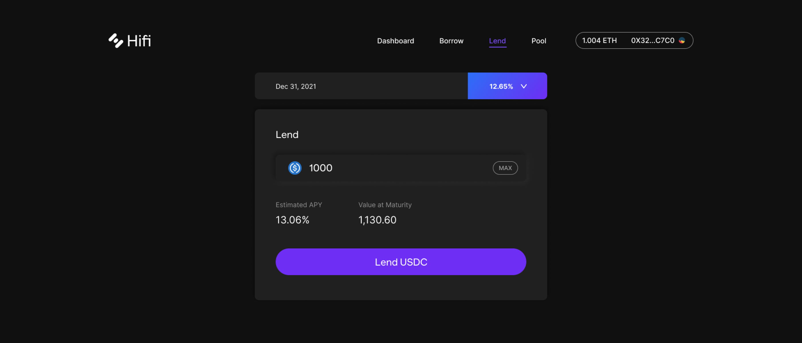

# Mainframe is now Hifi

Mainframe is now Hifi

### Introducing our new visual brand that encompasses our mission of delivering a high fidelity experience to decentralized finance.

Since beginning our pivot into DeFi, we’ve added to our leadership, rebuilt the team from the ground up, acquired Sablier, and we’re about to launch our lending protocol. This isn’t Mainframe anymore.

<iframe width="560" height="315" src="https://www.youtube.com/embed/ZxGJeNOFT20" frameborder="0" allowfullscreen></iframe>

### Introducing Hifi.finance

Hifi’s core values of delivering confidence and clarity to our users can be found throughout our new branding. Every decision for our rebrand was carefully considered to instill confidence for our users, who make large financial transactions on our protocol.

### Brand update

Hifi comes from our goal of creating *high fidelity* experiences and products for the DeFi space. The logo and submark encompass the functional and technical aspects of our brand in a clean, minimal way. Our primary color blends the Mainframe red and blue to create a unique purple that will help us stand out among the greens and blues of DeFi. Our dark color theme takes into account the preferences of our users while creating a strong website and web app.

### How does this affect you?

As a member of Hifi’s community, you can expect that we will continue to prioritize design and user experience so that we’re positioned well for growth and adoption as DeFi continues to grow.

Head over to [hifi.finance](https://hifi.finance/) to sign up for notifications about the launch of the Hifi Lending Protocol.

Source: https://blog.hifi.finance/mainframerebrand-5cb034c26e42
