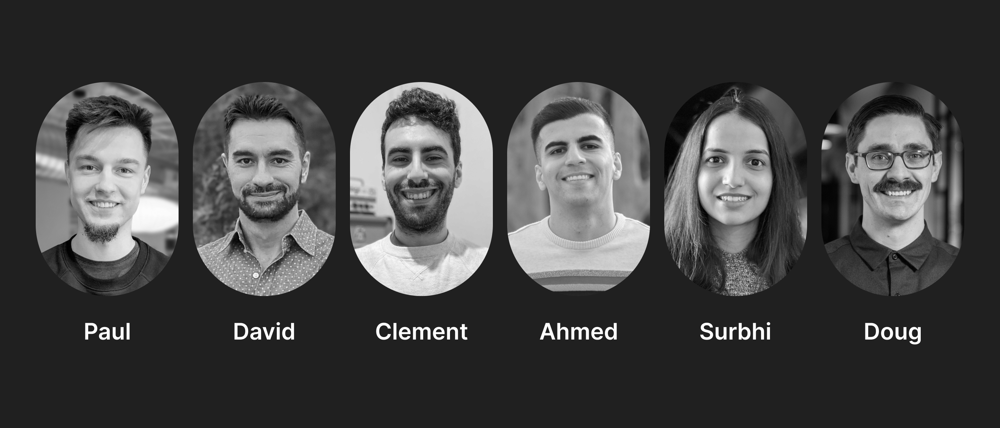
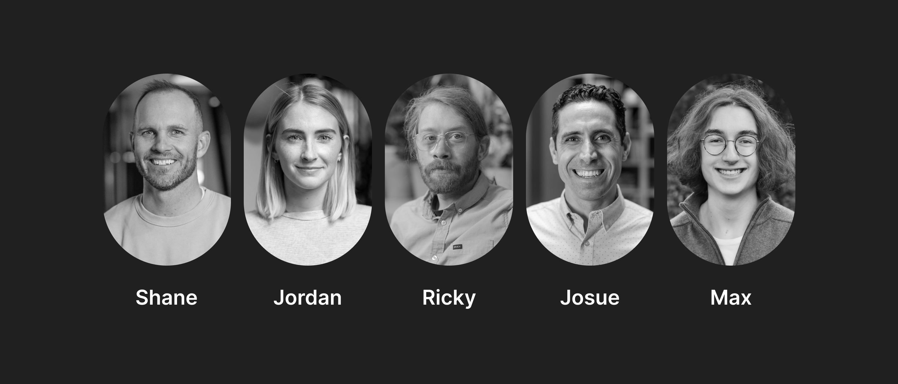

# Hifi Lending Protocol v.0 launched

Hifi Lending Protocol v.0 launched

### The moment we’ve all been waiting for is here; our public beta is live on Mainnet.

### ⚠️ Caution!

The borrowing and lending market will be volatile at first; if you are looking for a way to contribute, consider pooling liquidity into the balancer pool. Please be aware that any amount of hUSDC (our debt token) is limited to the balancer pools’ liquidity if you plan to exit your position before the maturity date. Take your time, ask questions in our Discord, and do not participate with anything you cannot afford to lose. Now that you’ve been warned let’s introduce you to the team.

### Meet the team behind the protocol

We want to take a moment to formally introduce the team who’s been working around the clock (literally, we are all in different time zones all around the world).

<iframe width="560" height="315" src="https://www.youtube.com/embed/oNawCTuaiBU" frameborder="0" allowfullscreen></iframe>

### Engineers

First up, Paul! *Paul* joined the team when we acquired Sablier, the token streaming protocol with more than [$280M in TVL](https://etherscan.io/address/0xA4fc358455Febe425536fd1878bE67FfDBDEC59a) (at the time of writing). He continues to lead our engineering team and has been knee-deep in developing the logic behind the protocol. *David*, located in Texas, joined us from Capital One and has over 13 years of front-end engineering experience. *Clement* is in France and came to us from Realty, a project which is tokenizing real estate and putting it on the blockchain. Then we have *Ahmed*, who has helped build Pollen, a community-driven asset management fund. Next up, *Surbhi*, located in India, built a DeFi aggregator tool before joining us. And *Doug*, our amazing CEO and leader here at Hifi Finance who pushes us to test the boundaries of what is possible within DeFi Lending.

### Not Engineers

*Shane* is the guy behind the camera who helps make our high-quality videos. Then we have *Jordan* (me!) in California working on our design and rebrand and everything in between. *Ricky* handles all of our operations and makes sure everything runs smoothly. And finally, *Josue* and *Max* help keep tabs on the community and keep sanity on Discord and our other social media channels.

Each member of our team has experience and perspective either from the traditional financial space or has delivered a DeFi product before. This team could build anything, and the way we’ve set up this public beta allows us to iterate often and experiment more. Now, go check out our [public beta](https://hifi.finance/) on Mainnet and send us your feedback in [Discord](https://discord.com/invite/mhtSRz6).

Source: https://blog.hifi.finance/hifi-lending-protocol-v-0-launched-325b2c7d4826
