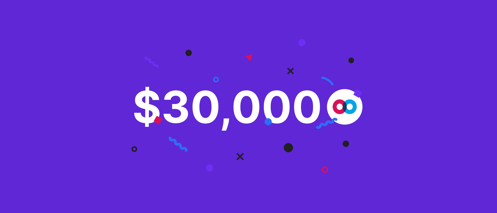

# MFT available in US via CoinZoom, $30K Giveaway

MFT available in US via CoinZoom, $30K Giveaway

### **MFT is live on CoinZoom, a digital currency exchange licensed in the US, and begins trading on Tuesday, April 13th.**

### Listing Details

MFT will be paired with USD, BTC, and USDT (Tether). Getting listed on a fully regulated US exchange like CoinZoom is an important step in our ongoing growth and accessibility effort within the US market. To celebrate this milestone, we are giving away $30,000 in MFT.

Start trading MFT against USD [here](https://trade.coinzoom.com/referral_register?referralToken=4e14e33f-207a-48fb-90ea-b2a593dcb9c4).

### Contest details

There will be daily and weekly rewards along with a grand prize. To qualify participants must purchase and hold a balance of **at least 20,000 MFT** on CoinZoom.

* **Rewards paid out daily, weekly and once at the end of the month, May 20th.**

* **Daily Prize — $200 in MFT split between all daily qualifying MFT holders.**

* **Weekly Prize — $1,000 in MFT split between all daily qualifying MFT holders.**

* **Grand Prize — $20,000 in MFT split between all daily qualifying MFT holders.**

The MFT CoinZoom Contest will begin April 21, 2021 and end on May 21, 2021. See the official contest rules [here](https://www.coinzoom.com/staking/) for additional details.

### About CoinZoom

Launched in early 2020, CoinZoom is a crypto exchange based in Salt Lake City, Utah, USA. It supports fiat pairs, deposits, and withdrawals. It is licensed and registered with FinCEN as a money services business in 48 of the 50 States in the US. This makes MFT available for purchase in most states excluding New York and Hawaii.

Using CoinZoom’s Visa Debit Cards, users can easily spend their fiat or crypto, including MFT, at over 53 million merchants. Card rewards can be as high as 5% thanks to CoinZoom’s reward program.

### About Hifi

Hifi (formerly Mainframe) is a Lending Protocol that allows anyone to borrow against their crypto. Hifi uses a bond-like instrument, representing an on-chain obligation that settles on a specific future date. Buying and selling the tokenized debt enables fixed-rate, fixed term lending and borrowing — something much needed in decentralized finance today.

Mainframe Token (MFT) is the native utility token that is used for:

* Governance votes

* Staking to ensure the safety of the protocol

* Rewarding contributors to the ecosystem

What can you do with the Hifi Lending Protocol:

* Borrow: Lock collateral in a vault to mint fixed-rate, fixed-term debt tokens. These debt tokens can be swapped for instant liquidity allowing users to leverage long, yield farm, or pursue other strategic trades without selling their collateral tokens.

* Lend: Buy fixed-rate, fixed-term debt tokens for a discount. When the term expires they can be redeemed for face value, earning lenders a predictable return on their investment.

* Provide Liquidity: Earn trading fees by providing liquidity between debt tokens and stablecoins on an Automated Market Maker (AMM).

*Interested in learning more about Hifi? **Join our community [here](https://discord.com/invite/mhtSRz6)**.*

Source: https://blog.hifi.finance/mft-available-in-us-via-coinzoom-30k-giveaway-3cd3b6aa272f
