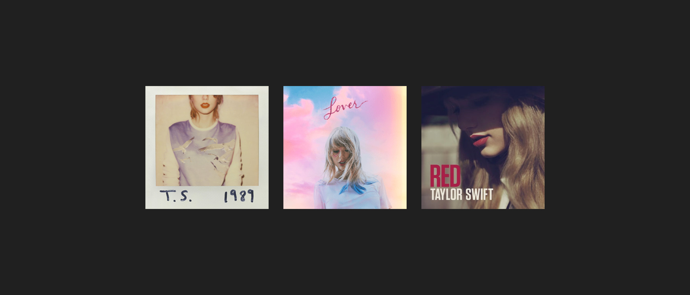

# NFTs 101

NFTs 101

### An accessible introduction to NFTs.

## Ownership

NFTs, non-fungible tokens, are unique tokens that represent ownership of an asset, on or off the blockchain. Because blockchain uses a [shared state](https://twitter.com/Santiag78758327/status/1370406050717954049), it is easy to reach a consensus on who owns each asset.

They are a pointer to the asset they represent.

### What is shared state?

Imagine that Lucy, John and Tim each have a spreadsheet with all of the Bitcoin they own. Because they are using the same spreadsheet, it’s easy to know if one person added or removed funds.

For example, if Tim takes some BTC from John, updating it on the spreadsheet, John and Lucy (the majority) still have the “right” version of the spreadsheet. Because John and Lucy are the majority, their version of the spreadsheet will be the accepted one, leading to the failure of Tim’s fraud attempt.

Because of this, falsifying an NFT is nearly impossible.

### Infrastructure

Your asset can only be as good as the infrastructure protecting it — think investing in a country that has been destabilized. How confident are you that the system recording your property rights is going to persist and remain in-force through time?

One could argue for example, that an NFT on a centralized chain is less valuable than an NFT on a decentralized chain, mainly because the former’s longevity depends on a single entity. Buying an NFT is also a bet on the platform on top of which it’s “hosted” in that regard.

## Abstraction

NFTs are an abstraction of real-world assets, similar to how online payments and cryptocurrencies are an abstraction of money. Instead of having physical cash, you have your funds in an online bank account or a crypto wallet. This same concept applies to NFTs. Instead of having physical ownership of the item, you get digital ownership through an on-chain token.

This idea of abstraction is incredibly important as it represents the very essence of NFTs. In reality, cryptocurrencies are just code–they don’t physically exist. The same thing applies to NFTs, which can be nearly anything: art, game collectibles, domain names, music, physical items, etc.

### Abstraction in its current form

There are already forms of abstraction in our world, today. One example is the album ownership rights of [Taylor Swift](https://en.wikipedia.org/wiki/Taylor_Swift).

In the music industry, there are two types of licenses for songs. The first one being the ownership rights, and the second one being the “[sync license](https://en.wikipedia.org/wiki/Synchronization_rights).” The synchronization license is needed by film-makers if they want to synchronize the song with visual imagery in their film, for example.

While Taylor Swift doesn’t own the ownership rights of her songs ([her previous record label does](https://twitter.com/ThatsMauvelous/status/1380572708879089674)), she does own the synchronization rights. This means that Swift doesn’t own her old recordings, but does own the abstract songs as creators can’t use them without her permission.

## Purpose

At its core, an NFT is a programmable token. This opens up a wide variety of possibilities, like with [Beeple’s B20](https://www.coingecko.com/en/coins/b20). The B20 token allows anyone to own a share of some of the art works of [Beeple](https://en.wikipedia.org/wiki/Mike_Winkelmann), a known crypto artist. This makes art much more accessible as an art work can have potentially millions of shares, making each share very cheap. Aside from that, it also unlocks a ton of potential liquidity as anyone can invest, not just wealthy people.

This concept has been leveraged by [Unisocks](https://unisocks.exchange/), an NFT project made by the [Uniswap](https://uniswap.org) team. There were initially 500 SOCKS tokens in circulation. Each token can be redeemed to obtain a physical pair of Uniswap-branded socks. Once redeemed, the token is burned, meaning it disappears forever from the circulating supply. Because of that, the more people that redeem their SOCKS, the scarcer the supply. Additionally, you don’t necessarily need to hold 1 whole token, you can also just hold a fraction like 0.01 SOCKS.

Because NFTs are tokens, this also makes the ownership (not necessarily the asset itself) of the asset easily transferable. Like you send $50 to a friend, you can now send the ownership of an artwork you own to him too.

While NFTs aren’t necessarily easy to understand, they will definitely become one of the central parts of the future of the internet. Aside from allowing creators to efficiently monetize their content, they will open up the gates to a world where liquidity isn’t locked up in “unproductive” assets.

## Conclusion

Using the programmable nature of NFTs, you could maintain your exposure to an artist like Beeple, while having access to liquidity by borrowing against it in a lending protocol. Or a content creator could sell an NFT for each piece of content he creates, and share 10% of the revenues generated by that piece of content with the owner of the NFT, for example.

By owning a specific NFT, you could also theoretically receive access to exclusive events, secret chat rooms, or just get treated differently because of your “status.” Protocols could also give governance rights to the owners of an NFT because that NFT proves they did something great in the past.

Finally, NFTs could also become a way to invest in future artists. [Social tokens](https://www.theblockcrypto.com/post/91551/social-tokens-media-future-payments) are a way to get “ownership” in the future revenues of a person, and help them bootstrap their career.

<iframe width="560" height="315" src="https://www.youtube.com/embed/4se4_ZqkcKw" frameborder="0" allowfullscreen></iframe>

Source: https://blog.hifi.finance/nfts-101-4783767808fc
