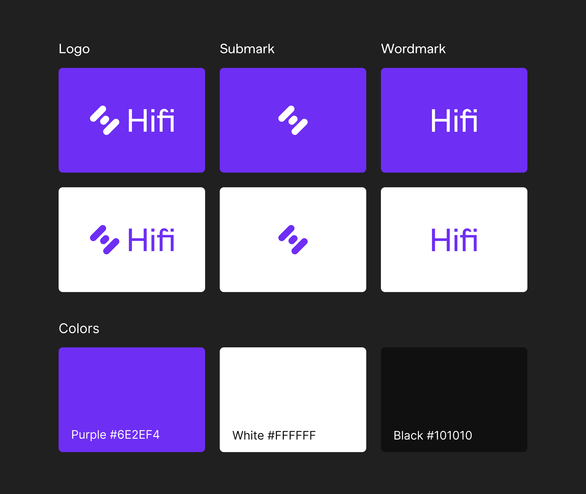

# The End of an Era: Sunsetting our Mainframe Brand and Domain

The End of an Era: Sunsetting our Mainframe Brand and Domain

As we continue the transition to our new brand, there are some housekeeping items to be aware of. In the coming months, we will be shutting down our Mainframe.com domain.

This is a formal call to action for exchanges, price aggregators, and explorers to update their resources to point to Hifi.finance. It’s a great time to revisit outdated descriptions of who we are and what we are building as well. Below are marketing resources to pull from when updating our description and branding. You can find high resolution resources available for download [here](https://hifi.finance/branding).

## Marketing copy

### Mission statement

Hifi Finance exists to accelerate the world’s transition to decentralized finance.

### Tagline

Fixed-rate borrowing against crypto, giving users instant liquidity to multiply their investment.

### Short description

The Hifi Lending Protocol allows anyone to borrow against their crypto. Hifi uses a bond-like instrument, representing an on-chain obligation that settles on a specific future date. Buying and selling the tokenized debt enables fixed-rate lending and borrowing — something much needed in decentralized finance today.

### Long description

The Hifi Lending Protocol allows anyone to borrow against their crypto by leveraging collateral assets approved by Hifi Governance. Hifi uses a bond-like instrument, representing an on-chain obligation that settles on a specific future date. Buying and selling the tokenized debt enables fixed-rate lending and borrowing — something much needed in decentralized finance today. Hifi Governance is the community-organized process of managing the various aspects of the Lending Protocol. Underwriting the lending protocol is an incentivization layer powered by staking Hifi’s Governance Token.

Since late 2017, Hifi’s community has been supporting its mission of accelerating the world’s transition to decentralized finance. Hifi is backed by the top names in VC and Crypto, including ArringtonXRP, NEO Global Capital, FBG, Shapeshift’s Erik Voorhees, ICON’s Min Kim, Ethereum’s Gavin Wood, Zilliqa’s Xinshu Dong, and many many more.

Source: https://blog.hifi.finance/the-end-of-an-era-sunsetting-our-mainframe-brand-and-domain-f3eb2c35eada
