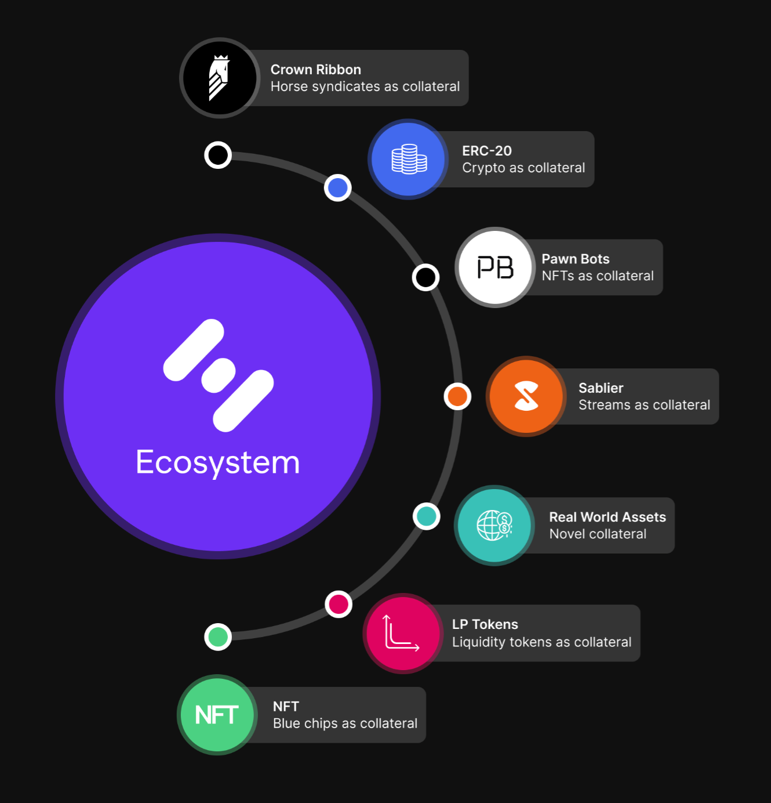

# Hifi Ecosystem Launch 🚀

Hifi Ecosystem Launch 🚀

### New Projects, Integrations, and Partnerships

For a while now, Hifi has been more than just a lending protocol. Beginning with our acquisition of [Sablier](https://sablier.finance/) in 2019, we’ve expanded who we serve in the DeFi space.

As our lending protocol takes on its final form, we are ready to restructure our product offerings to position our lending protocol at the center of everything we do. ***Our success will be measured by the volume of debt we service.***

To extend our reach and multiply our growth, we are launching the Hifi Ecosystem — a series of new projects and partnerships that build upon and integrate into Hifi’s lending protocol.

Our efforts are well underway, and everything we as a core team take on has the single objective of driving usage, TVL, and new users to our lending protocol.

If you’ve been following us for a while, you know about an upcoming NFT project and an NFT liquidity protocol we’re working on. You also may have heard some mutterings about our hopes of integrating [Sablier](https://sablier.finance/) streams as collateral. We want to accelerate our rate of experimentation, the ecosystem is how we plan to do it. Here’s what that’s going to look like.

## Hifi Ecosystem Partners

Sablier has seen incredible traction in the past 12 months and has found product-market fit surrounding token vesting schedules. Three weeks ago, we announced our intention to split Sablier out from Hifi as an independent product with a dedicated team.

The next major update to Sablier will represent token streams as ERC-721 NFTs, making Sablier streams compatible collateral on Hifi’s lending platform. Sablier is our first Ecosystem Partner. Over the coming months, we will see product updates from the Sablier team and begin to explore the possibilities of streams as collateral.

New ecosystem partners will be announced as we integrate with teams and onboard them across our suite of protocols and product offerings. Much more to come on this front!

## Hifi Ecosystem Projects

Two weeks ago we announced and began marketing [Pawn Bots](https://www.pawnbots.com/), our up-and-coming NFT project. With utility at its core, Pawn Bots will provide users with instant liquidity to borrow against their NFTs. It will be the first of its kind NFT project in more ways than one.

[Pawn Bots](https://www.pawnbots.com/) will highlight the need for additional infrastructure necessary to support NFTs as collateral. This means participating in the Pawn Bots community will give members a front-row seat as we innovate and launch new ecosystem initiatives that take each of these challenges head-on.

New projects will be announced as we build out the infrastructure layers needed for NFT collateral. Each piece of infrastructure will demand time and resources to help educate our community. It won’t be easy to take in all at once, so follow along as we revolutionize an industry and financialize NFTs!

To stay up to date on Hifi news and announcements be sure to follow us on [Twitter](https://twitter.com/hififinance) and join the [Discord](https://discord.com/invite/mhtSRz6).

Source: https://blog.hifi.finance/hifi-ecosystem-launch-f2c0fdd6ddf0
