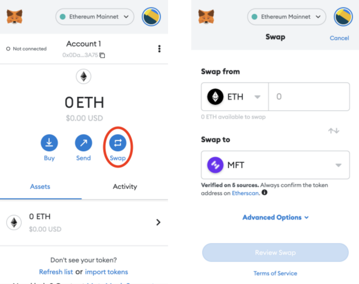

# How to Get Mainframe Token

How to Get Mainframe Token

### Mainframe Token can be obtained in two ways; directly from a centralized exchange or by performing a swap on a decentralized exchange. Here is a guide for both options.

## What is MFT?

Hifi (formerly Mainframe) launched its Mainframe Token (MFT)in Q1 2018, with a supply cap of 10B tokens. All tokens have vested and are widely distributed. MFT is a native utility token that is used for governance voting and soon minting [Pawn Bots ](https://www.pawnbots.com/)NFTs.

## Buying from a Centralized Exchange

MFT can be purchased directly from centralized exchanges (see below). These exchanges will allow you to purchase MFT directly with a credit card or bank account.

**MFT Listed Exchanges:**

* CoinZoom (United States)

* Binance (International, non-US)

* Upbit (South Korea)

* Bittrex Global (International non-US)

* MEXC Global (International non-US)

* Swyftx (International non-US)

## How to move MFT from an exchange to a wallet

Open your destination wallet (MetaMask, Coinbase Wallet, etc.) and copy the address. On the exchange where MFT was purchased locate the send option for your MFT and paste the destination address in the To field. Complete any other necessary prompts and your MFT should now be in your wallet. It should be noted you won’t pay higher fees for transferring more cryptocurrency in one transaction, so we recommend transferring your desired amount in one transaction rather than splitting it over multiple.

## Importing MFT to your wallet:

If your MFT does not appear in your wallet you will need to import the token. In MetaMask on the “Assets” tab select “Import Tokens” then search for MFT (see below) and import the token.

*Importing MFT on MetaMask*

## Swapping on a Decentralized Exchange

MFT can be obtained by exchanging other cryptocurrencies on the Ethereum Blockchain (ETH, MATIC, APE, etc.) for MFT using decentralized exchanges (DEXs). Performing a swap will give you an equivalent value of MFT for the token you are swapping it for, minus gas fees (paid in ETH).

**Method 1, using a DEX Directly:** To use a DEX directly, (Uniswap and SushiSwap are a couple to consider) navigate to their apps, connect your wallet, select which token to sell/swap, and then search for and choose MFT as the token to buy.

**Method 2, using Wallet Built-In Swap:** MetaMask and other wallets also have swap functionality built into them that will aggregate the best rates from multiple decentralized exchanges for your swap (while also adding in a small fee). Simply select which token to sell/swap in your wallet and then select the “Swap” option for that token. Specify MFT as the “Swap to” token and then specify how much you want to swap and select “Review Swap” where you can review the gas fees and then complete the Swap. Once network confirmations have been completed your MFT should now show in your wallet.

*Swapping ETH for MFT on MetaMask*

## You’re All Set

Once you have MFT in your wallet you’re ready to mint. When the mint date arrives you will need to connect your wallet to our mint page at [pawnbots.com](https://www.pawnbots.com/) where you will be required to exchange 1 MFT per Pawn Bot NFT. You will also need to cover gas fees for the mint which will require you to also have ETH in your wallet. If you do not have at least 1 MFT or enough ETH to cover gas fees in your wallet you will not be able to complete the mint.

If you have any questions or want to stay up to date on Hifi and Pawn Bots news and announcements be sure to follow us on [Twitter](https://twitter.com/hififinance) and join the [Discord](https://discord.com/invite/mhtSRz6).

Source: https://blog.hifi.finance/how-to-get-mainframe-token-93f026a606c3
