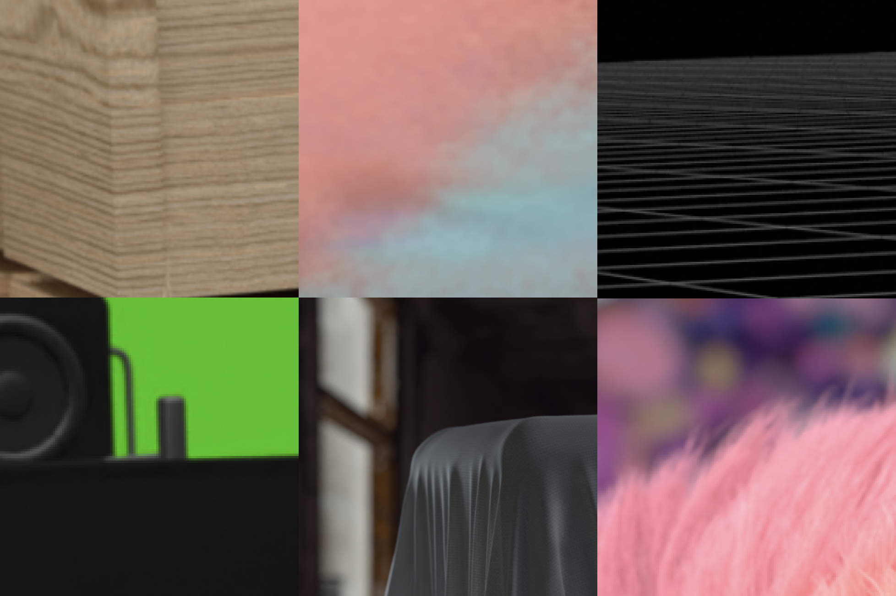

# Pawn Bots Rarity 😎

Pawn Bots Rarity 😎

### Once the art reveal is live (on [July 21st at 4 pm GMT](https://itsalmo.st/pawn-bots-reveal-time-26gz) ) the focus shifts to what we have in our collections.

Pawn Bots is a collection of 8,888 **completely unique** NFTs, being built at the intersection of DeFi and NFTs. With 10 different attribute types, the possibilities are vast. Bots will have varied expressions and looks based on their combination of attributes. While bots may share certain properties *no two bots will be exactly the same*.

### 💎 1 of 1’s 💎

Let’s start with the most exclusive bots of the collection. Hand-picked these bots are distinctly iconic. Each composition takes on a theme of its own, a complete visual identity, and the type of visual foundation that brands are built on. Those lucky enough to hold these bots will be the envy of web 3.

Here’s just a tiny peek at some features of these exclusive bots ⬇️

*Feel free to speculate in the Discord and keep an eye on the sneak-peeks channel*

### **A Potential $10,000 Buy Back**

We are so confident in these 1 of 1 pieces that we’re willing to back each one with a special invitation. Any original holder at the time of reveal who is unsatisfied with their 1 of 1 Pawn Bot can return it within 24 hours.

In exchange, we will host you in a high stakes game of Deal or No Deal for your chance to win $10,000. In the unlikely event we have multiple unsatisfied 1 of 1 holders, each participant will play a qualifying round of Deal or No Deal. The highest scoring participant will then move onto the $10,000 round.

### Flawless Bots 💅

Our flawless bots, match head to toe in a single rare theme. What makes these bots special is that they will only have properties matching their rare body colors (rainbow, diamond, gold, chrome, and matte black). If you’re lucky enough to cop one of these your Twitter profile is about to peak.

### Pawn Bots 🤖

Every Pawn Bot in the collection is completely unique. Hunt through each attribute searching for distinctive combinations and collectible nostalgia. At reveal be sure to check out [Rarity Sniper](https://raritysniper.com/) for a complete breakdown of the collection.

Head on over to [OpenSea](https://opensea.io/collection/pawnbots) now and snatch up as many Pawn Bots as your heart desires. See you at [reveal](https://itsalmo.st/pawn-bots-reveal-time-26gz)!

If you have any questions or want to stay up to date on the latest join our [Discord](http://discord.pawnbots.com/) and follow us on [Twitter](https://twitter.com/PawnBots).

Source: https://blog.hifi.finance/pawn-bots-rarity-5a91b2972f65
