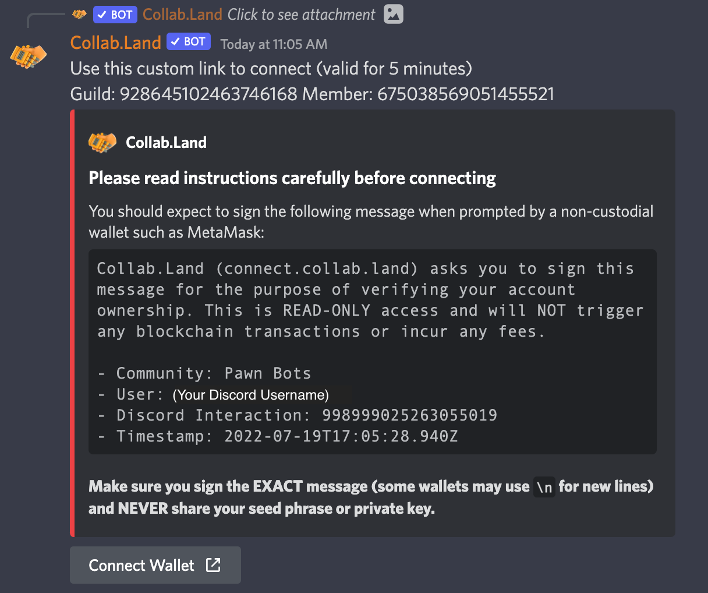
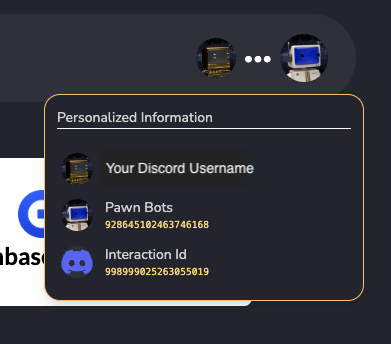
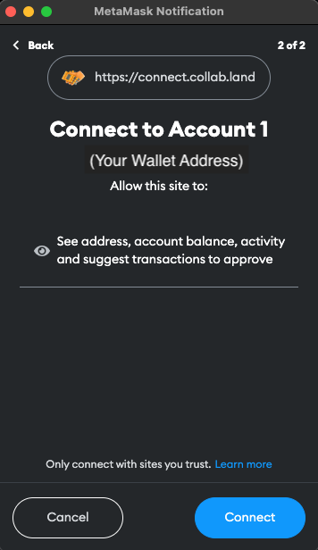
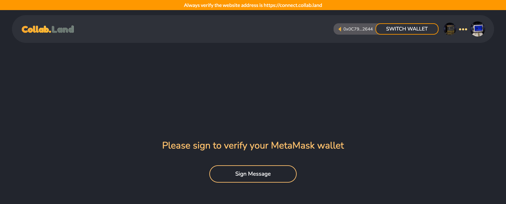
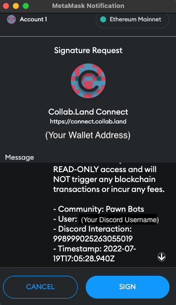

# Pawn Bots Holders-Only Groups

Pawn Bots Holders-Only Groups

## What are token-gated roles? 🔑

In its simplest form, [Collab.Land](https://collab.land/) is a bot that Discord communities can download as an add-on. It offers a range of commands for verifying holders of token types, quantities, and attributes. Depending on their token holdings, users will be allowed to join specific channels in the community. If they sell, the bot can boot them.

## Pawn Bots Community Roles Explained

**Members**: Newcomers who have become aware of the project and engage with it for the first time. They might not know a lot about the utility or community yet, so this stage focuses on getting familiarized. They are not holders or have not used Collab.Land to verify as such.

**Holders 🤖:** They have done enough research to trust the project, and are typically looking to continue to build relationships with other holders. This group is also active in checking our social media updates, sharing our content, and inviting all to join

Holders are granted access to special token-gated chats that have been created in Discord titled *holders-chat*, *bot-follow-bot*, and *share-your-bot*.

**Whales 🤖🐳:** High-conviction players (that dive deep into the ocean) with a higher than average balance of Pawn Bots are granted access to the *whales-chat*. Whales can often influence strategies and tactics deployed by the project. The project may also communicate early access opportunities, whale-only incentives, and feedback requests.

## How to connect with Collab.Land

Visit the #collabland-join channel in the Pawn Bots Discord.

From there you will be greeted with the following message:

Clicking the “Connect Wallet” button will take you to a browser tab for Collab.Land. This is where connecting your wallet takes place.

***Note**: This transaction will not require any gas fees.*

Hover over the profile pictures in the top right to confirm your Discord Interaction ID matches the message from Discord and that the Community reads “Pawn Bots”.

Once confirmed connect to the Collab.Land site with your wallet:

Once connected click “Sign Message”.

To complete the transaction sign the message in your wallet.

Once completed you can navigate back to Discord. If you have any questions or want to stay up to date on the latest join our [Discord](http://discord.pawnbots.com/) and follow us on [Twitter](https://twitter.com/PawnBots).

Source: https://blog.hifi.finance/pawn-bots-holders-only-groups-8725b5ba98d9
