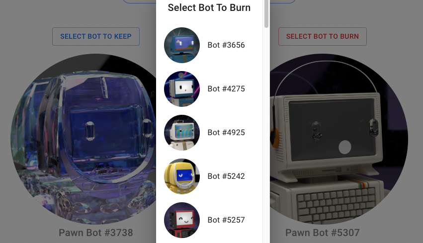
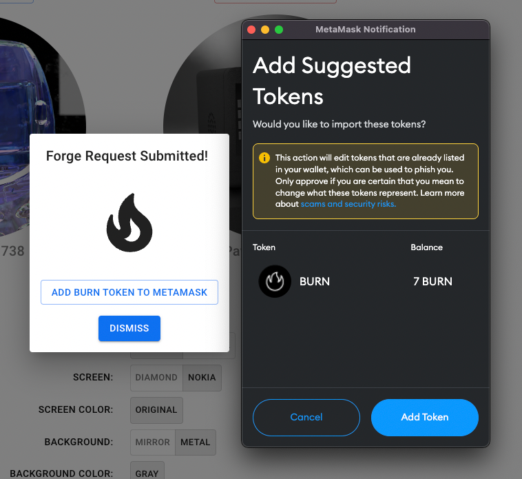

# 🎉 Introducing the Forge Web App

🎉 Introducing the Forge Web App

### Melt down, forge, and burn token mint into a single experience.

We are proud to introduce a more streamlined process for forging new bots with our new [Forge Web App](http://forge.pawnbots.com). Here is a brief overview to get you started.

## Connect and Select

Connect your wallet to show all of your Pawn Bots available to Forge. A drop-down list will appear for the bot you want to keep and the bot you want to burn. **Bots that have already been submitted in a previous request will be excluded from this list.**

*Decisions, decisions*

## Guided Experience

Combine the colors, screens, and traits to match your final bot’s desired identity. All possible combinations for your bots will be presented in the app to help guide you in the Forge process. Any traits out of scope will be filtered out to improve the experience.

## Burn & Mint

The app has also simplified burning your bot by including it in the process. You will no longer be required to send your bot to the burn address manually. As part of the transaction, you will also mint a Burn Token.

Click on “Add Burn Token to Metamask” on the forge confirmation screen and then click “Add Token” in the Metamask notification. Burn token will then appear in your Metamask wallet.

## Forge Request Instructions:

1. Visit [forge.pawnbots.com](http://forge.pawnbots.com)

1. Connect your wallet

1. Select desired traits from available options

1. Approve interaction with burn contract (required 1 time per wallet)

1. Approve transaction

1. Burn bot is sent to burn address (automatically)

1. Burn token is automatically minted

Head on over to [OpenSea](https://opensea.io/collection/pawnbots) to browse available Pawn Bots (to find all the right traits to modify your bots) and be sure to join our [Discord](http://discord.pawnbots.com/) and follow us on [Twitter](https://twitter.com/PawnBots).

Source: https://blog.hifi.finance/introducing-the-forge-web-app-7a2b33d292ef
