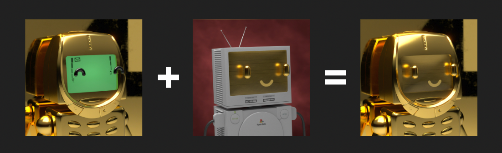
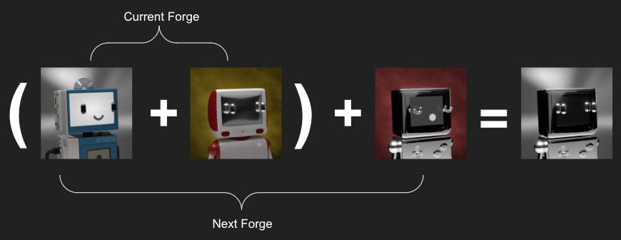
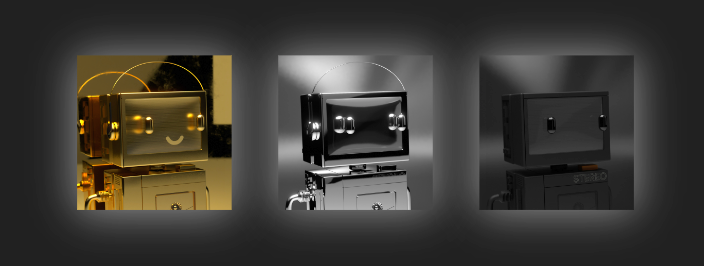
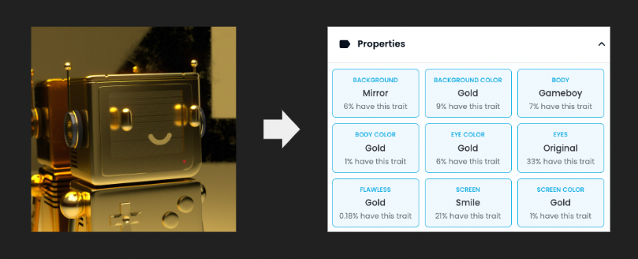

# Forging a Flawless

Forging a Flawless

### With each new phase, the community has been sacrificing bots to extract desired traits and forging improved NFTs to increase rarity and fine-tune aesthetics.

Every forge and upgrade request introduces more refinement and cohesion within the Pawn Bots collection, and every day that passes, holders are coming closer to Forging a Flawless…

## How a Flawless is Forged

A Flawless is born when 2 bots are Melted & Forged together to create something where all attributes and colors are matching those of an existing Flawless bot. For example, a forged Pawn Bot with a Gold Body, a Gold Mirror Background, Gold Original Eyes, and a Gold Smile Screen will produce an ultra-rare Forged Flawless Gold bot!

## A Challenging Task to Prestige

Flawless bots are some of the rarest of the rare in the Pawn Bots collection, so creating a Flawless is no walk in the park. It will require ample planning throughout each Melt Down and & Forge phase to make the traits precisely match. For instance, to create a Flawless Chrome bot, you MUST ensure the bot being forged will have Original Eyes with the Chrome Eye Color and an Original Mirror screen.

**Creating the perfect Flawless bot that meets all specifications could take multiples forges to accomplish**

## Requirements

Each Flawless color originally included one of each body, so all body types are eligible to forge up to a Flawless. Depending on the color, some Flawless bodies are paired with specific accessories and you are required to match the Body with the matching Accessory and Accessory Color. Let’s take the Cassette Player Body for example. For the Gold and Chrome bodies, the Cassette Players must include the Walkman Headphones to be considered Flawless; however, the Matte Black Cassette Player must have no accessories to be considered Flawless.

Currently, only Chrome, Gold, and Matte Black Flawless Pawn Bots can be forged, but remember that ALL attributes and colors must match a pre-existing Flawless to be considered Flawless. Referencing the image above again, you’ll notice the Flawless Gold bots require a Gold Smile Screen, the Flawless Chrome bots require an Original Mirror Screen, and the Flawless Matte Black bots require a Blank Black Screen. We understand that Forging a Flawless is a difficult task, and that is by design. This venture is aimed towards the most esteemed Forgers within the ecosystem. If more clarity is needed, we highly recommend looking at the existing [Flawless Pawn Bots](https://opensea.io/collection/pawnbots?search[sortAscending]=true&search[sortBy]=UNIT_PRICE&search[stringTraits][0][name]=flawless&search[stringTraits][0][values][0]=Matte%20Black&search[stringTraits][0][values][1]=Gold&search[stringTraits][0][values][2]=Chrome), viewing one you want to build, and using the properties as a checklist. Any of our team members in our Discord will also be happy to assist!

## Conclusion

The Pawn Bot’s team continues to build effective collateral for lending and borrowing. As we grow and expand, the team becomes perpetually excited about the future of Pawn Bots.

New limited edition attributes will be introduced to the Pawn Bot’s gene pool and available to purchase exclusively with BURN token. Remember the rewards rate (Ratio of BURN Token issued per Pawn Bot burned) for Forge Requests will be reduced beginning in Phase III to 0.9 BURN tokens per Forge Request. BURN token is received in 1 of 2 ways. The first way to receive BURN is to submit a [Forge Request](https://forge.pawnbots.com/). The other way is to visit [The Furnace](https://furnace.pawnbots.com/). Here holders can burn multiple Pawn Bots in a single transaction to save on time and gas fees.

Each Forge Request, Upgrade, or Burn will result in an entry to our ultra-rare 1-of-1 contest at the end of Phase III. Good luck!

To stay up to date with all of the latest on Pawn Bots join our [Discord](http://discord.pawnbots.com/) and follow us on [Twitter](https://twitter.com/PawnBots).

Source: https://blog.hifi.finance/forging-a-flawless-e50ca6038935
