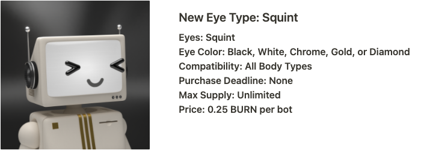
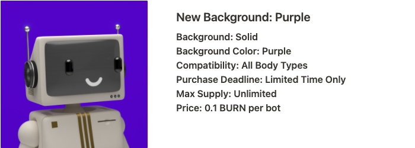
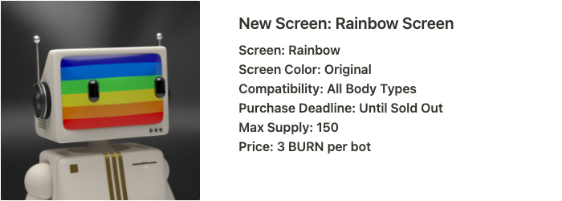

# Pawn Bots Phase III

Pawn Bots Phase III

### The collection continues to become more refined as holders continue the quest to forge flawless bots.

## 🗣 Phase III Introduction

We are both thrilled and proud to announce Phase III of Pawn Bots, beginning September 29th, 2022. With this third phase comes a new opportunity to add to your bots in the journey to [Forge a Flawless](https://medium.com/mainframe-bits-bobs/forging-a-flawless-e50ca6038935). Quick reminder:
> A Flawless is born when 2 bots are Melted & Forged together to create something where all attributes and colors are matching those of an existing Flawless bot. For example, a forged Pawn Bot with a Gold Body, a Gold Mirror Background, Gold Original Eyes, and a Gold Smile Screen will produce an ultra-rare Forged Flawless Gold bot!

The third phase of Pawn Bots includes a drastic overhaul of the Pawn Bot’s Store page (more to come on this soon). Our team has been hard at work on creating new attributes and developing the improved store. There are three new attributes that will be added to the Pawn Bot’s gene pool in this phase, all varying in price, time availability limits, and quantity limits. You’ll be able to purchase the following with BURN token in the Pawn Bot’s Store:

All bots are compatible with each of the new attributes. One note, while Squint eyes are available in Black, White, Chrome, Gold, and Diamond Colors. You will only have access to the existing eye color of the bot you are upgrading. If the bot being upgraded with Squint Eyes has an incompatible Eye Color, it will default to Black.

## 💎 Forging Ahead

Phase II was a massive success and gives us a ton to look forward to throughout the next phase. As stated in the Roadmap Update Section in the [Phase II Blog](https://medium.com/mainframe-bits-bobs/pawn-bots-melt-down-forge-phase-ii-86a655ac3682), all royalties from Pawn Bots continue to be allocated to Collection Liquidity and Lending Liquidity to create effective collateral as NFTs. Phase III introduces new upgrades in the store as Q3 comes to an end, and the team prepares for the Hifi token swap. The Pawn Bot’s team is excited for the next chapter as we continue to build towards long-term success. Stay tuned for more updates!

We’d love to hear your thoughts about upgrades, BURN Token, and Phase III. Come chat with us in [Discord](http://discord.pawnbots.com/) and follow us on [Twitter](https://twitter.com/PawnBots).

Source: https://blog.hifi.finance/pawn-bots-phase-iii-1b9b82731f30
