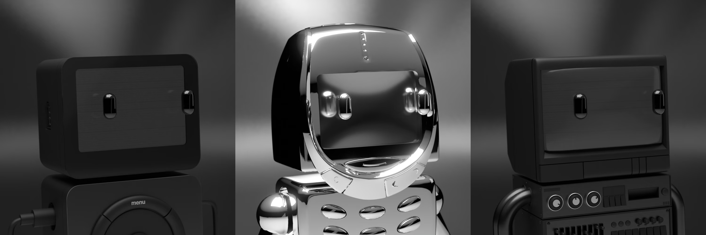

# New Upgrades

New Upgrades

### Phase III brings new improvements and attributes to the Pawn Bots store that will enhance the experience and collection.

## 📓 Phase II Recap

Phase II has been an incredible journey from start to finish. Over the past two phases, over 1300 Pawn Bots have been burned. We introduced the ability to upgrade your bots with Ceramic White body types using BURN token via [The Store](https://store.pawnbots.com/), and all 500 of them sold out within the first day! We established [The Furnace](https://furnace.pawnbots.com/), enabling users to mass burn bots in one transaction to save on both time and gas. With Phase II coming to an end, we still have an ongoing ultra-rare 1-of-1 giveaway for everyone who participates in the forging, burning, or upgrading of Pawn Bots. The winner will be announced alongside the Phase III reveal on October 25th, 2022.

## 🛣 Road to Flawless

Many Forgers are coming closer to [Forging a Flawless](https://medium.com/mainframe-bits-bobs/forging-a-flawless-e50ca6038935) with each additional phase. We wanted to highlight a couple of bots within the collection on their progress:

### **Chrome**

* Bot 7036 is now flawless Chrome Nokia 🎉

* Bot 5325 needs to remove its accessory

### **Gold**

* 7827 needs gold antennas

* 4249 needs a mirror background and the VGA cable accessory

* 6881 needs a gold mirror background

### **Black**

* 5736 is now flawless black 🎉

* 8491 is now flawless black 🎉

* 5869 needs a black, blank screen

* 8562 needs a black, blank screen

For those bots that have successfully forged up to flawless, we’ll be updating their metadata to include the flawless attribute within the week.

## 🔥 Obtaining BURN Token

If you don’t already have any BURN token, you’ll want to get some from [The Forge](https://forge.pawnbots.com/) or [The Store](https://store.pawnbots.com/). Due to the reduced rate of BURN token issued for Phase III from 1 BURN per bot to 0.9 BURN per bot, users will need to accept a new contract via MetaMask to allow the new BURN token distributor access to your Pawn Bots when using The Forge or The Furnace. This will occur even if you have previously given access to these websites, so there is no need for alarm. You can view the latest distributor contract [here](https://etherscan.io/address/0x00000000008f3587815e5E3fa5028377ca9D1616#code).

## 🏪 The Store

Starting today our new attributes (announced in our [previous blog post](https://blog.hifi.finance/pawn-bots-phase-iii-1b9b82731f30)) are available to be purchased in our new and improved Store. With our new store improvements, users will be able to apply multiple upgrades to multiple bots in a single transaction. This means you can easily apply any combination of upgrades to any combination of bots! A couple of things to keep in mind when using the Forge and Store:

* Pawn Bots that are pending upgrades from the Store will not be able to be forged until the next phase. If you are looking to forge and apply new attributes from the store in the same phase make sure you first forge and then apply upgrades in the Store. The newly purchased upgrades will take priority over attributes selected in the Forge Request.

* If you happen to forget an attribute in your Store purchase you can complete additional transactions to purchase any remaining attributes you have not already purchased for that bot.

* The amount of BURN token required to complete your purchase will add up automatically and be displayed above the purchase button. Make sure you have enough!

* Bots upgraded through the Forge or Store **must remain in the same wallet** until the reveal at the end of the phase. If they are transferred out, their upgrades will be voided. This includes any purchases or transfers between wallets you may own.

We hope you enjoy the additions we made to the store. Feel free to hop into [Discord](http://discord.pawnbots.com/) to ask us any questions and don’t forget to follow us on [Twitter](https://twitter.com/PawnBots). Happy upgrading.

Source: https://blog.hifi.finance/new-upgrades-f55f7db094c1
