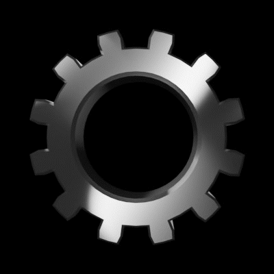

# The Pawn Bots Comprehensive Guide

The Pawn Bots Comprehensive Guide

The Pawn Bots NFT collection provides instant utility to holders and has been strategically architected as effective collateral. With these nostalgic NFTs, holders will soon be able to borrow against their Pawn Bots using the [Hifi lending protocol](https://hifi.finance/), providing instant liquidity. Royalties and project proceeds go into a liquidity pool and are lent back to holders that wish to borrow!

In addition to future borrowing, Pawn Bots provide further utility by allowing holders to customize and upgrade their NFTs while creating a diminishing supply.

## Getting Started

The first step in participating in the Pawn Bot’s ecosystem is to join the community [Discord](https://discord.com/invite/GpEX8Cdyh5). Here you will find important information including announcements and official links. The Discord also acts as the central hub of communication, establishing a friendly space for newcomers and holders to interact with each other as well as the Pawn Bots team.

Next, you’ll want to get your first Pawn Bot! This can be done on any major trading platform such as [OpenSea](https://opensea.io/collection/pawnbots), [Gem.xyz](https://www.gem.xyz/collection/pawnbots/) or [LooksRare](https://looksrare.org/collections/0x28F0521c77923F107E29a5502a5a1152517F9000?queryID=38d39542b018ac487d8a70e06ae020b0). If you’re unfamiliar with how to purchase an NFT, we highly recommend reading OpenSea’s [Getting Started Guide](https://support.opensea.io/hc/en-us/sections/10307989666835-Getting-Started), otherwise, any team member in Discord can happily assist you. Once you have your Pawn Bot, make sure to verify yourself as a Pawn Bot holder using the #collabland-join channel in the community Discord. Doing so will grant you access to the “Holders” role and unlock exclusive channels within the community.

## Meltdown and Forge Events

The Melt Down and Forge Event is an ongoing opportunity for holders to enhance their bots. This event is broken down into monthly phases. At the end of each phase, the metadata is refreshed with the selected traits and enhancements. This allows users to burn & sacrifice their Pawn Bots to generate new and improved versions. Users are able to increase the rarity/desirability of their NFTs by picking and choosing traits from 2 of their Pawn Bots and combining them into one unique NFT. The Pawn Bots collection uses [Rarity Sniper](https://raritysniper.com/pawn-bots) as the main source of truth for rarity rankings.

### How to Participate:

Holders must keep any Pawn Bot(s) in the same wallet used at the time of a Forge Request or upgrade request for the duration of the current phase. Metadata will fail to update for Pawn Bots that are transferred or sold prior to the end of the phase.​

1. Visit [forge.pawnbots.com](https://forge.pawnbots.com/) and connect your MetaMask wallet

1. Select which bot to keep and which to burn

1. Select traits to keep

1. Click “Submit Forge Request” (Holders interacting for the first time will be asked to approve the burn contract)

1. Sign MetaMask approval, then confirm burn in MetaMask​

When bots are forged, one Pawn Bot is kept, and the other is transferred to the burn address. The metadata and image for the bot kept is updated with the selected traits. The metadata for the bot burned is updated by eliminating all of its traits and the image is updated with a Dead Bot icon. On top of improved NFTs, participants will also be credited with BURN token to be used within the ecosystem.

Forging a Flawless? Learn how to do that here: [Forging a Flawless](https://medium.com/mainframe-bits-bobs/forging-a-flawless-e50ca6038935)

## Upgrading your Pawn Bots

Upgrades are a new way to customize and upgrade your Pawn Bots. New limited edition traits will be introduced to the Pawn Bot’s gene pool and available to purchase exclusively with BURN token.​

**To participate in upgrading:​**

1. Visit [store.pawnbots.com](https://store.pawnbots.com/) and connect your MetaMask wallet

1. Select bots to upgrade (can select as many as available in your wallet)

1. Purchase upgrade using BURN token. Prices vary depending on the attribute.

1. You should receive a confirmation if you successfully upgraded your Pawn Bots​

*Note: Pawn Bots submitted to be kept/upgraded must remain in the user’s wallet until the next Phase Reveal in order for the metadata to be updated.*

## The Furnace

With the BURN token’s diminishing rewards rates, holders may want an easy way to burn multiple Pawn Bots in a single transaction in order to maximize their BURN token yield. This is where The Furnace comes into play. To save on time & gas fees, The Furnace allows users to simply select NFTs they wish to burn in exchange for BURN token. Please note, that using The Furnace does not forge or upgrade your Pawn Bots. This cannot be undone, so proceed with caution! Holders will receive BURN token according to the current emissions rate and an entry to win the 1-of-1 Pawn Bot for each bot burnt.​

**To participate in burning:**

1. Visit [furnace.pawnbots.com](https://furnace.pawnbots.com/) and connect your MetaMask wallet

1. Select bots to burn (can select as many as available in your wallet)

1. Click the “Burn Bots” button

1. You should receive a confirmation if you successfully burned your Pawn Bots

## Lending/Borrowing (Coming Soon)

The Pawn Bot’s team has created a liquidity reserve by withholding 1,980 NFTs during the mint to support the borrowing utility. Royalties, along with the proceeds from our liquidity reserve bots, will go towards the two following destinations:​

**Collection liquidity** — is essentially a pool of liquidity that operates much like existing DEX liquidity pools (think Uniswap) but will be purpose-built for NFTs.​

**Lending Liquidity** — is a compounding liquidity pool that individuals can borrow from the community.​

Both of these liquidity pools will be a part of a future version of our [Hifi Lending protocol](https://hifi.finance/) and a separate NFT Liquidity infrastructure layer that will ship sometime after the upcoming Hifi token swap. At that time, borrowing against your Pawn Bots NFTs will also become available.

## Pawn Bots Phases

*Note: All forged, upgraded, and burnt Pawn Bot’s metadata will be updated with the reveal at the end of each phase.*

**Phase I** (completed):

* Launched Pawn Bots Forge Web App

* Forge Request Deadline: 25 August, 2022

* Reveal: 29 August, 2022

* BURN Rewards Rate: 1 BURN Token per Pawn Bot Forge Request

**Phase II** (completed):

* Launched Pawn Bots BURN Store

* Pawn Bots Upgrade: Ceramic White (Sold Out)

* Forge Request and Upgrades Deadline: 19 September, 2022

* Reveal: 26 September, 2022

* BURN Rewards Rate: 1 BURN Token per Pawn Bot Forge Request

**Phase III** (current phase):

* BURN Rewards Rate: 0.9 BURN Token per Pawn Bot Forge Request

* Pawn Bots Upgrade: New Eyes, Background, and Screen

* Forge Request and Upgrades Deadline: 18 October, 2022

* Reveal: 25 October, 2022

* 1 of 1 Giveaway alongside the Phase III reveal.

More to come… Stay tuned!

## FAQ

**How many Pawn Bots should be burned per Forge Request?**

Holders are required to burn 1 Pawn Bot per combination request.

**Can a single address complete multiple Forge Requests?**

Yes. You can submit as many requests as you have Pawn Bots. However, NFT IDs cannot be used in more than one request per phase.

**Will the team render a new Pawn Bot and send it back to the owner?**

The remaining Pawn Bot will have a metadata update with the selected properties from the bot sent to the burn address. No action will be needed from holders. The Pawn Bots team will never request/solicit a transfer.

**Are Pawn Bots sent to the burn address recoverable?**

Any tokens sent to a burn address are considered unusable and their corresponding transactions are irreversible.​

**What are the Pawn Bot combinations available for Forging?**

Any combination of existing traits (from the two Pawn Bots submitted) is acceptable. The Forge app will guide you through all possible options.​

**Can I use attributes from Pawn Bots not submitted in Forge Request?**

No. You MUST use existing traits from the two Pawn Bots you have submitted. Ie. If you submit a Pawn Bot with Body Color Red and Body Color Original, you cannot forge a Pawn Bot with Body Color Gold. Selecting traits outside of the two Pawn Bots submitted will result in your Forge Request being denied.

Thank you for learning about our project, join us in our [Discord](http://discord.pawnbots.com/) to stay up to date and don’t forget to follow us on [Twitter](https://twitter.com/PawnBots).

Source: https://blog.hifi.finance/the-pawn-bots-comprehensive-guide-c4f85623b31c
