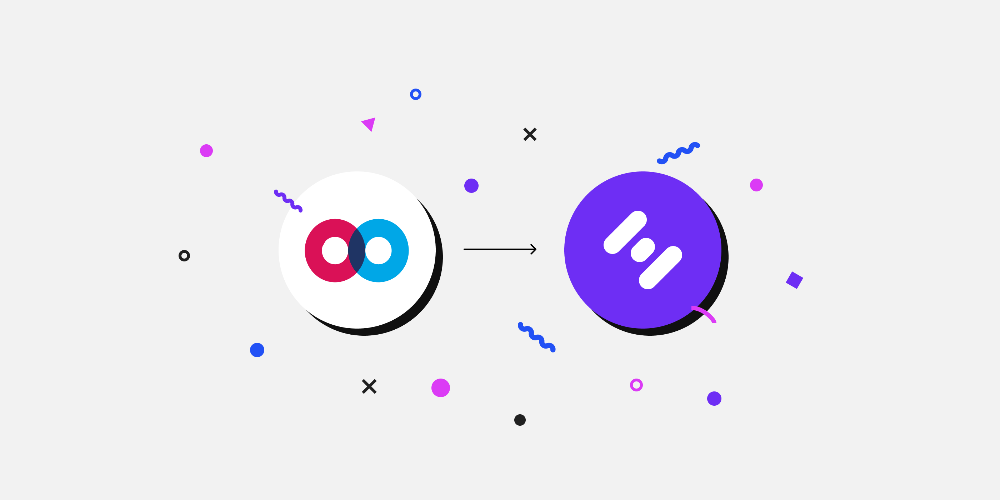

# The Road to Token Swap

The Road to Token Swap

Over the coming weeks, we will be releasing a series of blog posts that outline a path forward for Hifi. The token swap will mark a monumental achievement for our community in turning over control of the Hifi Lending Protocol to HIFI token holders. Here is a guide of what to expect and a schedule of announcements leading up to the token swap.

### Measuring Success

As we look to the future it’s essential that we position ourselves as a value add layer to the customers that the Hifi Lending Protocol will serve. It’s paramount that we are able to clearly articulate who that customer is so our efforts can be laser-focused on solving their problems.

Our opportunity is a function of our customer segment's size and the severity of the problem our offering solves. We need an ambitious vision that has the potential to disrupt entire industries and drive billions in value into the Hifi Lending Protocol. We’ve shared the beginnings of that vision in the past, in the coming weeks we will reiterate and expand on it. So buckle up.

Taking on the challenge of onboarding our first billion dollars of value into the Hifi Lending Protocol will not be easy or cheap. Our community will transform as we begin serving real customers, marketing to a much larger audience, and building out an entire ecosystem that integrates into our lending protocol. As a community, we have never executed at this scale and it will push us out of our comfort zone.

### Token Swap & Mainnet Proposal

Voting on the Token Swap & Mainnet Proposal is expected to occur during the first two weeks of December. Pending a successful vote by MFT token holders the actual swap will be available immediately following the vote. The Ethereum Mainnet deployment will take place in the new year after our existing market has expired on Polygon. To learn more about what we’re working on, read the second entry in our series: [**Our Customer](https://blog.hifi.finance/our-customer-d1f956a87e90)**

Join the conversation in [Discord](https://discord.com/invite/mhtSRz6) and [Twitter](https://twitter.com/hififinance) and help us redefine an industry.

Source: https://blog.hifi.finance/the-road-to-token-swap-89b0c2c739f3
