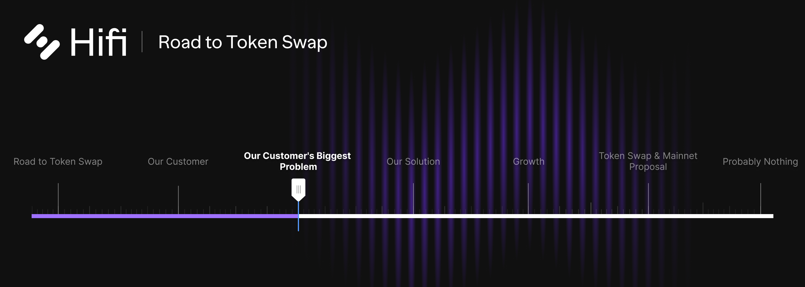

# Our Customer’s Biggest Problem

Our Customer’s Biggest Problem

Previously, we introduced [Our Customer](https://blog.hifi.finance/our-customer-d1f956a87e90), touched briefly on their biggest problem, and answered why we want to serve them specifically:
> NFTs are both the ***user onramp** *for blockchain and positioned to be the ***value onramp*** via Real World Assets (RWAs). This is why we will position Hifi and our Ecosystem to serve NFT Communities as our customer.
> Success for NFT projects, be it digital collections or tokenized Real World Assets, can be distilled down to a project’s ability to grow and retain community members. **Growth and retention** is the largest problem NFT projects face. Without it, projects cease to exist, it is a matter of life and death for NFT communities. This is an extremely important problem to solve for creators, issuers, communities, and holders alike.

In this blog post we dive deep and deconstruct the **growth and retention** challenges NFT communities face, getting specific about individual hurdles. Each section describes both the challenge itself and imagines an ideal scenario for our customers.

## The Three Most Impactful Issues

Price, liquidity, and uncertainty are the three most impactful issues that inhibit the **growth and retention **of NFT communities. Every NFT community faces these challenges, and overcoming them is essential for projects to succeed.

### **Price**

When demand increases for any collection, the price of individual items within that collection increase proportionally. This observation may seem obvious, but its impact on NFT community growth may not be. On the surface, it appears to be a good thing. Right? Who doesn’t want number to go up? Most rational holders of any collectible love when their property increases in value.

However, with an increase in price, the pool of individuals who qualify as potential new members of that specific community drastically changes. Given that wealth distribution is not linear, the growth prospects measured in terms of community size drop off a cliff as collections increase in value. *There is an adversarial relationship between success defined in terms of price appreciation and success defined in terms of community size. *Today, value appreciation stands in the way of community membership growth.

Ideally, NFT communities could grow both in terms of asset price and the number of stakeholders, independent of each growth metric. Another way to say this is, ideally, the pool of potential buyers does not change with respect to an increase in the collection’s value.

### **Liquidity**

NFTs are inherently illiquid. What does this mean? Liquidity is a measure of accessibility to the value of an asset. NFT Liquidity can be hard to come by. Accessing liquidity often requires collectors to sell at steep discounts or wait long periods of time for buyers to match with sellers. Without good solutions to meet collectors’ liquidity needs, communities face a constant force pushing existing members out of their community.

Let’s say you own an NFT and believe it’s worth $100K. How can you access that value? The most primitive way to access value is to sell the asset. Selling comes with noteworthy trade-offs. Regardless of your circumstance, whether you only need $10K or the full $100K you are forced into selling the whole asset.

Selling the asset may remove you from the community or cut off your access to community resources or events. If your NFT happens to have rare qualities, it may take weeks or months to sell. Consequently, with any amount of urgency, you may have to accept a low offer, at or below the floor price, to meet your liquidity needs.

Ideally, you’d have options. Options suited to deliver immediate liquidity proportional to specific needs. Users could choose to sell just a portion of their NFT or have the ability to borrow against it. Liquidity would be available 24/7 and pricing would be both public and fair. Community members wouldn’t lose access to the communities they helped build and to the relationships they’ve invested in and value so much. Users wouldn’t be forced to give up a piece of their identity to meet their liquidity needs.

### **Uncertainty**

Today, NFTs demand a binary decision be made by collectors. You can be in or out. You either own an NFT or you don’t. There’s no great way for collectors to ease into an NFT on their terms. Owning NFTs means being exposed financially and options to fine-tune that exposure are limited.

Uncertainty often stems from sources outside the control of project creators and the community itself. Communities can quickly turn toxic when expectations are not met, cultivating stress, fear, and reflexive panic. Without predictability, communities cannot seriously solicit themselves to a more mainstream audience. It is impossible to appeal to the masses if community membership and NFT ownership come with a relatively high number of unknowns.

Without tools to create certainty, communities have the impossible task of delivering a greater perceived value to members than their real financial loss during market slowdowns and pullbacks. Uncertainty reinforces a culture of short-sightedness. Members contribute and invest less in the non-financial aspect of communities when they plan to stay only as long as the good times keep rolling.

Ideally, you’d be able to fine-tune your exposure. Isolate the social and other membership benefits away from the financial aspects of NFT ownership. You’d be able to dollar cost average into the financial exposure on your terms. Passive tools would exist to optionally, put your NFT to work and help grow your exposure over time. You’d be able to hedge your financial exposure without forfeiting access to community resources and social benefits.

### **Summary**

Growth and retention are extremely nuanced and difficult for NFT communities. Collections that appreciate in value disproportionally price out and reduce their community’s membership potential. Existing members with liquidity needs often terminate their membership and interest in a community to meet their needs. And the inability to manage uncertainty like financial exposure and volatility prevents most in the world from ever showing up.

Collectors and project creators alike, need access to tools that will overcome the constant opposing forces inhibiting their community’s ability to maximize growth and retention. To learn more about how Hifi plans to address these issues read our next post [here](https://blog.hifi.finance/our-solution-514fc759c4ad).

Join the conversation on [Discord](https://discord.com/invite/mhtSRz6) and [Twitter](https://twitter.com/hififinance). Come help us redefine an industry.

Source: https://blog.hifi.finance/our-customers-biggest-problem-6f838302e5a
