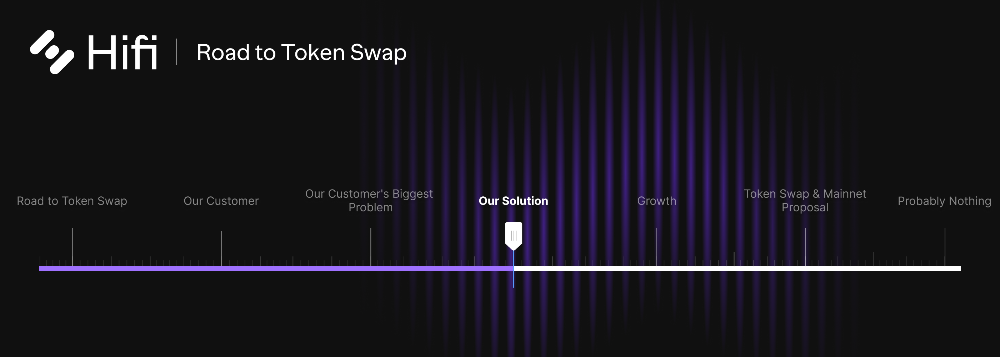

# Our Solution

Our Solution

In our previous blog post, we broke down the [**growth and retention](https://blog.hifi.finance/our-customers-biggest-problem-6f838302e5a)** challenges NFT communities face, getting specific about individual hurdles.
> Price, liquidity, and uncertainty are the three most impactful issues that inhibit the **growth and retention **of NFT communities. Every NFT community faces these challenges, and overcoming them is essential for projects to succeed.
> Collections that appreciate in value disproportionally price out and reduce their community’s membership potential. Existing members with liquidity needs often terminate their membership and interest in a community to meet their needs. And the inability to manage the uncertainty like financial exposure and volatility prevents most in the world from ever showing up.

In this post, we outline a new ecosystem offering that is a foundational requirement in our Lending Protocol’s ability to support NFT collateral. This new offering alongside Hifi’s Lending Protocol will solve each of the major hurdles we’ve identified that stand between our customer and their ability to maximize **growth and retention**.

### **New Ecosystem Offering**

To solve the core onboarding challenges NFT communities face with new members getting priced out, existing members being pushed out from their liquidity needs, and the constant battle against uncertainty, communities need a toolset that unlocks a new paradigm for NFTs.

Alongside Hifi’s Lending Protocol our team has been hard at work building a new infrastructure layer for NFT liquidity! Leveraging both this new liquidity layer and Hifi’s Lending Protocol, NFT communities are equipped to maximize their **growth and retention**.

### **Pooled NFTs**

The new infrastructure layer is a series of smart contracts that works by allowing users to deposit NFTs into collection-specific Liquidity Pools. It solves the problem of prospective members getting priced out of communities, and existing members being forced out for experiencing legitimate liquidity needs, and unlocks the ability for collectors to fine-tune their financial exposure to hedge uncertainty.

Ownership of these Pools is fungible and appropriately represented by pro-rata issuance of an ERC-20 Token. This seemingly simple architecture unlocks broad DeFi composability and a whole host of new use cases for collections.

Today we focus on just those use cases that solve our specific customer’s need to maximize their **growth and retention**. A more formal brand and product name will accompany its launch, but for now, we will simply refer to this architecture as Pooled NFTs.

### Pricing Solution
> There is an adversarial relationship between success defined in terms of price appreciation and success defined in terms of community size.

With Pooled NFTs, prospective community members build a position on their terms, buying any fraction of exposure to a collection. Intelligent NFT Communities will respond by opening their token-gated doors to include channels for these fractional members. Fractional members of a community have a symbiotic relationship with existing holders as their collective holdings drive additional market support and liquidity to the floor of collections. Onboarding is no longer negatively impacted by price appreciation when users can easily purchase small fractions of NFTs.

### Liquidity Solution
> NFT Liquidity can be hard to come by. Accessing liquidity often requires collectors to sell at steep discounts or wait long periods of time for buyers to match with sellers. Without good solutions to meet collector’s liquidity needs, communities face a constant force pushing existing members out of their community.

For collections that eventually qualify to onboard as collateral to Hifi’s Lending Protocol, their members get access to instant liquidity. With Hifi, users manage their preferred level of exposure to collections, adjusting as needed, providing ultimate flexibility to NFT communities.

For collections that have not yet qualified as Hifi collateral, their members can leverage Pooled NFT Markets to better meet the liquidity needs of their community. Pooled NFTs give collectors the option to sell just a portion of an NFT and escape being forced to sell whole NFTs. This leads to greater retention of existing members within communities.

Each of these approaches becomes a new retention tool communities can leverage to manage the many legitimate reasons members are being pushed out from within their communities.

### Uncertainty Solution
> There’s no great way for collectors to ease into an NFT on their terms. Owning NFTs means being exposed financially and options to fine-tune that exposure are limited.

Uncertainty comes in many forms, volatility and financial exposure are the most common. Since Pooled NFTs can easily be paired with other common tokens and deposited into markets on Uniswap, collectors can dampen the impacts of financial exposure and harvest volatility for a passive yield! Let’s explore this opportunity from a high level.

Uniswap liquidity providers deposit a pair of tokens into markets that provide a service to traders looking to buy or sell tokens. The net exposure for liquidity providers is dampened with respect to the two assets deposited. What does dampened mean in this context? It means that participants experience lower highs and higher lows. So for collections that have a high probability of being around in 5 years, being a Liquidity Provider of Pooled NFT markets gives collectors a new tool to reduce the more immediate impacts of volatility.

Don’t spend too much time thinking about the unique and fascinating qualities Pooled NFT Uniswap Liquidity Providers have or you will get lost exploring its incredible potential as collateral in helping NFT community members manage uncertainty. Our Lending Protocol is an excellent tool for both amplifying exposure through leverage and reducing exposure through hedging. Hifi unlocks the ability to completely hedge exposure for users.

Whether it’s dampening exposure through Pooled NFTs as a Uniswap Liquidity Provider or hedging out entirely from collections using Hifi. NFT Communities now have options to help their members combat uncertainty.

### Conclusion

The NFT Liquidity Infrastructure lays a foundation for Hifi’s Lending Protocol and together they enable NFT Communities with specific solutions that overcome the three most impactful barriers to **growth and retention**.

Hifi is unique, having experienced the impact of these challenges firsthand as we built our genesis NFT collection, Pawn Bots. Our background and expertise in DeFi, position us to bring to market real solutions for a segment of our industry that onboards the most new users, and is positioned to onboard the greatest amount of value blockchain will ever see.

Currently, Pooled NFTs are in the final stages of development and we cannot wait to share these tools with you and NFT Communities worldwide. Deployment of the NFT Liquidity Infrastructure will be a top priority following the upcoming Token Swap and Ethereum Mainnet Launch of Hifi’s Lending Protocol. To learn more about our growth strategy read the [next post ](https://blog.hifi.finance/growth-175a470d3d58)in our series.

Join the conversation on [Discord](https://discord.com/invite/mhtSRz6) and [Twitter](https://twitter.com/hififinance). Come help us redefine an industry.

Source: https://blog.hifi.finance/our-solution-514fc759c4ad
