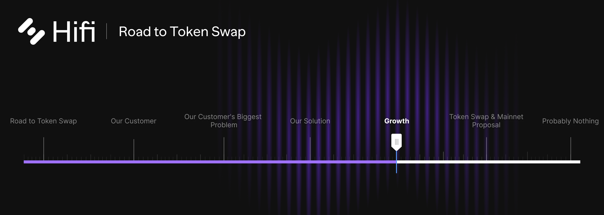
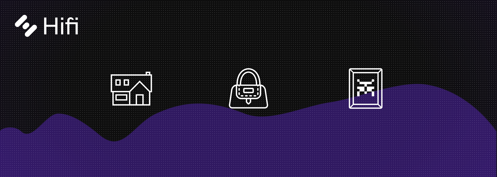

# Growth

Growth

In our [previous post](https://blog.hifi.finance/our-solution-514fc759c4ad), we introduced Pooled NFTs, a new ecosystem offering. This new offering lays a foundation for Hifi’s Lending Protocol and together they enable NFT Communities with specific solutions that overcome the three most impactful barriers to **growth and retention**.
> The new infrastructure layer is a series of smart contracts that works by allowing users to deposit NFTs into collection specific Liquidity Pools. It solves the problems of prospective members getting priced out of communities, existing members being forced out for experiencing legitimate liquidity needs, and unlocks the ability for collectors to fine-tune their financial exposure to hedge uncertainty.
> Hifi is unique, having experienced the impact of these challenges firsthand as we built our genesis NFT collection, Pawn Bots. Our background and expertise in DeFi, positions us to bring to market real solutions for a segment of our industry that onboards the most new users and is positioned to onboard the greatest amount of value blockchain will ever see.

In this post, we outline our growth strategy. How we plan to onboard the first billion dollars of value directly into Hifi’s Lending protocol. Our objective is simple, become growth maximalists, and position The Hifi Lending Protocol to onboard the greatest number of users and value as possible.

### Real World Assets (RWAs)

The most ambitious teams both across DeFi and the NFT space are working to bring real-world assets on-chain. We see real estate projects, high-end physical art, and other luxury goods, all being tokenized as NFTs. This effort will result in the largest onboarding of value onto blockchain ever.

The main challenge and exploration happening right now is to find the right legal structure and infrastructure to bring these ownership rights on-chain in an effective manner. We know this because we’re not sitting idly by waiting for others to figure it out.

Knowing the importance of hitching our proverbial wagon to the right horse, we are positioning our community to grab this opportunity by the horns and rein it in. This is our chance to leave a mark, and build a globally recognized brand. There has been plenty of talk about blockchain changing the future and disrupting entire industries, but most of it is still just that, talk. It’s time we climb down off our high horse, cowboy up, and go disrupt an industry.

### Disruption 101

Let’s begin by articulating some ideals. What industry is ripe for us to come in and disrupt with blockchain? Ideally, it would be a large global industry flush with valuable assets. Those assets would also just happen to have all the properties that make up great collateral. And it would be an industry that is underserved and overlooked by the existing financial system. That’s not too much to ask for, is it? Oh! And it would also be nice if taking on this industry were just absurd enough of an idea to really help amplify any media exposure we get to cut through all the noise out there.

This opportunity will drive direct usage of Hifi’s lending protocol and position our community with the experiential knowledge and supporting infrastructure to take advantage of the explosion of value that RWAs will represent on-chain.

### **Strategy Summary**

NFTs are onboarding the most users to the blockchain, and Real World Assets (RWAs) are positioned to onboard the greatest amount of value on-chain. Our customer is NFT Communities. Looking ahead we’re positioned to solve the single greatest challenge facing NFT communities. Helping NFT communities maximize **growth and retention** will drive value, usage, and new users to Hifi’s Lending protocol. Knowing that NFTs will play a foundational role in tokenizing ownership of real-world assets. Our ecosystem will onboard real-world assets on-chain and directly into Hifi’s Lending Protocol, disrupting industries along the way. Solving real issues for NFT communities is how Hifi will gain traction and find product market fit!

Our community is uniquely qualified to take on these opportunities. We have weathered multiple market cycles, have a background in DeFi, and know firsthand the growth and retention challenges NFT communities face. Read our next post where we outline the details of our [Token Swap and Ethereum Mainnet Proposal](https://blog.hifi.finance/token-swap-mainnet-proposal-a7b0105dc488).

Join the conversation on [Discord](https://discord.com/invite/mhtSRz6) and [Twitter](https://twitter.com/hififinance). Come help us redefine an industry.

Source: https://blog.hifi.finance/growth-175a470d3d58
