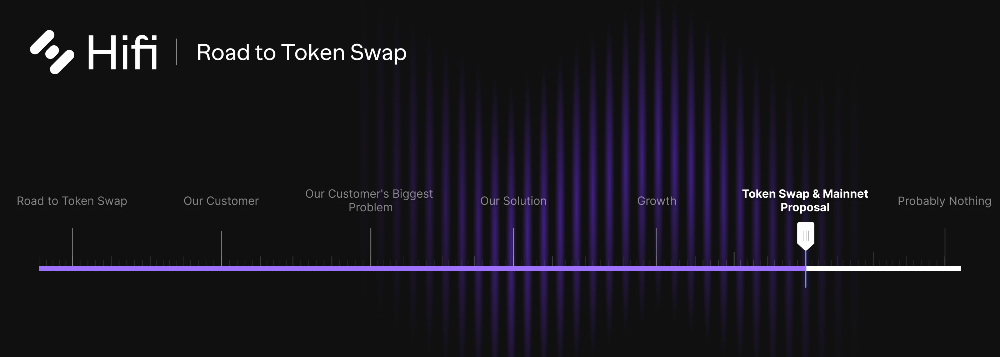

# Token Swap & Ethereum Mainnet Protocol Deployment Proposal

Token Swap & Ethereum Mainnet Protocol Deployment Proposal

It is proposed that the HIFI Token smart contract be deployed on Ethereum Mainnet with a token swap rate of 100 MFT per 1 HIFI. A new legal entity, Hifi DAO, be established and all relevant intellectual property, domains, and social accounts be transferred from Hifi Labs to HIFI DAO. The Hifi Protocol be deployed on Ethereum Mainnet and control assigned to HIFI DAO governance. Approve a new market in the Hifi Protocol beginning January 2023. And, Allocate 25M tokens (19.8% of new token supply) vesting linearly over two years to Hifi Labs.

Come and discuss the proposal in the community forum and join us for a [special AMA tomorrow](https://youtu.be/zN31w1Wuftk) at 9:30 am MST.

If you have not read the previous blog posts, we very clearly identify [our customer](https://blog.hifi.finance/our-customer-d1f956a87e90), [their biggest problem](https://blog.hifi.finance/our-customers-biggest-problem-6f838302e5a), [our solution](https://blog.hifi.finance/our-solution-514fc759c4ad), and a [two-pronged strategy for growth](https://blog.hifi.finance/growth-175a470d3d58). ***Without that context this proposal is meaningless, so be sure to read those now if you haven’t.***

### A DAO Is Born

Operating as a DAO introduces new responsibilities for HIFI token holders and establishes clear relationships with service providers. This change in structure for our community is a major step forward in decentralization. Hifi DAO is a legal entity that will serve HIFI token holders. It will be used to house all Hifi-related intellectual property and give HIFI Token holders the ability to enter into agreements with other entities the Hifi Protocol relies upon, like Chainlink.

The core team is employed by Hifi Labs, a separate legal entity. Hifi Labs will operate on a two-year contracted basis with Hifi DAO. Renewal of this and other contracts is managed through the standard governance process. This clarity in the relationship reaffirms, what’s already coded into Hifi’s smart contracts, HIFI token holders control the Hifi Protocol and the HIFI Token. The core team is not in control, nor is Doug, who has been leading their efforts. They are members of Hifi’s community and a service provider, so long as the Hifi DAO continues to value their contributions to the community.

### Hifi Protocol Deployment to Ethereum

The Hifi Protocol is ready for Mainnet. After several iterations and audits, the Hifi Protocol stood the test of time on Polygon. A new version of the Hifi protocol will be deployed on Ethereum. The new market will begin on Ethereum in January 2023 just after the last market, currently live on Polygon, expires.

### HIFI Token Swap

MFT will be swapped for HIFI at a rate of 100 MFT to 1 HIFI. 100M HIFI Tokens will be redeemed by MFT token holders. As [previously announced](https://blog.hifi.finance/governance-airdrop-827b65731f71), 1.25M HIFI tokens will be airdropped to MFT holders who have participated in Governance votes, inclusive of this proposal. 25M HIFI tokens will be allocated to Hifi Labs, vesting linearly over 2 years. The total supply of HIFI will be 126.25M Tokens.

### Funding Growth

It is not lost on us, as the core team, the gravity and material nature this proposal carries with it. Let’s be clear, this is not a small ask. Please make appropriate considerations as you decide how to vote.

Here are the major considerations we had in creating this proposal:

* Our common goal is to fuel Hifi’s growth.

* Talent acquisition and retention costs.

* The impact volatile token prices have on business operations.

* And lastly, an appropriate time frame to adequately measure results.

Our main objective is to fuel growth with this proposal. This desire is born out of our own hopes and reinforced by the community feedback we’ve received. From lessons we’ve learned during previous market cycles we know firsthand how unpredictability and the volatile nature of token prices impact runway and the ability to recruit and retain talent. Recent events have brought this reality to the surface for all of us. There must be an adequate buffer of value to weather unpredictable market downturns.

We know there exists a relationship between job stability and the cost of talent. The more stability you have to offer an employee the more affordable their terms of employment become. Additionally, when resources begin to run low and runway drops below the 12-month mark, it becomes increasingly difficult to hold onto the talent you do have.

High up-front costs in getting new hires up to speed in blockchain amplify the costs of turnover. This along with the need to allow enough time to adequately measure results is why we have chosen a two-year time frame for the Hifi Labs contract. It’s long enough to minimize its impact on the ability to retain and recruit talent and for Hifi DAO to adequately measure the results of our efforts.

Our leadership team at Hifi Labs has demonstrated prudence and appropriate stewardship in resource management over the past couple of years. The most common criticism we hear from the community is in regard to the restraint we exercise in deploying resources. Community members have expressed a greater appetite for marketing spend and more aggressiveness in our timelines. Looking back, I believe we’ve made the right tradeoffs as we considered our available resources. Looking ahead, we can use this opportunity to adjust course and allocate adequate resources to be more deliberate and aggressive in our growth.

This proposal will put Hifi Labs in the following position based on how broader market forces play out. If the market holds we can deploy these resources to scale both our marketing and development efforts. If the market crashes, we believe there is an adequate buffer to push forward with a similar trajectory to what we currently have today. And if the bear market is short-lived, Hifi Labs will have the opportunity to capture upside in excess of its needs and further reinforce the alignment of outcomes with HIFI Token Holders.

### Looking Ahead

Positioning ourselves to be the premier **growth and retention** tool for NFT communities solves the biggest problem for the fastest-growing segment in our industry. Trailblazing new paths to onboard real-world assets on-chain puts us at the bleeding edge of the largest onboarding of value blockchain will ever see.

Success requires that we scale every facet of our efforts. From marketing and integrations to business development and community support. We need to continue to recruit and retain some of the world's best talent for development and marketing. This includes extending our reach by supporting markets on new exchanges. We need a presence at major conferences around the world to grow our community and connect with builders creating the next generation of tokenized primitives for Hifi’s Lending Protocol.

Taking on the challenge of onboarding our first billion dollars of value into the Hifi Lending Protocol will not be easy or cheap. Our community will transform as we begin serving real customers, marketing to a much larger audience, and building an entire ecosystem that integrates into the Hifi Protocol. As a community, we have never executed at this scale and it will push us out of our comfort zone.

[The Hifi Tokenomics Lite Paper](https://blog.hifi.finance/hifi-tokenomics-lite-paper-9bc0bb9fa36e) provides a great high-level summary of all these changes. Come and discuss the proposal in the [community forum](https://forum.hifi.finance/c/proposals/5) and join us for a [special AMA tomorrow](https://youtu.be/zN31w1Wuftk) at 9:30 am MST.

Join the conversation on [Discord](https://discord.com/invite/mhtSRz6) and [Twitter](https://twitter.com/hififinance). Come help us redefine an industry.

Source: https://blog.hifi.finance/token-swap-mainnet-proposal-a7b0105dc488
