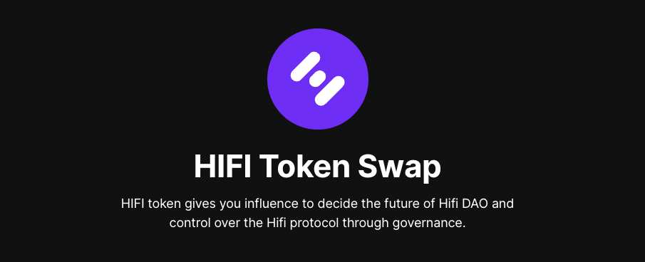
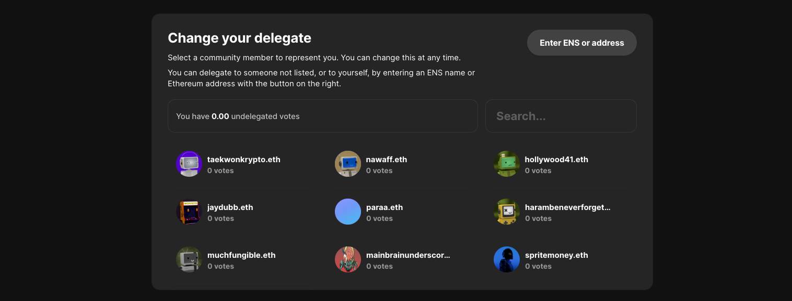

# Hifi DAO — Day 1! 🎉

Hifi DAO — Day 1! 🎉

### Congratulations! This is a monumental accomplishment for Hifi’s decentralization. HIFI token holders are now in control of all material aspects of the protocol, token, intellectual property, and community.

Today marks the dawn of a new era for Hifi. The community has come together to make Hifi DAO a reality. Working as a DAO will be different, but the tradeoffs are worth it! The first priority on the agenda is the Token Swap. The Token Swap is critical for the Hifi DAO because holders will be members of the Hifi DAO, and future decisions will be made by voting with the HIFI Token.

We need DAO members who are willing to self-custody their tokens for Governance to function properly. Please consider keeping your tokens in a wallet you control. You can participate directly in Hifi Governance or delegate to someone you trust within the community.

### Token Swap Introduction

When Token Swap goes live tomorrow, the HIFI Token smart contract will be deployed on Ethereum Mainnet with a token swap rate of 100 MFT per 1 HIFI. ***Links for the Token Swap will be published on official social channels on Friday, December 9th. Be weary of scammers pretending to be Hifi.***

The HIFI Token Swap application is a quick and easy process for swapping your MFT to HIFI. To prepare for the upcoming Token Swap, you’ll need your MFT in a self-custody wallet. Currently, the app supports the following wallets: [Metamask](https://metamask.io/), [Wallet Connect](https://walletconnect.com/), and [Coinbase Wallet](https://www.coinbase.com/wallet). Through Metamask you may also interact using hardware wallets like Trezor and Ledger.

There is no deadline for the Token Swap, but we highly recommend doing it as soon as possible to participate in the Hifi DAO governance votes.

### **Hifi Guardians/Delegates**

Hifi Guardians, a group of the most active advocates within our community. These members act as community ambassadors across our social channels, contributing to conversations that promote the Hifi Ecosystem. Many Guardians will also act as delegates for Hifi DAO and their names will pre-populate when selecting your delegate during the Token Swap process.

What is a delegate? A delegate is a fellow community member that you select to represent yourself. When assigning a delegate, you’re essentially giving them the power to vote on future Hifi Improvement Proposals on your behalf.

Before the Token Swap goes live, Spend some time deciding who you will select as your delegate. Your delegate votes are not restricted to Guardians. You’re able to assign your votes to anyone you choose, including yourself.

*Delegates can be set and changed at any time after you’ve successfully swapped your tokens*

### Conclusion

A large portion of our community members attended and voted for HIP 2, and we are extremely grateful to everyone who participated in this important process. Thank you for your strong support for Hifi DAO, and we hope you are as excited as we are for the next chapter of the Hifi Ecosystem.

Join the conversation on [Discord](https://discord.com/invite/mhtSRz6) and [Twitter](https://twitter.com/hififinance), and let’s make Hifi DAO the best decentralized autonomous organization in the world!

Source: https://blog.hifi.finance/hifi-dao-day-1-d9d085739b6f
