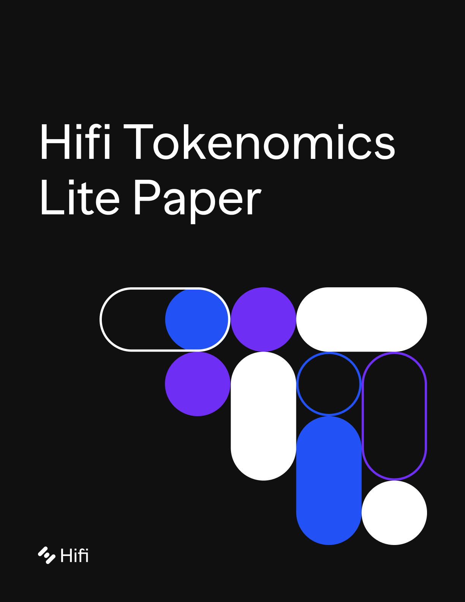
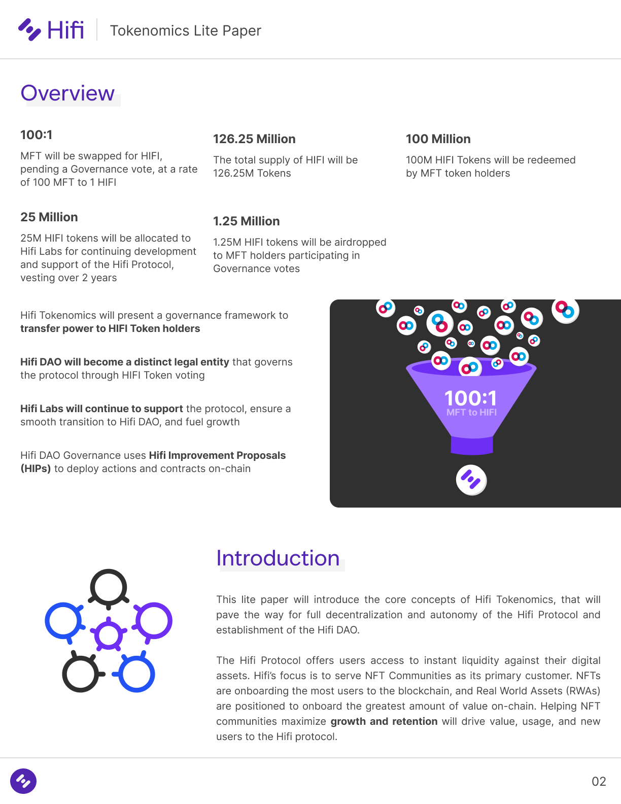
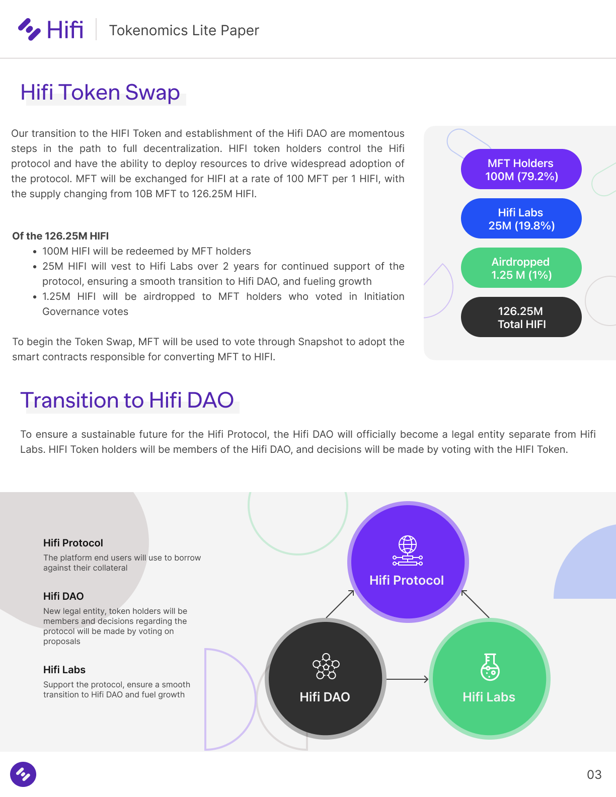
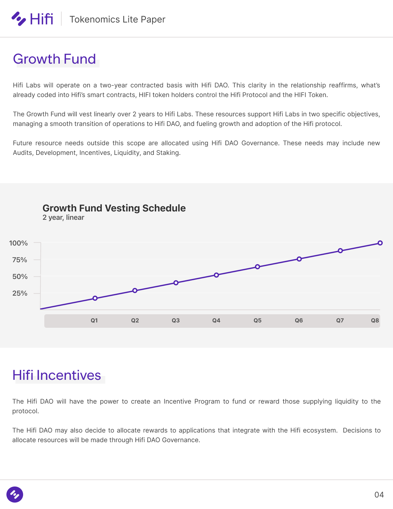
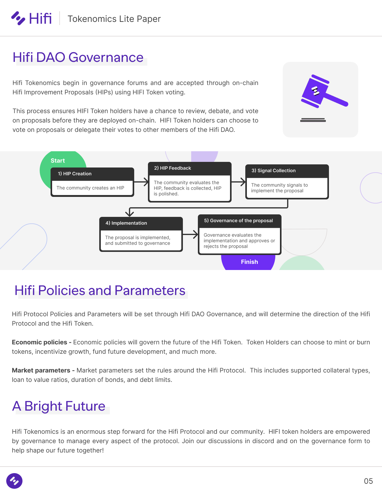

# HIFI Tokenomics Lite Paper

Available to download as a pdf here.

Discuss the proposal in the [community form](https://forum.hifi.finance/c/proposals/5) and join us for a [special AMA tomorrow](https://youtu.be/zN31w1Wuftk) at 9:30 am MST.

Join the conversation on [Discord](https://discord.com/invite/mhtSRz6) and [Twitter](https://twitter.com/hififinance). Come help us redefine an industry.

Source: https://blog.hifi.finance/hifi-tokenomics-lite-paper-9bc0bb9fa36e
